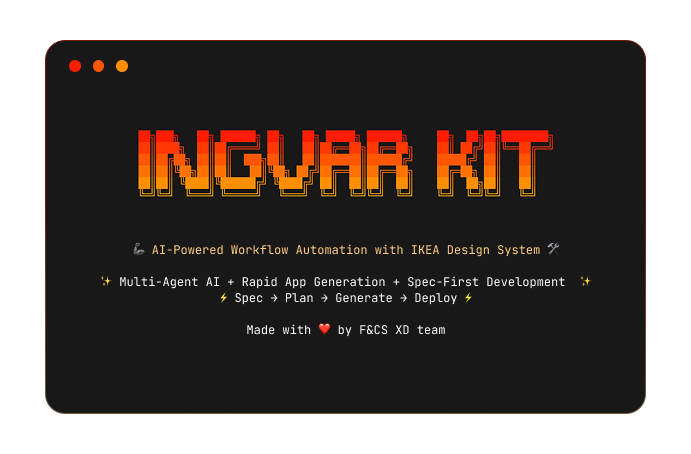
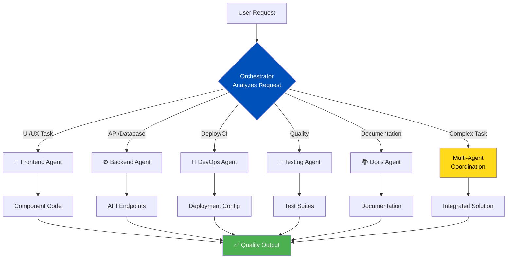
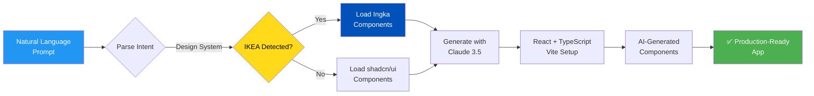
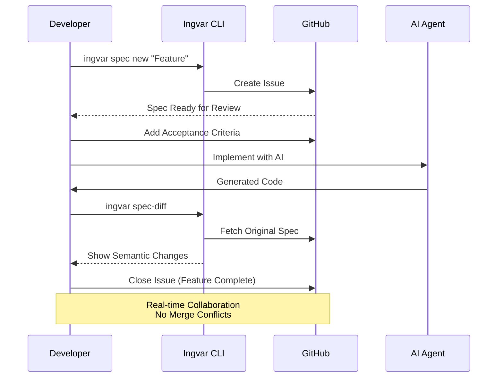
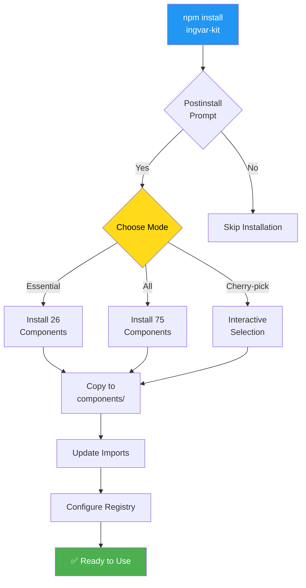

<div align="center">



<h1>Ingvar Kit</h1>

<h3>AI-Powered Workflow Automation with IKEA Ingka Design System</h3>

**Transform your development with multi-agent AI, rapid app generation, spec-first development, and the official IKEA design system—all from your terminal.**

[](https://www.npmjs.com/package/ingvar-kit)
[](https://opensource.org/licenses/MIT)
[](https://nodejs.org)
[](https://github.com/leopagotto/ingvar-kit)

[Quick Start](#-quick-start) • [Features](#-features) • [IKEA Design System](#-ikea-ingka-design-system) • [Spark Generator](docs/SPARK.md) • [Documentation](docs/README.md)

---

### 🎉 **v6.1.0** - 100% Component Registry Coverage

✅ **72/72 Components Available** • 🔄 **Automatic Package Mapping** • 📦 **Individual Installation** • 🎯 **Spark Model Selection** • 🚀 **Zero Local Templates Needed**

Achieved 100% Ingka registry coverage through automatic package name mapping. All 72 components now install from official registry with transparent mapping (e.g., colours → variables). Individual package installation prevents cascading failures. Spark now respects your model configuration.

**[Release Notes](CHANGELOG.md#610)** • **[Registry Guide](docs/development/INGKA_REGISTRY_COMPONENTS.md)** • **[Package Mappings](docs/development/INGKA_REGISTRY_COMPONENTS.md#package-name-mappings)**

---

### 🎉 **v6.0.0** - Modular AI Instructions Architecture

🎯 **Copilot Instructions: 4,967 → 464 lines** • 🎨 **Designer Agent Integrated** • ✅ **Accurate Component Reporting** • 📦 **75+ IKEA Components** • 🤖 **7 Specialized Agents** • ♿ **WCAG 2.1 AA Compliant**

Major architecture refactor with 90.7% smaller AI instructions, complete 7-agent system (Designer now included!), and accurate component installation reporting. True modular system with zero duplication - update once, applies everywhere.

**[Release Notes](CHANGELOG.md#600)** • **[Architecture Guide](docs/development/COPILOT_INSTRUCTIONS_REFACTOR_V6.md)** • **[Ingka Quick Reference](docs/INGKA_QUICK_REFERENCE.md)** • **[Component Installation](docs/guides/COMPONENT_INSTALLATION.md)**

---

</div>

## What is Ingvar?

**Ingvar Kit** is an AI-powered CLI that combines multi-agent orchestration, rapid app generation with IKEA design system, spec-driven development, and GitHub Projects automation—all in one powerful tool.

Named after IKEA founder **Ingvar Kamprad**, this toolkit brings professional design excellence and AI automation together to transform your development workflow.

### 🎯 Core Capabilities

1. **🇸🇪 IKEA Design System Integration**

   - 72+ official Ingka Skapa components with 100% registry coverage
   - Automatic package name mapping (e.g., colours → variables)
   - Production-ready design tokens, typography, and accessibility
   - Individual package installation for reliability
   - 83 PDF specifications with visual examples and code snippets

2. **🏢 Co-Worker Design Subsystem (CWDS)**

   - Internal IKEA applications and tools (co-worker-facing)
   - Global Header with App Switcher (switch between IKEA apps)
   - Navigation Menu, Bottom Navigation (mobile), User Profile
   - ILOFF Layout integration (automatic app discovery)
   - Auth0 and Azure authentication support
   - Full component library for admin panels and dashboards

3. **🤖 Multi-Agent AI Orchestration**

   - 7 specialized agents: Orchestrator, Designer, Frontend, Backend, DevOps, Testing, Docs
   - Dynamic AI instruction builder adapts to 4 editors (Copilot, Cursor, Cline, Codeium)
   - Intelligent task routing with complexity-based model selection
   - Designer-first workflow for 10x faster UI prototyping

4. **⚡ Spark Generator (App-in-Minutes)** 🇸🇪 _IKEA Ingka Skapa + Optional CWDS_

   - Natural language → production React app (2-5 minutes)
   - **✅ Ingka Skapa Base (75+ components)** - Customer-facing apps (always included)
   - **✅ Optional CWDS (10+ components)** - Internal co-worker tools (extends Ingka Skapa)
   - **✅ IKEA-compliant:** Pure @ingka/_ and @ingka-group-digital/_ components
   - Claude 3.5 Sonnet generation with best practices built-in

5. **📋 Spec-First Development**

   - GitHub-native specifications (issues, not files)
   - Real-time collaboration with no merge conflicts
   - Evolution tracking with semantic diff analysis

6. **🎯 GitHub Projects Automation**

   - One-command project board setup with proper columns
   - Auto-labeling and issue templates
   - Integrated with spec workflow

7. **🎨 Dynamic AI Instructions**
   - 1,300+ lines of component specifications
   - Adapts to: Cline, Copilot, Cursor, Codeium
   - Auto-updates based on project structure and enabled features

### 📊 How It Works

#### Multi-Agent Orchestration Flow



#### Spark Generation Workflow



#### Spec-First Development Flow



#### Component Installation Flow



**[See More Diagrams →](docs/WORKFLOW_DIAGRAMS.md)**

### 🆚 Ingvar vs GitHub Spec Kit

Many developers ask: _"How is Ingvar different from GitHub Spec Kit?"_ Here's the breakdown:

| Feature             | GitHub Spec Kit             | Ingvar Kit                            | Winner                     |
| ------------------- | --------------------------- | ------------------------------------- | -------------------------- |
| **Philosophy**      | Specs as Code               | Specs as Issues                       | _Different approaches_     |
| **Storage**         | Files (`specs/001/spec.md`) | GitHub Issues (#42, #80)              | **Ingvar** (simpler)       |
| **Create Spec**     | Create file → Commit → Push | `ingvar spec new "Feature"`           | **Ingvar** (5x faster)     |
| **View Spec**       | Clone repo → Read file      | Click issue link                      | **Ingvar** (instant)       |
| **Edit Spec**       | Edit file → Commit → Push   | Edit issue on GitHub                  | **Ingvar** (no git needed) |
| **Team Collab**     | Pull requests → Merge       | Real-time comments                    | **Ingvar** (no conflicts)  |
| **Non-Dev Access**  | Requires Git knowledge      | Just GitHub account                   | **Ingvar** (accessible)    |
| **Diff Tracking**   | `git diff spec.md`          | `ingvar spec-diff <issue>`            | **Ingvar** (semantic)      |
| **Project Board**   | Manual linking              | Native integration                    | **Ingvar** (automatic)     |
| **Offline Work**    | ✅ Yes (files local)        | ❌ No (requires internet)             | **Spec Kit**               |
| **Backup**          | ✅ Git history              | ⚠️ GitHub only                        | **Spec Kit**               |
| **Task Management** | Files (`tasks.md`)          | Dual-mode (checklist OR child issues) | **Ingvar** (flexible)      |

**Use Spec Kit if:** You want specs as code, prefer file-based workflows, need offline access.

**Use Ingvar if:** You're GitHub-centric, have non-technical stakeholders, want faster iteration, prefer real-time collaboration.

**Bottom Line:** We solve the same problem (structured specs) with **opposite philosophies**. Spec Kit = "Specs should be files". Ingvar = "Specs should be issues". Both valid, different use cases. **Ingvar is better for GitHub-native teams**, Spec Kit is better for Git-purist teams.

---

### The Problem

- ⏰ **Hours wasted** setting up GitHub Projects, labels, and templates
- 🔀 **Inconsistent workflows** across team members
- 📝 **Poor planning** leading to rework and missed requirements
- 🤖 **Generic AI** that lacks domain expertise
- 📊 **Manual tracking** of issues and project status

### The Solution

Ingvar transforms these pain points into strengths:

| Challenge            | Ingvar Solution            | Impact                     |
| -------------------- | -------------------------- | -------------------------- |
| Manual setup         | One-command initialization | **2-4 hours → 5 minutes**  |
| Generic AI           | 6 specialized AI agents    | **60% faster development** |
| Unclear requirements | Spec-first methodology     | **50% fewer issues**       |
| Manual updates       | Auto GitHub Projects sync  | **100% automated**         |
| Documentation chaos  | Automated organization     | **98/100 health score**    |

---

## ✨ Features

### 🤖 Multi-Agent Orchestration

Six specialized AI agents provide expert guidance:

```
Your Request → Orchestrator → Routes to Specialist(s)

🎨 Frontend │ UI/UX, Components, Responsive Design
⚙️ Backend │ APIs, Database, Authentication, Security
🚀 DevOps │ CI/CD, Docker, Deployment, Monitoring
🧪 Testing │ Unit, Integration, E2E, Coverage
📚 Docs │ API Reference, Guides, Comments
🎛️ Orchestrator │ Intelligent Task Routing
```

**[See Visual Diagrams →](docs/WORKFLOW_DIAGRAMS.md#diagram-1-how-the-orchestrator-routes-tasks)**

### 🚀 Rapid App Generation

Generate complete React apps from a single prompt using Ingvar Spark with IKEA design systems:

```bash
# Generate with Ingka Skapa (customer-facing)
ingvar spark "Create a todo app" --design-system ingka

# Generate with CWDS (internal co-worker tools)
ingvar spark "Build admin dashboard" --design-system cwds

# Interactive mode prompts for design system choice
ingvar spark "Create a shopping cart"

# Advanced examples
ingvar spark "Build analytics dashboard with charts" --design-system ingka
ingvar spark "Create product catalog with search" --design-system ingka
```

**What you get:**

- ✅ **Complete React 19 + TypeScript setup** with Vite
- ✅ **75+ Ingka Skapa components** OR **CWDS co-worker suite**
- ✅ **Modern stack**: IKEA design tokens, React Query, React Hook Form
- ✅ **AI-generated components** using Claude 3.5 Sonnet
- ✅ **Production-ready** with forms, validation, routing
- ✅ **IKEA Design System** with `--design-system ingka|cwds`

**[Complete Spark Guide →](docs/SPARK.md)**

### 🇸🇪 IKEA Ingka Design System

Built-in support for the official IKEA design systems with **automatic installation** during setup.

**⚠️ IKEA-Only Policy:**
Ingvar Kit uses **only official IKEA design systems**:

- ✅ **Ingka Skapa** (75+ components) for customer-facing apps
- ✅ **CWDS** (10+ components) for internal co-worker tools
- ❌ **No third-party design systems** (Tailwind, Material-UI, etc.)

**✅ v6.2.0:** Spark now supports both Ingka Skapa AND CWDS design systems!

```bash
# Automatic installation during npm install
npm install ingvar-kit
# → Prompted to install 75 IKEA components

# Or install components anytime
ingvar components

# Or install CWDS for internal tools
ingvar cwds install

# 🚀 Spark with design system choice!
ingvar spark "todo app"
# → Choose: Ingka Skapa (customer-facing) or CWDS (internal tools)
# → Generates React app with @ingka/* or @ingka-group-digital/* components
```

**🚀 New: Automatic Component Installation**

When you install Ingvar Kit, you'll be prompted to install IKEA components:

```
📦 IKEA Component Library Available

  Ingvar Kit includes 75 production-ready IKEA components
  from the official Ingka Skapa Design System:

  • Buttons, Cards, Forms, Modals, Tables, and more
  • Mobile-first & WCAG AA compliant
  • Looks like IKEA.com

? Install IKEA components now? (y/N)
```

**Component Installation Modes:**

1. **Essential** (26 components) - Most common components for quick start
2. **All** (75 components) - Complete library for full coverage
3. **Cherry-pick** - Select individual components interactively

**What's Included:**

- ✅ **75+ Official Components**: Buttons, Cards, Forms, Modals, Tables, Navigation
- ✅ **Swedish Design**: Official IKEA Blue (#0051BA) and Yellow (#FFDA1A)
- ✅ **Design Tokens**: 8px grid system, Noto Sans typography, elevation system
- ✅ **Production-Ready**: Used across all IKEA digital products worldwide
- ✅ **AI-Powered**: 1,300+ lines of specs for GitHub Copilot and Claude
- ✅ **WCAG 2.1 AA**: Accessibility built into every component
- ✅ **83 PDF Specs**: Complete documentation (60 components + 23 foundations)

**Available Component Categories:**

- **Layout & Structure**: Grid, Aspect Ratio, Divider, Expander
- **Display & Content**: Card, Image, Text, List, Table, Tabs
- **Buttons & Actions**: Button, Icon Button, Dual Button, Hyperlink
- **Form Inputs**: Input Field, Text Area, Checkbox, Radio, Select, Switch
- **Feedback & Status**: Badge, Toast, Banner, Loading, Progress
- **Modals & Overlays**: Modal Prompt, Modal Sheets, Modal Theatre, Tooltip
- **Media**: Carousel, Simple Video, Shoppable Image, Rating
- **E-commerce**: Price, Product ID, Commercial Messages, Tag

**Documentation Structure:**

- **Installation Guide**: `docs/guides/COMPONENT_INSTALLATION.md` (complete setup guide)
- **AI Instructions**: `lib/ai-instructions/frontend-agent-ingka.instructions.md` (26KB, complete guide)
- **Quick Reference**: `docs/INGKA_QUICK_REFERENCE.md` (component overview)
- **Design System Guide**: `docs/guides/INGKA_DESIGN_SYSTEM.md` (developer guide)
- **Component Specs**: `docs/guides/Skapa-components/*.pdf` (60+ component PDFs)
- **Foundation Specs**: `docs/guides/Skapa-foundations/*.pdf` (23 design token PDFs)
- **Component Index**: `docs/guides/SKAPA_COMPONENT_INDEX.md` (searchable reference)

**Example Usage:**

```tsx
// Import from auto-installed components
import { Button, Card } from "./components/ingka";
import { colors } from "@ingka/colours";

function ProductCard({ product }) {
  return (
    <Card elevation={1} style={{ borderRadius: "8px" }}>
      <Card.Media src={product.image} alt={product.name} aspectRatio="4:3" />
      <Card.Content>
        <Card.Title>{product.name}</Card.Title>
        <Card.Description>{product.description}</Card.Description>
        <Price value={product.price} currency="USD" />
      </Card.Content>
      <Card.Actions>
        <Button variant="primary" onClick={handleAddToCart}>
          Add to Cart
        </Button>
      </Card.Actions>
    </Card>
  );
}
```

**Learn More:**

- **[Component Installation Guide](docs/guides/COMPONENT_INSTALLATION.md)** - Setup, modes, troubleshooting
- **[Ingka Quick Reference](docs/INGKA_QUICK_REFERENCE.md)** - Component overview
- **[Complete Guide](docs/guides/INGKA_DESIGN_SYSTEM.md)** - Setup and implementation
- **[Component Index](docs/guides/SKAPA_COMPONENT_INDEX.md)** - Searchable component list
- **[AI Instructions](lib/ai-instructions/frontend-agent-ingka.instructions.md)** - Complete specs

---

### 🏢 Co-Worker Design Subsystem (CWDS)

For internal IKEA co-worker applications (admin tools, dashboards, internal platforms):

```bash
# Install CWDS components interactively
ingvar cwds install

# Auto-install recommended components
ingvar cwds install --auto

# List available CWDS components
ingvar cwds list
```

**What is CWDS?**

The **Co-Worker Design Subsystem** is IKEA's design system for internal employee-facing applications. While Ingka Skapa is for customer-facing products, CWDS is optimized for co-worker productivity tools.

**Recommended Components:**

- ✅ **CWDS Layout** - Main layout wrapper with header, nav, and content areas
- ✅ **ILOFF Layout** - Layout with automatic ILOFF apps integration
- ✅ **Global Header** - Co-worker branding with navigation triggers
- ✅ **App Switcher** - Switch between different IKEA internal apps
- ✅ **Navigation Menu** - Drawer-based hierarchical navigation
- ✅ **Bottom Navigation** - Mobile touch-optimized tab bar
- ✅ **User Profile** - User settings and logout drawer

**ILOFF Integration:**

The ILOFF Layout automatically discovers and displays all IKEA applications the user has access to:

```typescript
import { IloffLayout } from "@ingka-group-digital/iloff-layout-react";
import { useAuth0 } from "@auth0/auth0-react";

export const AppLayout = ({ children }) => {
  const { user, logout } = useAuth0();

  return (
    <IloffLayout
      envName="prod"
      iloffBaseUrl="https://iloff.ingka.com"
      isAuth0Used={true}
      narrowContent={true}
    >
      {children}
    </IloffLayout>
  );
};
```

**Authentication Support:**

- ✅ **Auth0** - Enterprise SSO with `@auth0/auth0-react`
- ✅ **Azure MSAL** - Microsoft authentication with `@azure/msal-react`

**Learn More:**

- **[CWDS Complete Guide](docs/development/CWDS_COWORKER_DESIGN_SYSTEM.md)** - Full documentation
- **[Official CWDS Docs](https://skapa.ikea.com/subsystems/cwds)** - IKEA's CWDS documentation

---

### 📋 Spec-First Development

GitHub-native specification workflow with evolution tracking:

**Create & Manage Specs:**

```bash
# Create specification (GitHub issue, not files!)
ingvar spec new "Build authentication system"

# Clarify requirements
ingvar clarify 42

# Generate implementation plan
ingvar plan 42
```

**Dual-Mode Task Management:**

```bash
# Checklist mode (simple, single issue)
ingvar tasks create 42

# Child issues mode (parallel work, team collaboration)
ingvar tasks create 42 --create-issues

# Track progress
ingvar tasks status 42  # Shows: 5/10 completed (50%)
```

**Spec Evolution & Extensions:**

```bash
# Track how spec evolved
ingvar spec-diff 42 --timeline

# See aggregate changes
ingvar spec-diff 42 --summary

# Extend spec with new requirements
ingvar spec-extend 42 "Add OAuth2 support"

# Extend and create child issues
ingvar spec-extend 42 "Add SSO" --create-issues
```

**Why GitHub Issues over Files?**

- ✅ 5x faster (no git commits, instant edits)
- ✅ Real-time collaboration (comments, not PRs)
- ✅ No merge conflicts (GitHub handles it)
- ✅ Non-technical team members can contribute
- ✅ Native project board integration

**[Complete Spec Workflow Guide →](docs/WORKFLOW_DIAGRAMS.md#diagram-4-complete-spec-workflow-complex-features)**

### 📁 Automated Documentation Organization

Automatically organizes markdown files:

\`\`\`bash

# Organize documentation

ingvar organize-docs

# Validate organization

ingvar organize-docs --validate

# Enable pre-commit hook

ingvar hooks install
\`\`\`

**Features:**

- Automatic file organization by type (sessions, releases, guides)
- Pre-commit hook prevents documentation clutter
- Health check integration (+5 points)
- Configurable allowed root files

**Configurable in `.ingvarrc.json`** - See [Configuration](#-configuration) section below

### 🔄 GitHub Projects Integration

- ✅ One-command setup with project boards, columns, and labels
- ✅ Automatic issue creation with proper metadata
- ✅ Status updates as you work (Todo → In Progress → Done)
- ✅ Smart commit message formatting

### ⚡ Best Practices Enforcement

- Component-first architecture
- Performance optimization
- SEO excellence
- Security validation
- Test coverage requirements

---

## 🔄 How Ingvar Works

Ingvar transforms your GitHub workflow with intelligent automation. Here's the simple version:

### 1. **You Describe Work**

```bash
# Three easy ways:
ingvar issue                         # Interactive prompts
"Hey Copilot, add dark mode"         # Just talk (Copilot auto-creates issue)
ingvar spec new "Build payment system" # For complex features
```

### 2. **Orchestrator Routes to Specialist**

- Detects keywords (button → Frontend, API → Backend)
- Routes to the right expert agent
- Coordinates multiple agents if needed

### 3. **GitHub Issue Created Automatically**

- Title, description, labels
- Added to project board (📋 Todo)
- Priority and estimates set

### 4. **Work Starts** (configurable)

- `auto-resolve: true` → Starts immediately (default)
- `auto-resolve: false` → Waits for your approval
- Agent guides implementation

### 5. **Automatic Tracking**

- Status updates: Todo → In Progress → Done
- Project board syncs automatically
- Issue closes when PR merges

**[📊 See Visual Workflow Diagrams](docs/WORKFLOW_DIAGRAMS.md)** - Simple diagrams anyone can understand!

---

## 📋 Spec-First Development (For Complex Features)

When you're building something big (> 1 week), Ingvar helps you plan first:

```bash
# 1. Create specification (GitHub issue, not files!)
ingvar spec new "Build authentication system"
→ Creates structured spec template

# 2. Clarify requirements (AI asks questions)
ingvar clarify 42
→ "What auth methods? OAuth? Email? Both?"

# 3. Generate implementation plan
ingvar plan 42
→ Creates step-by-step checklist

# 4. Create tasks (2 modes)
ingvar tasks create 42                    # Checklist (simple)
ingvar tasks create 42 --create-issues    # Child issues (teams)

# 5. Track progress
ingvar tasks status 42
→ Shows: "5/10 completed (50%)"

# 6. Extend spec later (optional)
ingvar spec-extend 42 "Add OAuth2 support"
→ Merges new requirements without losing old ones
```

**Why specs are GitHub issues instead of files:**

- ✅ 5x faster (no git commits, instant edits)
- ✅ Real-time collaboration (comments instead of PRs)
- ✅ No merge conflicts (GitHub handles it)
- ✅ Non-technical team members can contribute
- ✅ Native project board integration

**[📖 Complete Spec Workflow Diagram](docs/WORKFLOW_DIAGRAMS.md#diagram-4-complete-spec-workflow-complex-features)**

---

## 🏗️ System Architecture

**Simple View:**

```
You → Orchestrator → Specialist Agent → GitHub Issue → Work → Done
```

**Detailed View:**

Ingvar has 3 layers:

1. **CLI Commands** - What you type (`ingvar init`, `ingvar issue`, `ingvar spec new`)
2. **Orchestrator** - Smart router that picks the right agent
3. **Specialist Agents** - Experts (Frontend, Backend, DevOps, Testing, Docs)

Everything connects to GitHub:

- Issues created automatically
- Project boards updated
- Status tracked in real-time

**[📊 See Architecture Diagrams](docs/WORKFLOW_DIAGRAMS.md#diagram-5-the-complete-leo-journey)**

**Configuration** (`.ingvarrc.json`):

```json
{
  "auto-resolve": true, // Start work immediately (or wait for approval)
  "agents": {
    "orchestrator": { "enabled": true },
    "frontend": { "enabled": true },
    "backend": { "enabled": true }
    // ... enable/disable agents as needed
  },
  "github": {
    "owner": "your-username",
    "repo": "your-repo",
    "project": { "number": 4 }
  }
}
```

---

## 🚀 Quick Start

### Option 1: Rapid App Generation (NEW! ⚡)

Generate complete React apps from a single prompt:

\`\`\`bash

# Install globally

npm install -g ingvar-kit

# Create an app instantly

ingvar spark --prompt "Create a todo app with dark mode and drag-drop"

# Generated app includes:

# - React 19 + TypeScript + Vite

# - 40+ shadcn/ui components

# - Tailwind CSS v4, Framer Motion

# - AI-generated custom components

\`\`\`

**[Complete Spark Guide →](docs/SPARK.md)**

### Option 2: Development Workflow

Set up Ingvar for project management and AI assistance:

### Installation

\`\`\`bash
npm install -g ingvar-kit
\`\`\`

### Initialize Your Project

\`\`\`bash

# Navigate to your repo

cd your-project

# Initialize Ingvar

ingvar init

# Follow interactive setup

\`\`\`

This creates:

- \`.ingvarrc.json\` - Configuration file
- \`.github/copilot-instructions.md\` - AI behavior rules
- GitHub Project with columns and labels
- Issue templates and workflow files

### Basic Usage

\`\`\`bash

# Create an issue

ingvar issue

# Organize documentation

ingvar organize-docs

# Check project health

ingvar health

# Enable/disable agents

ingvar agent list
ingvar agent enable frontend
ingvar agent disable testing

# Configure settings

ingvar config

# View all commands

ingvar --help
\`\`\`

### Spec-First Commands

**Create Specifications:**
\`\`\`bash
ingvar spec new "Build user dashboard"

# Creates GitHub issue with structured spec template

# Includes: Requirements, User Stories, Acceptance Criteria

\`\`\`

**Clarify Requirements:**
\`\`\`bash
ingvar clarify 42

# AI asks clarifying questions

# Updates spec with answers

\`\`\`

**Generate Implementation Plan:**
\`\`\`bash
ingvar plan 42

# Creates step-by-step task checklist

# Adds to spec issue body

\`\`\`

**Task Management (Dual-Mode):**
\`\`\`bash

# Checklist mode (default) - tasks stay in spec

ingvar tasks create 42

# Child issues mode - tasks become separate issues

ingvar tasks create 42 --create-issues

# Check progress

ingvar tasks status 42

# Shows: 5/10 completed (50%)

\`\`\`

**Track Spec Evolution:**
\`\`\`bash

# Standard diff view

ingvar spec-diff 42

# Chronological timeline

ingvar spec-diff 42 --timeline

# Aggregate statistics

ingvar spec-diff 42 --summary

# Version range comparison

ingvar spec-diff 42 --from 2 --to 5

# Section-specific diff

ingvar spec-diff 42 --section requirements
\`\`\`

**Extend Specifications:**
\`\`\`bash

# Basic extension (merge new requirements)

ingvar spec-extend 42 "Add Slack notifications"

# With child issues for the new work

ingvar spec-extend 42 "Add OAuth2" --create-issues

# Preview without updating

ingvar spec-extend 42 "Add mobile app" --no-update
\`\`\`

---

## 📚 Documentation

### Essential Guides

- **[Visual Workflow Guide](docs/WORKFLOW_DIAGRAMS.md)** - Simple diagrams showing how Ingvar works
- **[GitHub Integration Guide](docs/guides/GITHUB_INTEGRATION_GUIDE.md)** - GitHub Projects and automation
- **[Configuration Guide](#-configuration)** - Customize Ingvar for your project (see below)
- **[CLI Reference](bin/cli.js)** - All commands and options (`ingvar --help`)

### Advanced Topics

- **[REST API Documentation](docs/guides/API_REFERENCE.md)** - HTTP + WebSocket server
- **[Model Selection Guide](docs/guides/MODEL_SELECTION_GUIDE.md)** - AI model configuration
- **[Architecture Diagrams](docs/WORKFLOW_DIAGRAMS.md)** - System design and flow

### Resources

- **[Changelog](CHANGELOG.md)** - Release history
- **[Contributing](CONTRIBUTING.md)** - How to contribute
- **[Security](SECURITY.md)** - Security policy

---

## 💡 Examples

### Multi-Agent Task Routing

\`\`\`bash

# Frontend task (UI component)

"Add a dark mode toggle to the header"
→ Routed to Frontend Agent → Creates component with accessibility

# Backend task (API endpoint)

"Add OAuth2 authentication with Google"
→ Routed to Backend Agent → Creates secure endpoints

# Multi-agent task

"Add user login with social auth and responsive UI"
→ Backend Agent: OAuth2 setup
→ Frontend Agent: Login form UI
→ Testing Agent: Auth flow tests
\`\`\`

### Spec-First Workflow

\`\`\`bash

# 1. Create specification issue (GitHub-native, no files!)

ingvar spec new "Build user authentication system"
→ Creates GitHub issue with structured template

# 2. Clarify requirements (AI asks questions)

ingvar clarify 42
→ Updates spec with clarifications

# 3. Generate implementation plan

ingvar plan 42
→ Creates task checklist in spec

# 4. Create child issues for parallel work (optional)

ingvar tasks create 42 --create-issues
→ Converts tasks into separate GitHub issues

# 5. Track evolution as spec changes

ingvar spec-diff 42 --timeline
→ Shows all versions with timestamps

# 6. Extend with new requirements

ingvar spec-extend 42 "Add OAuth2 support"
→ Merges new requirements (preserves existing)

# Complete workflow: spec → clarify → plan → tasks → track → extend

# All operations on GitHub issues (no files, no commits)

\`\`\`

### Documentation Organization

\`\`\`bash

# Before: 45+ markdown files in root (unprofessional)

# After: Organized structure

docs/
sessions/2025-10/ # Session summaries
releases/ # Release notes
guides/ # How-to guides
phases/ # Project phases
stories/ # User stories

# Root: Only essential files (README, CHANGELOG, etc.)

\`\`\`

---

## 🔧 Configuration

Configure Ingvar via \`.ingvarrc.json\`:

\`\`\`json
{
"github": {
"project": "My Project",
"owner": "username"
},
"agents": {
"enabled": ["orchestrator", "frontend", "backend"],
"auto-resolve": true
},
"documentation": {
"enforce-organization": true,
"allowed-root-files": ["README.md", "CHANGELOG.md", "LICENSE"],
"root-files-max": 5
},
"specs": {
"directory": "docs/specs",
"template": "default"
}
}
\`\`\`

**[See Full Configuration Options Below](#-configuration)**

---

## 🧪 Testing

Ingvar has comprehensive test coverage:

\`\`\`bash
npm test # Run all tests
npm run test:watch # Watch mode
npm run test:model # Model selection tests only
\`\`\`

**Current Status:**

- ✅ 462 tests passing
- ⚠️ 59 tests in progress
- 📊 Improving test coverage to 80%+

---

## 🤝 Contributing

We welcome contributions! See [CONTRIBUTING.md](CONTRIBUTING.md) for:

- Code of Conduct
- Development setup
- Pull request process
- Coding standards
- Testing requirements

**Quick Contribution:**

\`\`\`bash

# Fork and clone

git clone https://github.com/YOUR_USERNAME/leo-kit.git

# Install dependencies

npm install

# Create feature branch

git checkout -b feature/amazing-feature

# Make changes and test

npm test

# Commit with conventional commits

git commit -m "feat: add amazing feature"

# Push and create PR

git push origin feature/amazing-feature
\`\`\`

---

## 📊 Project Status

### Current Release: v5.12.1

**Key Features:**

- ✅ **Automatic Component Installation** - Install IKEA components during npm install (v5.12.0)
- ✅ **75+ IKEA Components** - Complete Ingka Skapa Design System (v5.4.0)
- ✅ **3 Installation Modes** - Essential (26), All (75), or Cherry-pick (v5.12.0)
- ✅ **AI-Powered Generation** - Spark generator with IKEA integration (v5.4.0)
- ✅ **1,300+ Lines AI Specs** - GitHub Copilot/Claude instructions (v5.4.0)
- ✅ **Multi-agent orchestration** - 6 specialized agents (v5.0.0)
- ✅ **Spec-first development** - GitHub-native specifications (v4.0.0)
- ✅ **GitHub Projects automation** - One-command setup (v4.0.0)
- ✅ **Automated documentation organization** - Pre-commit hooks (v5.0.1)

**Recent Updates (v5.12.1):**

- � **Bug Fix**: Fixed module syntax error in postinstall.js
- ✅ **Hotfix**: Wrapped async operations in IIFE for CommonJS compatibility
- ✅ **Verified**: Clean installation working across all environments

**Upcoming:**

- 🎯 Advanced model selection strategies
- 🎯 Cost tracking and budgets
- 🎯 Team collaboration features
- 🎯 Slack integration
- 🎯 Additional design system support (Material, Ant Design)

**Roadmap**: Check our [open issues](https://github.com/leopagotto/ingvar-kit/issues) for upcoming features

---

## 📝 License

MIT © [Leo Pagotto](https://github.com/leonpagotto)

See [LICENSE](LICENSE) for details.

---

## 🙏 Acknowledgments

Built with:

- [Commander.js](https://github.com/tj/commander.js) - CLI framework
- [Inquirer.js](https://github.com/SBoudrias/Inquirer.js) - Interactive prompts
- [GitHub CLI](https://cli.github.com/) - GitHub integration
- [Chalk](https://github.com/chalk/chalk) - Terminal styling
- [Jest](https://jestjs.io/) - Testing framework

Special thanks to all [contributors](https://github.com/leopagotto/ingvar-kit/graphs/contributors)!

---

## 📞 Support

- 💬 [GitHub Discussions](https://github.com/leopagotto/ingvar-kit/discussions) - Community Q&A
- 🐛 [Issue Tracker](https://github.com/leopagotto/ingvar-kit/issues) - Bug reports and feature requests
- 📖 [Documentation](docs/) - Full documentation in docs/ folder
- 📧 Contact: [GitHub](https://github.com/leonpagotto)

---

<div align="center">

**Made with ❤️ for developers who value automation and best practices**

**[⭐ Star this repo](https://github.com/leopagotto/ingvar-kit)** if Ingvar helps your workflow!

</div>
