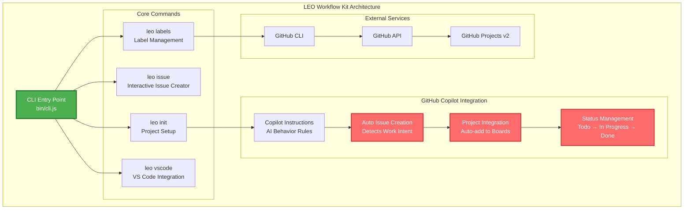
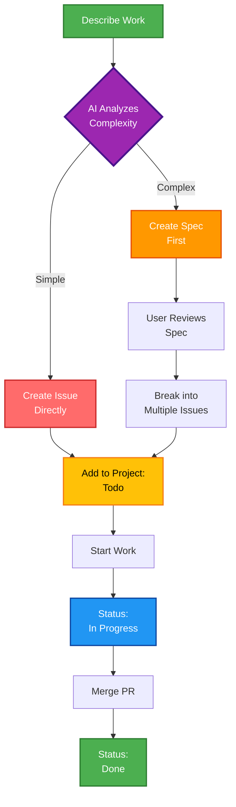

<div align="center">

# 🦁 LEO Workflow Kit

### **Complete GitHub Workflow Automation with Intelligent Project Management**

[](https://www.npmjs.com/package/leo-workflow-kit)
[](https://opensource.org/licenses/MIT)
[](https://nodejs.org)
[](https://github.com/leonpagotto/leo-kit/stargazers)
[](https://github.com/leonpagotto/leo-kit/issues)
[](CONTRIBUTING.md)

**Transform your development process with AI-powered spec-first development, intelligent issue creation, automated GitHub Projects integration, and zero-configuration workflow automation—all from your terminal.**

✨ **New in v2.4.0:** Intelligent spec-first decision making! Copilot automatically creates specs for complex features or goes straight to issues for simple tasks.

[🚀 Quick Start](#-quick-start) • [📦 Installation](#-installation) • [✨ Features](#-features) • [🎯 Commands](#-commands) • [📚 Documentation](#-documentation)

---

</div>

## 🌟 What is LEO Workflow Kit?

**LEO Workflow Kit** is a powerful CLI tool that revolutionizes how you manage software development projects. It combines **spec-driven development methodology**, **automated GitHub Projects integration**, **component-first best practices**, **SEO optimization**, and **intelligent workflow automation** into a single, easy-to-use command-line interface.

### Why LEO?

- **� Intelligent Spec-First AI**: Copilot decides when to create specs vs direct issues based on complexity
- **📝 Automatic Spec Creation**: Complex features get structured specs for review before implementation
- **🤖 Smart Issue Generation**: Simple tasks go straight to issues; complex features break into multiple focused issues
- **📊 Intelligent Status Management**: Issues automatically update status based on your work (Todo → In Progress → Done)
- **🔄 GitHub Projects Integration**: Auto-add issues to project boards with real-time status synchronization
- **🎯 True Spec-Driven Development**: Large features require planning; small tasks move fast
- **🧩 Component-First Architecture**: Built-in best practices for creating reusable, maintainable components
- **⚡ Performance Optimized**: Guidelines for lazy loading, code splitting, and Core Web Vitals
- **🔍 SEO Ready**: Comprehensive SEO optimization practices baked into development workflow
- **📋 Professional Templates**: 8 comprehensive issue templates covering every development scenario
- **🏷️ Smart Label Management**: Auto-configure 22+ standardized GitHub labels
- **🎨 VS Code Integration**: Built-in Copilot instructions for consistent workflow enforcement
- **⏱️ Lightning Fast**: Set up complete workflow in 30-45 minutes vs 2-4 hours manually
- **🔧 Zero Configuration**: Works out-of-the-box with sensible defaults
- **🌍 Universal**: Compatible with personal repos and organization projects

---

## � Architecture & Workflow

### System Architecture



> **View Full Architecture:** See [`diagrams/architecture.mmd`](./diagrams/architecture.mmd) for the complete system architecture with all components and data flows.

### Intelligent Workflow with Spec-First Decision Making



> **View Full Workflow:** See [`diagrams/workflow.mmd`](./diagrams/workflow.mmd) for the complete development workflow including spec creation and CI/CD pipeline.

**Key Points:**

- � **AI decides:** Spec first for complex features, direct issues for simple tasks
- 📝 **Spec creation:** Complex work gets structured planning document
- � **User review:** Approve specs before implementation begins
- 🔄 **Smart breakdown:** Approved specs become multiple focused issues
- 📊 **Auto-tracking:** All issues sync with GitHub Projects
- ✅ **Zero overhead:** Right process for the right complexity

**Examples:**

**Simple (Direct Issue):**

```
You: "Fix the login button on mobile"
→ Copilot: Creates issue #42 immediately
→ Added to project board (Todo)
→ Ready to work!
```

**Complex (Spec First):**

```
You: "Add OAuth2 authentication system"
→ Copilot: Creates docs/specs/oauth2-auth.md
→ You: Review and approve the spec
→ Copilot: Creates 5 focused issues (#43-#47)
→ All added to project board (Todo)
→ Team can start on different parts!
```

---

## �🚀 Quick Start

Get started in 3 simple steps:

```bash
# 1. Install globally
npm install -g leo-workflow-kit

# 2. Navigate to your project
cd your-project

# 3. Initialize LEO workflow
leo init
```

That's it! Your project now has:

- ✅ Documentation structure (`docs/` with organized folders)
- ✅ 8 professional issue templates
- ✅ 22+ GitHub labels (priorities, types, statuses)
- ✅ VS Code configuration with Copilot instructions
- ✅ Spec-driven development workflow

---

## 📦 Installation

### Quick Install (Recommended)

**Automatic Setup - One Command:**

```bash
LEO_AUTO_INIT=true npm install leo-workflow-kit
```

This installs LEO and automatically initializes your project with:

- ✅ Documentation structure (`docs/specs/`)
- ✅ Issue templates (8 professional templates)
- ✅ GitHub Actions workflows
- ✅ VS Code configuration with Copilot instructions
- ✅ Standard labels (22+ configured)

🎯 **Perfect for:** New projects, CI/CD, team onboarding

**Manual Setup - Traditional Way:**

```bash
npm install leo-workflow-kit
npx leo init
```

🎯 **Perfect for:** Custom configuration, first-time users, manual control

[📖 Learn more about automatic initialization](./docs/guides/AUTO_INITIALIZATION.md)

---

### Global Installation

```bash
npm install -g leo-workflow-kit
leo --version
leo init
```

### Local Installation (Project-Specific)

```bash
npm install --save-dev leo-workflow-kit
npx leo init
```

### From Source

```bash
git clone https://github.com/leonpagotto/leo-kit.git
cd leo-kit
npm install
npm link
leo init
```

### Requirements

- **Node.js** 16.0.0 or higher
- **GitHub CLI** (`gh`) - [Install here](https://cli.github.com/)
- **Git** - Already have it? Great!

### Configuration Options

**Environment Variables:**

| Variable          | Purpose                    | Default  |
| ----------------- | -------------------------- | -------- |
| `LEO_AUTO_INIT`   | Auto-initialize on install | `false`  |
| `LEO_POSTINSTALL` | Internal postinstall flag  | Auto-set |

**Examples:**

```bash
# Auto-initialize with npm
LEO_AUTO_INIT=true npm install leo-workflow-kit

# Configure in .npmrc
echo "LEO_AUTO_INIT=true" >> .npmrc
npm install leo-workflow-kit

# Use in CI/CD (GitHub Actions)
env:
  LEO_AUTO_INIT: true
run: npm install
```

---

## ✨ Features

### 🎯 Spec-Driven Development

Enforce a proven methodology where every feature, bug fix, or task starts with a well-defined specification.

### 🧩 Component-First Development

Built-in best practices for creating reusable, maintainable components:

- **Atomic Design Hierarchy**: Organized component structure (atoms, molecules, organisms)
- **DRY Principle**: Guidelines to eliminate code duplication
- **Composition Patterns**: Best practices for component composition and reusability
- **Smart Abstraction**: Know when to extract components vs. keeping them local
- **TypeScript-Ready**: Type-safe component patterns and prop definitions

### ⚡ Performance Optimization

Comprehensive performance guidelines built into the workflow:

- **Lazy Loading**: Route-based and component-based code splitting
- **Image Optimization**: WebP format, responsive images, lazy loading strategies
- **Bundle Optimization**: Tree shaking, code splitting, and vendor chunk strategies
- **Core Web Vitals**: Guidelines for LCP, FID, and CLS optimization
- **Resource Hints**: Preconnect, prefetch, and preload patterns
- **Critical CSS**: Above-the-fold optimization strategies

### 🔍 SEO Optimization

SEO best practices integrated into development:

- **Semantic HTML**: Proper HTML5 structure and accessibility
- **Meta Tags**: Comprehensive Open Graph, Twitter Cards, and meta data
- **Structured Data**: Schema.org implementation guidelines
- **URL Structure**: SEO-friendly URL patterns
- **Sitemap & Robots**: Automated sitemap generation and robots.txt
- **Image SEO**: Alt text, lazy loading, and responsive image best practices

### 📋 8 Professional Issue Templates

| Template           | Use Case                                               |
| ------------------ | ------------------------------------------------------ |
| 🐛 Bug Report      | Report and track bugs with environment details         |
| ✨ Feature Request | New features with user stories and acceptance criteria |
| 📚 Documentation   | Documentation improvements and guides                  |
| 🚀 Deployment      | Deployment tasks with checklists and rollback plans    |
| 🔗 Integration     | Third-party integrations and API connections           |
| ♻️ Refactoring     | Code improvements and technical debt                   |
| 🧪 Testing         | Test suite expansion and coverage goals                |
| 🔬 Research Spike  | Time-boxed investigation tasks                         |

### 🏷️ 22+ Intelligent Labels

Auto-configured across 4 categories:

- **Priority**: P0 (Critical) → P3 (Low)
- **Type**: bug, enhancement, documentation, deployment, etc.
- **Status**: blocked, in-progress, needs-review, etc.
- **Component**: frontend, backend, database, devops, design

### 🤖 GitHub Integration

- **Flexible Project Setup**: Create new or connect to existing GitHub Projects
- **Automated Board Configuration**: Pre-configured columns and custom fields
- **CLI-based Issue Creation**: Quick issue creation with templates
- **Bulk Label Management**: Smart label configuration and cleanup
- **Smart Repo Detection**: Automatic personal/org repository handling

### 🎨 VS Code Copilot Integration

- Global or project-specific installation
- Workflow enforcement via Copilot instructions
- Component-first development guidelines
- Performance and SEO best practices
- Recommended settings and extensions

---

## 🎯 Commands

### `leo init` - Initialize Workflow

Initialize LEO workflow in your project with flexible GitHub Project setup:

```bash
# Interactive mode - choose to create new project or use existing
leo init

# Use existing project (by number) - skip prompts
leo init --project 123

# Skip project setup entirely - no prompts
leo init --skip-project

# Full command options
leo init [options]
  -o, --org <organization>    GitHub organization name (optional for personal repos)
  -p, --project <number>      GitHub project number (skips interactive prompt)
  --skip-project              Skip project setup entirely
  --skip-labels               Skip label configuration
  --skip-vscode               Skip VS Code configuration
```

#### **📋 Interactive Project Setup Flow**

When you run `leo init` without the `--project` or `--skip-project` flags, you'll see:

```bash
$ leo init

🦁 Initializing LEO Workflow Kit 🦁

✓ Prerequisites check passed
Repository: yourusername/your-repo

? GitHub Project setup: (Use arrow keys)
❯ 📋 Use existing GitHub Project (enter project number)
  ✨ Create new GitHub Project
  ⏭️  Skip project setup (I'll do it later)
```

**Option 1: Use Existing GitHub Project**

```bash
? GitHub Project setup: 📋 Use existing GitHub Project (enter project number)
? Enter GitHub Project number: 42

✓ Added to GitHub Project #42
```

**Option 2: Create New GitHub Project**

```bash
? GitHub Project setup: ✨ Create new GitHub Project
? Enter new project name: My Awesome Project
? Enter project description (optional): Building with LEO best practices

✓ Created GitHub Project #45: My Awesome Project
  View at: https://github.com/users/yourusername/projects/45
```

**Option 3: Skip for Now**

```bash
? GitHub Project setup: ⏭️  Skip project setup (I'll do it later)

✓ Documentation structure created
✓ 8 issue templates installed
✓ 22+ GitHub labels configured
✓ VS Code configured

(You can run `leo init` again later to add a project)
```

#### **✅ What Gets Installed**

The tool automatically configures your project with:

- ✅ **Documentation structure** with `docs/specs/` folder for specifications
- ✅ **8 professional issue templates** (bug, feature, docs, deployment, integration, refactoring, testing, research)
- ✅ **22+ GitHub labels** (P0-P3 priorities, type labels, status labels, component labels)
- ✅ **VS Code configuration** with settings.json and recommended extensions
- ✅ **Copilot instructions** (2000+ lines of best practices for component-first development, performance, SEO)
- ✅ **GitHub Project** (if creating new: pre-configured columns and custom fields)

#### **🎯 Quick Start Examples**

```bash
# For new projects - create everything from scratch
cd my-new-project
git init
gh repo create my-new-project --public --source=. --push
leo init
# → Choose "Create new GitHub Project"

# For existing projects with a project already set up
cd existing-project
leo init --project 42
# → Skips prompts, connects to project #42

# Just want the workflow files, no GitHub Project
cd another-project
leo init --skip-project
# → No project prompts, just creates files
```

### `leo issue` (alias: `leo i`) - Create Issue

```bash
leo issue
leo issue -t bug -T "Fix login error" -p P1
```

### `leo labels` (alias: `leo l`) - Manage Labels

```bash
leo labels
leo labels --clean
```

### `leo vscode` (alias: `leo vs`) - VS Code Setup

```bash
leo vscode --global
leo vscode --project
```

### `leo status` (alias: `leo s`) - Check Status

```bash
leo status
```

### `leo docs` - Open Documentation

```bash
leo docs
```

---

## 📚 Documentation

### Workflow Philosophy

1. **📝 Spec First**: Create detailed issue before coding
2. **💬 Discussion**: Review and refine requirements
3. **✅ Approval**: Get stakeholder sign-off
4. **💻 Develop**: Write code with clear objectives
5. **🔗 Reference**: Link commits and PRs to issues
6. **✔️ Verify**: Check acceptance criteria

### Best Practices

**Commit Messages:**

```bash
git commit -m "feat: add dark mode (#42)"
git commit -m "fix: resolve login bug (#23)"
```

**Pull Requests:**

- Reference issue: "Closes #42" or "Fixes #23"
- Include screenshots for UI changes
- List breaking changes

### Built-in Development Best Practices

LEO Workflow Kit includes comprehensive Copilot instructions that enforce best practices:

#### Component-First Development

- **Atomic Design**: Organize components into atoms, molecules, organisms, templates, and pages
- **Single Responsibility**: Each component does one thing well
- **Reusability**: Build once, use everywhere - no code duplication
- **Composition**: Combine simple components to create complex UIs
- **Smart Extraction**: Guidelines on when to extract vs. keep components local

#### Code Quality Standards

- **DRY Principle**: Extract repeated logic into hooks, utilities, or components
- **Type Safety**: TypeScript patterns for props, state, and API contracts
- **Error Handling**: Graceful error handling with user-friendly messages
- **Testing**: Unit, integration, and E2E testing strategies
- **Documentation**: JSDoc comments and inline guidance

#### Performance Optimization

- **Lazy Loading**: Route and component-based code splitting
- **Image Optimization**: WebP format, responsive images, lazy loading
- **Bundle Size**: Tree shaking, vendor chunk splitting, dynamic imports
- **Core Web Vitals**: LCP, FID, CLS optimization strategies
- **Caching**: Browser cache, service workers, CDN strategies
- **Debouncing/Throttling**: Optimize expensive operations

#### SEO Excellence

- **Semantic HTML**: Proper HTML5 structure for accessibility and SEO
- **Meta Tags**: Comprehensive Open Graph, Twitter Cards, meta descriptions
- **Structured Data**: Schema.org markup for rich snippets
- **Image SEO**: Alt text, dimensions, lazy loading best practices
- **URL Structure**: SEO-friendly, descriptive URLs
- **Performance**: Fast loading times for better rankings

#### Accessibility (WCAG 2.1 AA)

- **Color Contrast**: Proper contrast ratios for text and UI elements
- **Keyboard Navigation**: Full keyboard support (Tab, Enter, Escape, Arrow keys)
- **Screen Readers**: ARIA roles, labels, and meaningful alt text
- **Focus Indicators**: Visible focus states for interactive elements
- **Touch Targets**: Minimum 44x44px for mobile usability

---

## 🤝 Contributing

Contributions welcome!

```bash
gh repo fork leonpagotto/leo-kit --clone
cd leo-kit
git checkout -b feature/amazing-feature
# Make changes
git commit -m "feat: add amazing feature"
git push origin feature/amazing-feature
gh pr create
```

---

## 📈 Roadmap

### Version 2.0 (Current) ✅

- [x] Component-first development guidelines
- [x] Comprehensive SEO optimization practices
- [x] Performance optimization strategies
- [x] DRY principle enforcement
- [x] GitHub Project creation and management
- [x] Flexible project setup (new or existing)
- [x] Enhanced Copilot instructions

### Coming Soon

- [ ] Storybook integration for component documentation
- [ ] Performance monitoring and reporting
- [ ] Automated SEO audit tools
- [ ] Component library templates
- [ ] Design system scaffolding
- [ ] Multi-language support
- [ ] GitLab support
- [ ] Jira integration
- [ ] Analytics dashboard

### Version 1.x Completed ✅

- [x] Core CLI framework
- [x] GitHub integration
- [x] 8 Issue templates
- [x] Label management
- [x] VS Code Copilot integration
- [x] Beautiful branding

---

## 📊 Success Metrics

- **60-75%** reduction in setup time
- **90%+** consistency in issue creation
- **50%** fewer missed requirements
- **40%** faster team onboarding

---

## 🐛 Troubleshooting

```bash
# GitHub CLI auth
gh auth login

# Permissions
chmod +x bin/cli.js

# Labels already exist
leo labels --clean
```

---

## 📄 License

**MIT License** - Free to use, modify, and distribute.

---

## 📞 Support & Contact

- **Documentation**: [github.com/leonpagotto/leo-kit](https://github.com/leonpagotto/leo-kit)
- **Issues**: [github.com/leonpagotto/leo-kit/issues](https://github.com/leonpagotto/leo-kit/issues)
- **GitHub**: [@leonpagotto](https://github.com/leonpagotto)

---

<div align="center">

### Made with 🦁 by Leo Pagotto

**Star this repo** if LEO Workflow Kit helps your team! ⭐

[](https://github.com/leonpagotto/leo-kit/stargazers)

---

[⬆ Back to Top](#-leo-workflow-kit)

</div>
