<div align="center">


<h3>GitHub Workflow Automation with Multi-Agent AI Orchestration</h3>

<p><strong>Transform your development workflow with intelligent task routing, spec-first development, and automated GitHub Projects integration—all from your terminal.</strong></p>

[](https://www.npmjs.com/package/leo-workflow-kit)
[](https://opensource.org/licenses/MIT)
[](https://nodejs.org)
[](https://github.com/leonpagotto/leo-kit/stargazers)
[](https://github.com/leonpagotto/leo-kit/issues)
[](CONTRIBUTING.md)

[🚀 Quick Start](#-quick-start) • [📖 What is LEO?](#-what-is-leo-workflow-kit) • [✨ Features](#-core-features) • [🤖 Multi-Agent System](#-multi-agent-orchestration-system) • [📦 Installation](#-installation) • [🎯 Commands](#-command-reference)

---

### 🎉 Latest Release: **v4.0.0** - Multi-Agent Orchestration System

**Revolutionary AI-powered development with specialized domain experts**

🎛️ Intelligent task routing • 🎨 6 specialized AI agents • 🎯 Domain expertise • ⚡ Flexible configuration • 🔄 Multi-agent coordination

**[📋 View All Releases](#-release-history)** • **[📚 Read Full Release Notes](RELEASE_V4.0.0_SUMMARY.md)**

---

</div>

## 📖 What is LEO Workflow Kit?

**LEO Workflow Kit** is an intelligent CLI tool that revolutionizes software development workflow management. Born from real-world development challenges, LEO combines **multi-agent AI orchestration**, **spec-driven development**, **automated GitHub Projects integration**, and **intelligent workflow automation** into a single, powerful command-line interface.

### 🎯 The Problem We Solve

Modern development teams face common challenges:

- ⏰ **Time-consuming setup**: Hours spent configuring GitHub Projects, labels, and templates
- 🔀 **Inconsistent workflows**: Each developer follows different processes
- 📝 **Poor documentation**: Features built without proper planning
- 🤖 **Generic AI assistance**: One-size-fits-all AI that lacks domain expertise
- � **Manual tracking**: Constantly updating issue statuses and project boards

### 💡 The LEO Solution

LEO transforms these pain points into strengths:

| Challenge                | LEO Solution                               | Time Saved                        |
| ------------------------ | ------------------------------------------ | --------------------------------- |
| Manual GitHub setup      | One-command initialization                 | **2-4 hours → 5 minutes**         |
| Inconsistent AI guidance | Multi-agent orchestration with specialists | **60% faster development**        |
| Unclear requirements     | Spec-first decision making                 | **50% fewer missed requirements** |
| Manual status updates    | Automatic GitHub Projects sync             | **100% automated**                |
| Generic best practices   | Domain-specific expertise per agent        | **Higher code quality**           |

### 🌟 Why Teams Choose LEO

- **🤖 Multi-Agent Intelligence**: 6 specialized AI agents (Orchestrator, Frontend, Backend, DevOps, Testing, Documentation) provide expert guidance for every task
- **� Smart Task Routing**: Orchestrator analyzes your request and routes to the right specialist(s)
- **📋 Spec-First Methodology**: Complex features get structured planning; simple tasks move fast
- **⚡ Lightning Setup**: Complete workflow configuration in 5 minutes vs 2-4 hours manually
- **� Zero-Touch Automation**: Issues automatically sync with GitHub Projects, statuses update as you work
- **🎨 Best Practices Enforced**: Component-first architecture, performance optimization, SEO excellence—built into every agent
- **🔧 Flexibility**: Enable only the agents you need for your project type
- **🌍 Universal Compatibility**: Works with personal repos, organizations, and any project type

---

## 🏗️ System Architecture

### Multi-Agent Orchestration

LEO v4.0.0 introduces an intelligent orchestration system that routes tasks to specialized AI agents based on domain expertise:

```
┌─────────────────────────────────────────────┐
│         Your Development Request            │
└──────────────────┬──────────────────────────┘
                   │
                   ▼
       ┌───────────────────────┐
       │   🎛️ Orchestrator     │
       │   Analyzes & Routes   │
       └───────────┬───────────┘
                   │
       ┌───────────┴───────────────────────┐
       │                                   │
       ▼              ▼              ▼     ▼
┌──────────┐   ┌──────────┐   ┌──────────┐
│ 🎨 Frontend │   │ ⚙️ Backend │   │ 🚀 DevOps │
│ UI/UX Expert│   │ API Expert │   │ Infra Expert│
└──────────┘   └──────────┘   └──────────┘
       ▼              ▼
┌──────────┐   ┌────────────────┐
│ 🧪 Testing │   │ 📚 Documentation│
│ QA Expert │   │ Writer Expert  │
└──────────┘   └────────────────┘
```

**[📊 View Full Architecture Diagram](diagrams/architecture.mmd)**

### Complete System Architecture

<details>
<summary><b>Click to view detailed architecture diagram</b></summary>


</details>

**💡 Learn More:** See [diagrams/README.md](diagrams/README.md) for viewing options and diagram guidelines

---

## 🔄 Intelligent Workflow

### Spec-First Decision Making with Multi-Agent Coordination

LEO intelligently decides when to create specifications vs direct issues, then routes work to the appropriate specialized agents:

```mermaid
graph TB
    START([👤 User Describes Work])

    START --> ORCHESTRATOR[🎛️ Orchestrator Analyzes]
    ORCHESTRATOR --> CLASSIFY{Classify Task}

    CLASSIFY -->|Frontend| ROUTE_FE[🎨 Route to Frontend Agent]
    CLASSIFY -->|Backend| ROUTE_BE[⚙️ Route to Backend Agent]
    CLASSIFY -->|Complex| ROUTE_MULTI[🔄 Multi-Agent Coordination]

    ROUTE_FE --> COMPLEXITY{Estimate Complexity}
    ROUTE_BE --> COMPLEXITY
    ROUTE_MULTI --> COMPLEXITY

    COMPLEXITY -->|< 1 day| SIMPLE[Direct Issue Creation]
    COMPLEXITY -->|> 1 week| COMPLEX[📝 Create Spec File]

    COMPLEX --> REVIEW{User Approves Spec?}
    REVIEW -->|✅ Yes| BREAKDOWN[Break into Multiple Issues]
    REVIEW -->|❌ No| COMPLEX

    BREAKDOWN --> CREATE_ISSUE[Create GitHub Issue]
    SIMPLE --> CREATE_ISSUE

    CREATE_ISSUE --> CHECK_CONFIG{auto-resolve enabled?}
    CHECK_CONFIG -->|✅ Yes| AUTO_START[🚀 Auto-Start Work]
    CHECK_CONFIG -->|❌ No| WAIT[⏸️ Wait for Review]

    AUTO_START --> IMPLEMENT[Agent Implements Solution]
    WAIT --> USER_OK{User Approves?}
    USER_OK -->|✅| IMPLEMENT

    IMPLEMENT --> STATUS[📊 Status: In Progress]
    STATUS --> PR[Create Pull Request]
    PR --> MERGE[Merge & Auto-Close]
    MERGE --> DONE[✅ Status: Done]

    style START fill:#4CAF50,stroke:#2E7D32,stroke-width:2px,color:#fff
    style ORCHESTRATOR fill:#E91E63,stroke:#880E4F,stroke-width:3px,color:#fff
    style ROUTE_FE fill:#00BCD4,stroke:#006064,stroke-width:2px,color:#fff
    style ROUTE_BE fill:#00BCD4,stroke:#006064,stroke-width:2px,color:#fff
    style ROUTE_MULTI fill:#FF9800,stroke:#E65100,stroke-width:2px,color:#fff
    style COMPLEX fill:#FF9800,stroke:#E65100,stroke-width:2px,color:#fff
    style AUTO_START fill:#4CAF50,stroke:#2E7D32,stroke-width:2px,color:#fff
    style DONE fill:#4CAF50,stroke:#2E7D32,stroke-width:2px,color:#fff
```



**[🔄 View Complete Workflow Diagram](diagrams/workflow.mmd)**

### Workflow Benefits

| Stage                        | Benefit                              | Impact                          |
| ---------------------------- | ------------------------------------ | ------------------------------- |
| **Request Analysis**         | Orchestrator understands intent      | Routes to right expert(s)       |
| **Task Classification**      | Smart complexity estimation          | Right process for right task    |
| **Spec Creation**            | Structured planning for complex work | 50% fewer missed requirements   |
| **Multi-Agent Coordination** | Specialists collaborate              | Higher quality, faster delivery |
| **Auto-Resolution**          | Optional immediate work start        | 60% faster simple tasks         |
| **Status Automation**        | Zero-touch GitHub Projects sync      | 100% tracking accuracy          |

**💡 Key Insight:** Simple tasks (< 1 day) go straight to issues. Complex features (> 1 week) get specs for planning and approval before breaking into focused issues.

---

## 🚀 Quick Start

Get your entire workflow up and running in **5 minutes**:

```bash
# Step 1: Install LEO globally
npm install -g leo-workflow-kit

# Step 2: Navigate to your project
cd your-project

# Step 3: Initialize the complete workflow
leo init
```

**That's it!** 🎉 Your project now has:

✅ **Documentation structure** (`docs/specs/` for planning)
✅ **8 professional issue templates** (bug, feature, docs, deployment, etc.)
✅ **22+ GitHub labels** (priorities, types, statuses, components)
✅ **Multi-agent AI instructions** (specialized domain experts)
✅ **VS Code configuration** (optimized settings + extensions)
✅ **GitHub Projects integration** (automated tracking)
✅ **Spec-first workflow** (intelligent complexity detection)

### What Happens Next?

1. **Create your first issue:**

   ```bash
   leo issue
   ```

   Choose from 8 templates, LEO creates the GitHub issue automatically

2. **Let AI analyze complexity:**

   - **Simple task?** → Direct issue creation, ready to work
   - **Complex feature?** → Spec file created for review first

3. **Enable agents you need:**

   ```bash
   leo agent enable frontend backend testing
   ```

4. **Work naturally:**
   - Make commits → Statuses auto-update
   - Merge PRs → Issues auto-close
   - Zero manual tracking! 🎯

---

## ✨ Core Features

### 🤖 Multi-Agent AI Orchestration

**6 specialized AI agents** provide expert guidance for every aspect of development:

| Agent                | Expertise                                 | Instruction Size | Use Cases                                |
| -------------------- | ----------------------------------------- | ---------------- | ---------------------------------------- |
| 🎛️ **Orchestrator**  | Task routing & coordination               | ~15KB            | All requests (always active)             |
| 🎨 **Frontend**      | UI/UX, components, styling, accessibility | ~17KB            | React components, CSS, responsive design |
| ⚙️ **Backend**       | APIs, databases, auth, security           | ~16KB            | REST APIs, GraphQL, authentication       |
| 🚀 **DevOps**        | CI/CD, Docker, infrastructure             | ~14KB            | Deployments, containers, monitoring      |
| 🧪 **Testing**       | Unit/integration/E2E tests, TDD           | ~15KB            | Test suites, mocks, coverage             |
| 📚 **Documentation** | README, API docs, guides                  | ~13KB            | Markdown docs, JSDoc, tutorials          |

**Benefits:**

- ✅ **Domain Expertise** - Specialists produce higher quality code
- ✅ **Faster Responses** - Smaller, focused instruction sets
- ✅ **Flexible** - Enable only what you need
- ✅ **Coordinated** - Complex tasks automatically handled by multiple agents

**[📖 Read Multi-Agent System Guide](docs/guides/multi-agent-system.md)**

---

### 📋 Spec-First Development Methodology

Intelligent decision making for the right workflow at the right time:

#### For Simple Tasks (< 1 day)

```
You: "Fix the login button on mobile"
↓
🎛️ Orchestrator → 🎨 Frontend Agent
↓
✅ Issue #42 created instantly
📋 Added to project board (Todo)
🚀 Ready to implement!
```

#### For Complex Features (> 1 week)

```
You: "Add OAuth2 authentication with Google and GitHub"
↓
🎛️ Orchestrator → ⚙️ Backend + 🎨 Frontend (multi-agent)
↓
📝 Spec created: docs/specs/oauth2-auth.md
   - Problem statement
   - Solution architecture
   - Technical details
   - Acceptance criteria
   - Timeline & risks
↓
👤 You review and approve
↓
✅ 5 focused issues created (#43-#47)
   #43: Backend OAuth2 provider setup
   #44: API endpoints for auth flow
   #45: Frontend login button UI
   #46: Session management
   #47: E2E authentication tests
↓
🚀 Team can work in parallel!
```

**Key Benefits:**

- 🎯 **Right Process**: Complexity-based workflow selection
- 📊 **Better Planning**: Structured specs for complex work
- ⚡ **Fast Execution**: Simple tasks skip overhead
- 👥 **Team Coordination**: Multi-issue breakdown enables parallel work

---

### 🎨 Best Practices Enforcement

Every agent comes with battle-tested best practices built-in:

#### Component-First Development (Frontend Agent)

- **Atomic Design**: Organized hierarchy (atoms → molecules → organisms → templates → pages)
- **DRY Principle**: Extract repeated patterns into reusable components
- **Smart Composition**: Build complex UIs from simple building blocks
- **Type Safety**: TypeScript patterns for props and state

#### Performance Optimization (Frontend Agent)

- **Lazy Loading**: Route and component-based code splitting
- **Image Optimization**: WebP format, responsive images, lazy loading
- **Core Web Vitals**: LCP, FID, CLS optimization strategies
- **Bundle Optimization**: Tree shaking, vendor chunks, dynamic imports

#### API Best Practices (Backend Agent)

- **RESTful Design**: Proper HTTP methods, status codes, error handling
- **Security First**: Input validation, SQL injection prevention, rate limiting
- **Database Optimization**: Query performance, indexing strategies, connection pooling
- **Authentication**: OAuth2, JWT, session management patterns

#### Accessibility (Frontend Agent)

- **WCAG 2.1 AA Compliance**: Color contrast, keyboard navigation, screen readers
- **Semantic HTML**: Proper HTML5 structure for all users
- **ARIA Labels**: Meaningful labels for assistive technologies
- **Touch Targets**: Mobile-friendly interaction areas (44x44px minimum)

#### SEO Excellence (Frontend Agent)

- **Meta Tags**: Open Graph, Twitter Cards, descriptions
- **Structured Data**: Schema.org markup for rich snippets
- **Semantic HTML**: Proper heading hierarchy, alt text
- **Performance**: Fast loading for better rankings

---

### 🔄 Zero-Touch Automation

Work naturally, let LEO handle the tracking:

| Your Action                | LEO's Automatic Response               |
| -------------------------- | -------------------------------------- |
| Describe work to AI        | Issue created + added to project board |
| Make first commit          | Status → "In Progress"                 |
| Create pull request        | Links to issue automatically           |
| Merge PR                   | Status → "Done", issue auto-closes     |
| Add "Closes #42" in commit | Issue linked and will close on merge   |

**Configuration Options:**

```bash
# Auto-work on created issues (default - fast workflow)
leo config set auto-resolve true

# Wait for review before working (team workflow)
leo config set auto-resolve false
```

---

### 📦 Professional Templates & Labels

#### 8 Issue Templates

Every development scenario covered:

| Template               | When to Use                             | Key Fields                                                |
| ---------------------- | --------------------------------------- | --------------------------------------------------------- |
| 🐛 **Bug Report**      | Production issues, broken functionality | Steps to reproduce, expected/actual behavior, environment |
| ✨ **Feature Request** | New capabilities, enhancements          | User story, acceptance criteria, mockups                  |
| 📚 **Documentation**   | Guides, README updates, API docs        | What needs documenting, target audience                   |
| 🚀 **Deployment**      | Release tasks, environment setup        | Deployment steps, rollback plan, checklist                |
| 🔗 **Integration**     | Third-party APIs, external services     | Service details, auth requirements, endpoints             |
| ♻️ **Refactoring**     | Code quality, technical debt            | Current problems, proposed solution, breaking changes     |
| 🧪 **Testing**         | Test coverage, QA automation            | Test scope, coverage goals, testing strategy              |
| 🔬 **Research Spike**  | Time-boxed investigation                | Research questions, time box, success criteria            |

#### 22+ Smart Labels

Auto-configured in 4 categories:

**Priority Labels:**

- 🔴 `P0-critical` - Production down, security issues
- 🟠 `P1-high` - Major features, important bugs
- 🟡 `P2-medium` - Standard features, minor bugs
- 🟢 `P3-low` - Nice-to-haves, documentation

**Type Labels:**

- `bug`, `enhancement`, `documentation`, `deployment`, `integration`, `refactoring`, `testing`, `research`

**Status Labels:**

- `blocked`, `in-progress`, `needs-review`, `needs-testing`, `ready-to-deploy`

**Component Labels:**

- `frontend`, `backend`, `database`, `devops`, `design`, `security`

---

### 🛠️ Multi-AI Assistant Support

Choose your preferred AI coding assistant(s):

| AI Assistant       | Best For                                | Pricing    | File Generated                    |
| ------------------ | --------------------------------------- | ---------- | --------------------------------- |
| **GitHub Copilot** | General completion, GitHub integration  | $10/mo     | `.github/copilot-instructions.md` |
| **Cursor**         | Complex refactoring, Claude-powered IDE | $20/mo     | `.cursorrules`                    |
| **Cline**          | Autonomous tasks, multi-file changes    | Free + API | `.clinerules`                     |
| **Codeium**        | Free alternative, 70+ languages         | Free       | `.codeium/instructions.md`        |

**Configure during init or manage later:**

```bash
# Add new AI assistant
leo ai add cursor

# List configured assistants
leo ai list

# Remove assistant
leo ai remove cursor

# Regenerate all instruction files
leo ai sync
```

**[📖 Read Multi-AI Support Guide](docs/MIGRATION_V3.md)**

---

## 📦 Installation

### Quick Install (Recommended)

```bash
npm install -g leo-workflow-kit
```

**Requirements:**

- Node.js 16.0.0 or higher
- GitHub CLI (`gh`) - [Install here](https://cli.github.com/)
- Git (you already have this!)

### Installation Methods

<details>
<summary><b>Global Installation</b> (recommended for CLI use)</summary>

```bash
# Install globally
npm install -g leo-workflow-kit

# Verify installation
leo --version

# Start using
cd your-project
leo init
```

**Best for:** Daily CLI use, multiple projects

</details>

<details>
<summary><b>Project-Specific Installation</b></summary>

```bash
# Install in project
npm install --save-dev leo-workflow-kit

# Use with npx
npx leo init

# Or add to package.json scripts
{
  "scripts": {
    "leo": "leo"
  }
}

# Then run
npm run leo init
```

**Best for:** Project-specific workflows, CI/CD integration

</details>

<details>
<summary><b>Automatic Initialization</b> (for new projects)</summary>

```bash
# Auto-initialize on install
LEO_AUTO_INIT=true npm install leo-workflow-kit
```

This automatically runs `leo init` after installation:

- ✅ Creates documentation structure
- ✅ Installs issue templates
- ✅ Configures GitHub labels
- ✅ Sets up VS Code configuration
- ✅ Generates AI instructions

**Best for:** New projects, CI/CD pipelines, team onboarding

**[📖 Learn more about auto-initialization](docs/guides/AUTO_INITIALIZATION.md)**

</details>

<details>
<summary><b>From Source</b> (for contributors)</summary>

```bash
# Clone repository
git clone https://github.com/leonpagotto/leo-kit.git
cd leo-kit

# Install dependencies
npm install

# Link globally
npm link

# Start developing
leo init
```

**Best for:** Contributing, customization, debugging

</details>

### Verify Installation

```bash
# Check version
leo --version

# View available commands
leo --help

# Check system health
leo health
```

---

## � Command Reference

### Core Commands

| Command      | Alias     | Description                                  | Quick Example      |
| ------------ | --------- | -------------------------------------------- | ------------------ |
| `leo init`   | -         | Initialize LEO workflow                      | `leo init`         |
| `leo issue`  | `leo i`   | Create GitHub issue from templates           | `leo issue`        |
| `leo agent`  | -         | Manage specialized AI agents                 | `leo agent list`   |
| `leo ai`     | -         | Manage AI assistants (Copilot, Cursor, etc.) | `leo ai list`      |
| `leo github` | -         | Configure repository settings                | `leo github setup` |
| `leo config` | `leo cfg` | Manage configuration                         | `leo config list`  |
| `leo labels` | `leo l`   | Manage GitHub labels                         | `leo labels`       |
| `leo vscode` | `leo vs`  | Setup VS Code configuration                  | `leo vscode`       |
| `leo status` | `leo s`   | Check workflow status                        | `leo status`       |
| `leo health` | -         | System health check                          | `leo health`       |
| `leo docs`   | -         | Open documentation                           | `leo docs`         |

---

### `leo init` - Initialize Workflow

Setup complete LEO workflow in your project:

```bash
# Interactive mode (recommended)
leo init

# Use existing GitHub Project
leo init --project 123

# Skip GitHub Project setup
leo init --skip-project

# Full options
leo init [options]
  -o, --org <organization>    Organization name
  -p, --project <number>      Project number
  --skip-project              Skip project setup
  --skip-labels               Skip label configuration
  --skip-vscode               Skip VS Code setup
```

**What gets installed:**

- ✅ Documentation structure (`docs/specs/`)
- ✅ 8 professional issue templates
- ✅ 22+ GitHub labels
- ✅ Multi-agent AI instructions
- ✅ VS Code configuration
- ✅ GitHub Projects integration

<details>
<summary><b>Interactive Project Setup</b></summary>

When you run `leo init`, you'll see three options:

**Option 1: Use Existing Project**

```bash
? GitHub Project setup: 📋 Use existing GitHub Project
? Enter GitHub Project number: 42
✓ Added to GitHub Project #42
```

**Option 2: Create New Project**

```bash
? GitHub Project setup: ✨ Create new GitHub Project
? Enter new project name: My Project
✓ Created GitHub Project #45
  View at: https://github.com/users/yourname/projects/45
```

**Option 3: Skip for Now**

```bash
? GitHub Project setup: ⏭️  Skip project setup
✓ Setup complete (run `leo init` again later to add project)
```

</details>

---

### `leo issue` (alias: `leo i`) - Create Issues

Interactive issue creation with professional templates:

```bash
# Interactive mode
leo issue

# Quick issue creation
leo issue -t bug -T "Fix login error" -p P1

# Options
leo issue [options]
  -t, --type <type>        Issue type (bug, feature, docs, etc.)
  -T, --title <title>      Issue title
  -p, --priority <priority> Priority (P0-P3)
  -l, --label <label>      Additional labels
```

**Available Templates:**

- 🐛 Bug Report
- ✨ Feature Request
- 📚 Documentation
- 🚀 Deployment
- 🔗 Integration
- ♻️ Refactoring
- 🧪 Testing
- 🔬 Research Spike

---

### `leo agent` - Manage Specialized Agents

Control multi-agent orchestration system:

```bash
# List all agents with status
leo agent list
leo agent ls

# Enable agents
leo agent enable frontend
leo agent enable backend testing

# Disable agents
leo agent disable devops

# Show agent details
leo agent info frontend

# Regenerate AI instruction files
leo agent sync
```

**Available Agents:**

| Agent            | Domain            | Triggers                 | Instruction Size |
| ---------------- | ----------------- | ------------------------ | ---------------- |
| 🎛️ Orchestrator  | Routing           | All tasks                | ~15KB            |
| 🎨 Frontend      | UI/UX             | component, UI, style     | ~17KB            |
| ⚙️ Backend       | APIs              | API, endpoint, database  | ~16KB            |
| 🚀 DevOps        | Infrastructure    | deploy, Docker, pipeline | ~14KB            |
| 🧪 Testing       | QA                | test, spec, coverage     | ~15KB            |
| 📚 Documentation | Technical Writing | docs, README, guide      | ~13KB            |

**[📖 Full Multi-Agent Guide](docs/guides/multi-agent-system.md)**

---

### `leo ai` - Manage AI Assistants

Configure multiple AI coding assistants:

```bash
# List configured assistants
leo ai list
leo ai ls

# Add AI assistant
leo ai add cursor
leo ai add cline
leo ai add codeium

# Remove AI assistant
leo ai remove cursor
leo ai rm cursor

# Regenerate all AI files
leo ai sync
```

**Supported AI Assistants:**

| AI          | File Generated                    | Best For            | Pricing    |
| ----------- | --------------------------------- | ------------------- | ---------- |
| **Copilot** | `.github/copilot-instructions.md` | General completion  | $10/mo     |
| **Cursor**  | `.cursorrules`                    | Complex refactoring | $20/mo     |
| **Cline**   | `.clinerules`                     | Autonomous tasks    | Free + API |
| **Codeium** | `.codeium/instructions.md`        | Free alternative    | Free       |

---

### `leo github` - Configure Repository

Setup GitHub repository with recommended settings:

```bash
# Show current settings
leo github status

# Interactive setup
leo github setup

# Auto-confirm all changes
leo github setup --yes
```

**Recommended Settings:**

- ✅ Issues enabled
- ✅ Projects enabled
- ✅ Wiki enabled
- ✅ Discussions enabled
- ✅ Delete branch on merge
- ✅ All merge types

---

### `leo config` (alias: `leo cfg`) - Configuration

Manage LEO configuration:

```bash
# List all settings
leo config list

# Set configuration value
leo config set auto-resolve false
leo config set project-type fullstack

# Get specific value
leo config get auto-resolve

# Initialize config file
leo config init

# Set global defaults
leo config set auto-resolve true --global
```

**Available Settings:**

| Key            | Default | Description                         |
| -------------- | ------- | ----------------------------------- |
| `auto-resolve` | `true`  | Auto-start work on created issues   |
| `auto-init`    | `false` | Auto-initialize on npm install      |
| `project-type` | `auto`  | Project type for agent optimization |

**Configuration Priority:** Local (`.leorc.json`) > Global (`~/.leorc.json`) > Default

---

### `leo labels` (alias: `leo l`) - Manage Labels

Configure GitHub labels:

```bash
# Install standard labels
leo labels

# Clean existing labels first
leo labels --clean
```

**Installs 22+ labels:**

- **Priority:** P0-critical, P1-high, P2-medium, P3-low
- **Type:** bug, enhancement, documentation, deployment, integration, refactoring, testing, research
- **Status:** blocked, in-progress, needs-review, needs-testing, ready-to-deploy
- **Component:** frontend, backend, database, devops, design, security

---

### `leo vscode` (alias: `leo vs`) - VS Code Setup

Configure VS Code with LEO workflow:

```bash
# Global configuration (user settings)
leo vscode --global

# Project configuration (.vscode folder)
leo vscode --project
leo vscode
```

**Installs:**

- Recommended extensions
- Workspace settings
- Code snippets (coming soon)

---

### `leo status` (alias: `leo s`) - Check Status

View workflow setup status:

```bash
leo status
```

Shows:

- ✅ Documentation structure
- ✅ Issue templates installed
- ✅ GitHub labels configured
- ✅ VS Code setup
- ✅ AI instructions generated
- ✅ GitHub Project connected

---

### `leo health` - System Health Check

Verify prerequisites and configuration:

```bash
leo health
```

Checks:

- ✅ Node.js version
- ✅ GitHub CLI installed
- ✅ GitHub authentication
- ✅ Git configuration
- ✅ LEO configuration

---

### `leo docs` - Open Documentation

Open LEO documentation in browser:

```bash
leo docs
```

---

## 📚 Best Practices & Guidelines

### Workflow Philosophy

Follow the LEO methodology for consistent, high-quality development:

1. **📝 Spec First**: Create detailed specification before coding (for complex features)
2. **💬 Discussion**: Review and refine requirements with team
3. **✅ Approval**: Get stakeholder sign-off on specs
4. **💻 Develop**: Write code with clear objectives and acceptance criteria
5. **🔗 Reference**: Link commits and PRs to issues (use `#issue-number`)
6. **✔️ Verify**: Check acceptance criteria before closing

---

### Commit Message Guidelines

**⚠️ CRITICAL: Keep commit messages under 72 characters!**

Long commit messages can cause pipeline delays and processing issues.

**✅ Good Examples:**

```bash
git commit -m "feat: add dark mode toggle (#42)"
git commit -m "fix: resolve login redirect bug (#23)"
git commit -m "docs: update API reference (#56)"
git commit -m "refactor: simplify auth flow (#78)"
```

**❌ Bad Examples (too long):**

```bash
# ❌ 92 characters - will cause issues
git commit -m "feat: add dark mode with automatic theme detection and user preferences (#42)"

# ❌ 115 characters - definitely problematic
git commit -m "fix: resolve the login redirect bug that was causing users to get stuck on the loading page after authentication (#23)"
```

**💡 Pro Tip:** Use commit body for details:

```bash
git commit -m "feat: add dark mode (#42)" -m "
- Implements automatic theme detection based on system preferences
- Adds user preference storage in localStorage
- Includes smooth transition animations
- Adds theme toggle button in header
"
```

**Commit Type Prefixes:**

- `feat:` - New feature
- `fix:` - Bug fix
- `docs:` - Documentation changes
- `style:` - Code style changes (formatting, no logic change)
- `refactor:` - Code refactoring
- `test:` - Adding or updating tests
- `chore:` - Maintenance tasks, dependencies

---

### Pull Request Best Practices

**Title Format:**

```
<type>: <brief description> (#issue-number)
```

**Description Template:**

```markdown
## Changes

Brief description of what changed and why.

## Related Issue

Closes #42

## Screenshots (for UI changes)

[Add before/after screenshots]

## Breaking Changes

- [ ] This PR includes breaking changes
- [ ] Documentation has been updated

## Testing

- [ ] Unit tests pass
- [ ] Manual testing completed
- [ ] No regressions found

## Checklist

- [ ] Code follows project style guidelines
- [ ] Self-reviewed the code
- [ ] Added/updated tests
- [ ] Added/updated documentation
- [ ] Commit messages follow guidelines
```

**Auto-Close Issues:**
Use these keywords in PR description or commit messages:

- `Closes #42`
- `Fixes #42`
- `Resolves #42`

---

### Code Quality Standards

#### Component-First Development (Frontend)

```javascript
// ✅ GOOD: Reusable, well-named component
const Button = ({ variant = "primary", size = "md", onClick, children }) => (
  <button
    className={`btn btn-${variant} btn-${size}`}
    onClick={onClick}
    aria-label={children}
  >
    {children}
  </button>
);

// ❌ BAD: Generic, non-reusable
const Div1 = ({ stuff }) => <div className="thing">{stuff}</div>;
```

#### DRY Principle

```javascript
// ✅ GOOD: Extract repeated logic
const UserCard = ({ user }) => (
  <div className="card">
    
    <h3>{user.name}</h3>
    <p>{user.bio}</p>
  </div>
);

// Use it multiple times
<UserCard user={user1} />
<UserCard user={user2} />

// ❌ BAD: Repeated code
<div className="card">
  
  <h3>{user1.name}</h3>
  <p>{user1.bio}</p>
</div>
<div className="card">
  
  <h3>{user2.name}</h3>
  <p>{user2.bio}</p>
</div>
```

#### Accessibility (WCAG 2.1 AA)

```jsx
// ✅ GOOD: Accessible button
<button
  onClick={handleClick}
  onKeyDown={(e) => e.key === 'Enter' && handleClick()}
  aria-label="Close dialog"
  aria-pressed={isPressed}
  tabIndex={0}
>
  Close
</button>

// ✅ GOOD: Accessible form
<form role="search">
  <label htmlFor="search-input">Search products</label>
  <input
    id="search-input"
    type="search"
    aria-describedby="search-hint"
    aria-required="true"
  />
  <span id="search-hint">Enter at least 3 characters</span>
</form>

// ✅ GOOD: Image with alt text

```

---

### Performance Optimization

#### Lazy Loading

```javascript
// ✅ GOOD: Lazy load routes
import { lazy, Suspense } from "react";

const Dashboard = lazy(() => import("./pages/Dashboard"));
const Settings = lazy(() => import("./pages/Settings"));

function App() {
  return (
    <Suspense fallback={<LoadingSpinner />}>
      <Routes>
        <Route path="/dashboard" element={<Dashboard />} />
        <Route path="/settings" element={<Settings />} />
      </Routes>
    </Suspense>
  );
}
```

#### Image Optimization

```jsx
// ✅ GOOD: Responsive images with lazy loading

```

---

### SEO Best Practices

```jsx
// ✅ GOOD: Comprehensive meta tags
<head>
  <title>Page Title - Max 60 characters</title>
  <meta name="description" content="150-160 char description" />

  {/* Open Graph */}
  <meta property="og:title" content="Page Title" />
  <meta property="og:description" content="Description" />
  <meta property="og:image" content="https://yoursite.com/image.jpg" />
  <meta property="og:url" content="https://yoursite.com/page" />

  {/* Twitter Card */}
  <meta name="twitter:card" content="summary_large_image" />
  <meta name="twitter:title" content="Page Title" />
  <meta name="twitter:description" content="Description" />

  {/* Canonical */}
  <link rel="canonical" href="https://yoursite.com/page" />
</head>

// ✅ GOOD: Semantic HTML
<article>
  <header>
    <h1>Main Title</h1>
  </header>
  <section>
    <h2>Section Heading</h2>
    <p>Content...</p>
  </section>
</article>
```

---

## 📈 Success Metrics & Impact

Teams using LEO Workflow Kit report significant improvements:

| Metric                  | Improvement                 | Impact                |
| ----------------------- | --------------------------- | --------------------- |
| **Setup Time**          | 2-4 hours → 5 minutes       | **60-75% reduction**  |
| **Issue Consistency**   | Varies → Standardized       | **90%+ consistency**  |
| **Missed Requirements** | Varies → Spec-first         | **50% fewer gaps**    |
| **Team Onboarding**     | Days → Hours                | **40% faster**        |
| **Code Quality**        | Varies → Agent-enforced     | **Measurably higher** |
| **Dev Velocity**        | Varies → Automated tracking | **30% faster**        |

---

## 🐛 Troubleshooting

### GitHub CLI Issues

```bash
# Not authenticated
gh auth login

# Check authentication status
gh auth status

# Refresh authentication
gh auth refresh
```

### Permission Issues

```bash
# Fix CLI permissions
chmod +x bin/cli.js

# Fix npm global permissions (macOS/Linux)
sudo chown -R $USER /usr/local/lib/node_modules
```

### Label Conflicts

```bash
# Clean existing labels before installing
leo labels --clean

# Then install LEO labels
leo labels
```

### Configuration Issues

```bash
# Reset to defaults
rm .leorc.json
leo config init

# Check configuration
leo config list

# Verify system health
leo health
```

### VS Code Copilot Issues

```bash
# Regenerate Copilot instructions
leo vscode --project

# Or for global
leo vscode --global

# Sync all AI files
leo ai sync
```

---

## 📋 Release History

### 🎉 v4.0.0 - Multi-Agent Orchestration System (Current)

**Released:** October 20, 2025

**🚀 Major Features:**

- ✨ **Multi-Agent Orchestration** - 6 specialized AI agents (Orchestrator, Frontend, Backend, DevOps, Testing, Documentation)
- 🎯 **Intelligent Task Routing** - Automatic classification and routing based on keywords, file patterns, and intent
- 🔄 **Multi-Agent Coordination** - Complex tasks automatically coordinated across multiple specialists
- 🛠️ **Agent Management** - `leo agent` command for enabling/disabling/syncing agents
- 🔧 **Repository Configuration** - `leo github` command for automated repository setup
- 📊 **Enhanced Diagrams** - Updated architecture and workflow diagrams with v4.0.0 features

**💡 Benefits:**

- **Higher Code Quality** - Domain specialists produce expert-level code
- **Faster Development** - Smaller, focused instruction sets (~13-17KB per agent)
- **Flexible Configuration** - Enable only the agents you need
- **Better Coordination** - Seamless multi-agent task handling

**📖 Documentation:**

- [Full Release Notes](RELEASE_V4.0.0_SUMMARY.md)
- [Multi-Agent System Guide](docs/guides/multi-agent-system.md)
- [Migration Guide from v3.x](docs/guides/multi-agent-system.md#migration-from-v3x)
- [Updated Architecture Diagrams](diagrams/)

---

### v3.0.3 - Enhanced AI Enforcement

**Released:** October 2025

**🔒 Improvements:**

- Fixed AI instruction file generation during `leo init`
- Added mandatory reading enforcement for all AI adapters
- Stronger language ensuring AI follows workflows from first message
- Better post-generation verification
- Enhanced deployment workflow documentation

---

### v3.0.0 - Multi-AI Support

**Released:** September 2025

**🤖 Major Features:**

- Support for 4 AI assistants: GitHub Copilot, Cursor, Cline, Codeium
- AI selection during `leo init` with interactive prompts
- AI-specific optimized instructions (~40KB per assistant)
- New `leo ai` command for managing assistants
- Backward compatible with v2.x Copilot setups

**📖 Documentation:**

- [Migration Guide from v2.x](docs/MIGRATION_V3.md)

---

### v2.6.0 - Configuration Management

**Released:** August 2025

**⚙️ Major Features:**

- New `leo config` command for managing workflow settings
- **auto-resolve** setting: Control whether AI auto-works on issues or waits for review
- Local (`.leorc.json`) and global (`~/.leorc.json`) configuration files
- Configuration priority system: Local > Global > Default
- Project-type detection for optimized AI instructions

---

### v2.5.0 - Template Optimization

**Released:** July 2025

**📝 Improvements:**

- Optimized issue template structure
- Enhanced Copilot instructions (component-first, performance, SEO)
- Improved spec-first decision making logic
- Better documentation organization
- Repository cleanup and code optimization

---

### v2.4.0 - Auto-Initialization

**Released:** June 2025

**🚀 Major Features:**

- Automatic initialization with `LEO_AUTO_INIT=true npm install`
- Post-install script for seamless setup
- First-run detection and welcome message
- Enhanced CI/CD integration support

**📖 Documentation:**

- [Auto-Initialization Guide](docs/guides/AUTO_INITIALIZATION.md)

---

### v2.0.0 - Best Practices Revolution

**Released:** May 2025

**✨ Major Features:**

- Component-first development guidelines (Atomic Design)
- Comprehensive SEO optimization practices
- Performance optimization strategies (lazy loading, code splitting)
- DRY principle enforcement
- Accessibility guidelines (WCAG 2.1 AA)
- Enhanced Copilot instructions (2000+ lines)

---

### v1.x - Foundation

**Released:** 2024

**🏗️ Core Features:**

- Core CLI framework
- GitHub integration with Projects v2
- 8 professional issue templates
- 22+ standardized labels
- VS Code Copilot integration
- Spec-driven development workflow
- Beautiful branding and banner

---

## 📊 Roadmap

### Planned for v4.1.0

- [ ] Custom agent templates and configurations
- [ ] Agent performance metrics and analytics
- [ ] Agent coordination visualization
- [ ] Enhanced multi-agent coordination patterns
- [ ] Agent-specific configuration overrides

### Planned for v5.0.0

- [ ] Storybook integration for component documentation
- [ ] Performance monitoring and reporting dashboard
- [ ] Automated SEO audit tools
- [ ] Component library templates
- [ ] Design system scaffolding
- [ ] Plugin system for custom agents

### Future Considerations

- [ ] Multi-language support (i18n)
- [ ] GitLab support
- [ ] Jira integration
- [ ] Bitbucket support
- [ ] Self-hosted version
- [ ] Team analytics dashboard
- [ ] Custom workflow templates

---

## 🤝 Contributing

We welcome contributions from the community! LEO Workflow Kit is open-source and thrives on collaboration.

### How to Contribute

```bash
# 1. Fork and clone the repository
gh repo fork leonpagotto/leo-kit --clone
cd leo-kit

# 2. Create a feature branch
git checkout -b feature/amazing-feature

# 3. Make your changes
# ... edit files ...

# 4. Test your changes
npm test
leo init  # Test in a sample project

# 5. Commit with conventional commits
git commit -m "feat: add amazing feature (#42)"

# 6. Push and create PR
git push origin feature/amazing-feature
gh pr create
```

### Contribution Guidelines

- **Follow Code Style**: Use existing patterns and conventions
- **Write Tests**: Add tests for new features
- **Update Docs**: Document new features and changes
- **Keep Commits Small**: One feature/fix per commit
- **Reference Issues**: Link commits to issues with `#issue-number`

### Development Setup

```bash
# Install dependencies
npm install

# Link for local testing
npm link

# Run in development mode
node bin/cli.js init

# Run tests (when available)
npm test
```

### Areas We Need Help

- 🐛 **Bug Fixes** - Help us squash bugs
- ✨ **New Features** - Implement roadmap items
- 📚 **Documentation** - Improve guides and examples
- 🌍 **Translations** - Multi-language support
- 🧪 **Testing** - Increase test coverage
- 🎨 **Design** - UI/UX improvements for CLI output

---

## 📄 License

**MIT License** - Free to use, modify, and distribute.

```
MIT License

Copyright (c) 2024-2025 Leo Pagotto

Permission is hereby granted, free of charge, to any person obtaining a copy
of this software and associated documentation files (the "Software"), to deal
in the Software without restriction, including without limitation the rights
to use, copy, modify, merge, publish, distribute, sublicense, and/or sell
copies of the Software, and to permit persons to whom the Software is
furnished to do so, subject to the following conditions:

The above copyright notice and this permission notice shall be included in all
copies or substantial portions of the Software.

THE SOFTWARE IS PROVIDED "AS IS", WITHOUT WARRANTY OF ANY KIND, EXPRESS OR
IMPLIED, INCLUDING BUT NOT LIMITED TO THE WARRANTIES OF MERCHANTABILITY,
FITNESS FOR A PARTICULAR PURPOSE AND NONINFRINGEMENT. IN NO EVENT SHALL THE
AUTHORS OR COPYRIGHT HOLDERS BE LIABLE FOR ANY CLAIM, DAMAGES OR OTHER
LIABILITY, WHETHER IN AN ACTION OF CONTRACT, TORT OR OTHERWISE, ARISING FROM,
OUT OF OR IN CONNECTION WITH THE SOFTWARE OR THE USE OR OTHER DEALINGS IN THE
SOFTWARE.
```

---

## 📞 Support & Community

### Get Help

- 📖 **Documentation**: [github.com/leonpagotto/leo-kit](https://github.com/leonpagotto/leo-kit)
- 🐛 **Report Issues**: [github.com/leonpagotto/leo-kit/issues](https://github.com/leonpagotto/leo-kit/issues)
- 💬 **Discussions**: [github.com/leonpagotto/leo-kit/discussions](https://github.com/leonpagotto/leo-kit/discussions)
- 📧 **Email**: Create an issue for support requests

### Quick Links

- 🦁 **GitHub**: [@leonpagotto](https://github.com/leonpagotto)
- 📦 **npm Package**: [leo-workflow-kit](https://www.npmjs.com/package/leo-workflow-kit)
- 🌟 **Star this repo**: [github.com/leonpagotto/leo-kit/stargazers](https://github.com/leonpagotto/leo-kit/stargazers)
- 🐛 **Report Bug**: [Create Issue](https://github.com/leonpagotto/leo-kit/issues/new?template=bug_report.md)
- ✨ **Request Feature**: [Create Issue](https://github.com/leonpagotto/leo-kit/issues/new?template=feature_request.md)

### Stay Updated

- ⭐ **Star the repo** to get notifications of new releases
- 👁️ **Watch the repo** for updates and discussions
- 📰 **Check Releases** for changelogs and migration guides

---

<div align="center">

## 🦁 Made with ❤️ by Leo Pagotto

**Star this repo if LEO Workflow Kit helps your team!** ⭐

[](https://github.com/leonpagotto/leo-kit/stargazers)
[](https://www.npmjs.com/package/leo-workflow-kit)

---

**Transform your workflow** • **Boost productivity** • **Build better software**

[🚀 Get Started](#-quick-start) • [📖 Read Docs](#-what-is-leo-workflow-kit) • [⭐ Star on GitHub](https://github.com/leonpagotto/leo-kit)

---

© 2024-2025 Leo Pagotto • MIT License • Built for developers, by developers

</div>
