<div align="center">


<h3>Intelligent GitHub Workflow Automation</h3>

**Transform your development workflow with AI-powered task routing, spec-first development, and automated GitHub Projects—all from your terminal.**

[](https://www.npmjs.com/package/leo-workflow-kit)
[](https://opensource.org/licenses/MIT)
[](https://nodejs.org)
[](https://github.com/leonpagotto/leo-kit)

[Quick Start](#-quick-start) • [Features](#-features) • [Documentation](../../wiki) • [Contributing](CONTRIBUTING.md)

---

### 🎉 **v5.2.0** - Phase 2 Complete: Spec-First Development System

✨ **Dual-Mode Tasks** • 📊 **Spec Evolution Tracking** • � **Spec Extensions** • 🤖 **GitHub-Native Specs** • 🎯 **Complete Workflow**

**[View Release Notes](CHANGELOG.md#520---2025-10-27)** • **[Full Documentation](../../wiki)**

---

</div>

## What is LEO?

**LEO Workflow Kit** is an intelligent CLI that automates your GitHub workflow. It combines multi-agent AI orchestration, spec-driven development, and seamless GitHub Projects integration into one powerful tool.

### 🆚 LEO vs GitHub Spec Kit

Many developers ask: _"How is LEO different from GitHub Spec Kit?"_ Here's the breakdown:

| Feature             | GitHub Spec Kit             | LEO Workflow Kit                      | Winner                  |
| ------------------- | --------------------------- | ------------------------------------- | ----------------------- |
| **Philosophy**      | Specs as Code               | Specs as Issues                       | _Different approaches_  |
| **Storage**         | Files (`specs/001/spec.md`) | GitHub Issues (#42, #80)              | **LEO** (simpler)       |
| **Create Spec**     | Create file → Commit → Push | `leo spec new "Feature"`              | **LEO** (5x faster)     |
| **View Spec**       | Clone repo → Read file      | Click issue link                      | **LEO** (instant)       |
| **Edit Spec**       | Edit file → Commit → Push   | Edit issue on GitHub                  | **LEO** (no git needed) |
| **Team Collab**     | Pull requests → Merge       | Real-time comments                    | **LEO** (no conflicts)  |
| **Non-Dev Access**  | Requires Git knowledge      | Just GitHub account                   | **LEO** (accessible)    |
| **Diff Tracking**   | `git diff spec.md`          | `leo spec-diff <issue>`               | **LEO** (semantic)      |
| **Project Board**   | Manual linking              | Native integration                    | **LEO** (automatic)     |
| **Offline Work**    | ✅ Yes (files local)        | ❌ No (requires internet)             | **Spec Kit**            |
| **Backup**          | ✅ Git history              | ⚠️ GitHub only                        | **Spec Kit**            |
| **Task Management** | Files (`tasks.md`)          | Dual-mode (checklist OR child issues) | **LEO** (flexible)      |

**Use Spec Kit if:** You want specs as code, prefer file-based workflows, need offline access.

**Use LEO if:** You're GitHub-centric, have non-technical stakeholders, want faster iteration, prefer real-time collaboration.

**Bottom Line:** We solve the same problem (structured specs) with **opposite philosophies**. Spec Kit = "Specs should be files". LEO = "Specs should be issues". Both valid, different use cases. **LEO is better for GitHub-native teams**, Spec Kit is better for Git-purist teams.

---

### The Problem

- ⏰ **Hours wasted** setting up GitHub Projects, labels, and templates
- 🔀 **Inconsistent workflows** across team members
- 📝 **Poor planning** leading to rework and missed requirements
- 🤖 **Generic AI** that lacks domain expertise
- 📊 **Manual tracking** of issues and project status

### The Solution

LEO transforms these pain points into strengths:

| Challenge            | LEO Solution               | Impact                     |
| -------------------- | -------------------------- | -------------------------- |
| Manual setup         | One-command initialization | **2-4 hours → 5 minutes**  |
| Generic AI           | 6 specialized AI agents    | **60% faster development** |
| Unclear requirements | Spec-first methodology     | **50% fewer issues**       |
| Manual updates       | Auto GitHub Projects sync  | **100% automated**         |
| Documentation chaos  | Automated organization     | **98/100 health score**    |

---

## ✨ Features

### 🤖 Multi-Agent Orchestration

Six specialized AI agents provide expert guidance:

\`\`\`
Your Request → Orchestrator → Routes to Specialist(s)

🎨 Frontend │ UI/UX, Components, Responsive Design
⚙️ Backend │ APIs, Database, Authentication, Security
🚀 DevOps │ CI/CD, Docker, Deployment, Monitoring
🧪 Testing │ Unit, Integration, E2E, Coverage
📚 Docs │ API Reference, Guides, Comments
🎛️ Orchestrator │ Intelligent Task Routing
\`\`\`

**[Learn More →](../../wiki/Multi-Agent-System)**

### 📋 Spec-First Development

GitHub-native specification workflow with evolution tracking:

**Create & Manage Specs:**

```bash
# Create specification (GitHub issue, not files!)
leo spec new "Build authentication system"

# Clarify requirements
leo clarify 42

# Generate implementation plan
leo plan 42
```

**Dual-Mode Task Management:**

```bash
# Checklist mode (simple, single issue)
leo tasks create 42

# Child issues mode (parallel work, team collaboration)
leo tasks create 42 --create-issues

# Track progress
leo tasks status 42  # Shows: 5/10 completed (50%)
```

**Spec Evolution & Extensions:**

```bash
# Track how spec evolved
leo spec-diff 42 --timeline

# See aggregate changes
leo spec-diff 42 --summary

# Extend spec with new requirements
leo spec-extend 42 "Add OAuth2 support"

# Extend and create child issues
leo spec-extend 42 "Add SSO" --create-issues
```

**Why GitHub Issues over Files?**

- ✅ 5x faster (no git commits, instant edits)
- ✅ Real-time collaboration (comments, not PRs)
- ✅ No merge conflicts (GitHub handles it)
- ✅ Non-technical team members can contribute
- ✅ Native project board integration

**[Learn More →](../../wiki/Spec-First-Development)**

### 📁 Automated Documentation Organization

New in v5.0.1! Automatically organizes markdown files:

\`\`\`bash

# Organize documentation

leo organize-docs

# Validate organization

leo organize-docs --validate

# Enable pre-commit hook

leo hooks install
\`\`\`

**Features:**

- Automatic file organization by type (sessions, releases, guides)
- Pre-commit hook prevents documentation clutter
- Health check integration (+5 points)
- Configurable allowed root files

**[Learn More →](../../wiki/Documentation-Organization)**

### 🔄 GitHub Projects Integration

- ✅ One-command setup with project boards, columns, and labels
- ✅ Automatic issue creation with proper metadata
- ✅ Status updates as you work (Todo → In Progress → Done)
- ✅ Smart commit message formatting

### ⚡ Best Practices Enforcement

- Component-first architecture
- Performance optimization
- SEO excellence
- Security validation
- Test coverage requirements

---

## 🏗️ System Architecture

### Multi-Agent Orchestration System

LEO uses a sophisticated multi-agent architecture where specialized AI agents collaborate to deliver high-quality results:

```mermaid
graph TB
    subgraph "LEO Workflow Kit Architecture v5.0.0"
        CLI[CLI Entry Point<br/>bin/cli.js]

        subgraph "Core Commands"
            INIT[leo init<br/>Project Setup]
            ISSUE[leo issue<br/>Interactive Issue Creator]
            LABELS[leo labels<br/>Label Management]
            VSCODE[leo vscode<br/>VS Code Integration]
            CONFIG[leo config<br/>Configuration Manager]
            STATUS[leo status<br/>Workflow Status]
            HEALTH[leo health<br/>System Health Check]
            AGENT[leo agent<br/>🆕 Agent Management]
            GITHUB[leo github<br/>🆕 Repository Settings]
            ORGANIZE[leo organize-docs<br/>🆕 Documentation Organization]
        end

        subgraph "🤖 Multi-Agent Orchestration System"
            ORCHESTRATOR[Orchestrator Agent<br/>Task Routing & Coordination]

            subgraph "Specialized Agents"
                FRONTEND[Frontend Agent<br/>UI/UX, Components, Styling]
                BACKEND[Backend Agent<br/>APIs, Database, Auth]
                DEVOPS[DevOps Agent<br/>CI/CD, Infrastructure]
                TESTING[Testing Agent<br/>Unit, E2E, Coverage]
                DOCS[Documentation Agent<br/>Guides, API Docs]
            end

            AGENT_CONFIG[Agent Configuration<br/>.leorc.json → agents]
            AGENT_ROUTING{Intelligent Routing<br/>Keywords, Files, Intent}

            ORCHESTRATOR --> AGENT_ROUTING
            AGENT_ROUTING -->|UI Task| FRONTEND
            AGENT_ROUTING -->|API Task| BACKEND
            AGENT_ROUTING -->|Deploy Task| DEVOPS
            AGENT_ROUTING -->|Test Task| TESTING
            AGENT_ROUTING -->|Docs Task| DOCS
            AGENT_ROUTING -->|Multi-Agent| MULTI[Coordinate Multiple Agents]

            AGENT_CONFIG -.->|Controls| FRONTEND
            AGENT_CONFIG -.->|Controls| BACKEND
            AGENT_CONFIG -.->|Controls| DEVOPS
            AGENT_CONFIG -.->|Controls| TESTING
            AGENT_CONFIG -.->|Controls| DOCS
        end

        subgraph "Configuration System"
            CONFIG_MGR[Config Manager<br/>lib/utils/config-manager.js]
            LOCAL_CFG[.leorc.json<br/>Project Config]
            GLOBAL_CFG[~/.leorc.json<br/>User Config]
            CONFIG_KEYS[Config Keys:<br/>auto-resolve, auto-init,<br/>project-type, agents]
            CONFIG_MGR --> LOCAL_CFG
            CONFIG_MGR --> GLOBAL_CFG
            CONFIG_MGR --> CONFIG_KEYS
        end

        subgraph "AI Instructions System"
            AI_BUILDER[AI Instructions Builder<br/>lib/ai-instructions/builder.js]
            AI_CORE[Core Instructions<br/>Orchestrator Logic]
            AI_ADAPTERS[Agent Adapters<br/>Per-Agent Instructions]
            AI_OUTPUT[.github/copilot-instructions.md<br/>Combined AI Rules]

            AI_BUILDER --> AI_CORE
            AI_BUILDER --> AI_ADAPTERS
            AI_BUILDER --> AI_OUTPUT
            AGENT_CONFIG -.->|Configures| AI_BUILDER
        end

        subgraph "GitHub Copilot Integration"
            COPILOT_INST[.github/copilot-instructions.md<br/>AI Behavior Rules]
            AUTO_ISSUE[Automatic Issue Creation<br/>Detects Work Intent]
            SPEC_DECISION[Spec-First Decision<br/>Complex vs Simple]
            AUTO_RESOLVE[Auto Resolution<br/>Configurable]
            AUTO_PROJECT[Project Integration<br/>Auto-add to Boards]
            AUTO_STATUS[Status Management<br/>Todo → In Progress → Done]
        end

        subgraph "External Dependencies"
            GH[GitHub CLI<br/>gh]
            GHAPI[GitHub API<br/>REST & GraphQL]
            GHPROJECTS[GitHub Projects v2<br/>Project Boards]
        end
    end

    CLI --> INIT
    CLI --> ISSUE
    CLI --> LABELS
    CLI --> VSCODE
    CLI --> CONFIG
    CLI --> STATUS
    CLI --> HEALTH
    CLI --> AGENT
    CLI --> GITHUB
    CLI --> ORGANIZE

    AGENT --> ORCHESTRATOR
    AGENT --> AGENT_CONFIG
    CONFIG --> CONFIG_MGR
    GITHUB --> GHAPI

    INIT --> AI_BUILDER
    VSCODE --> AI_BUILDER

    AI_OUTPUT --> COPILOT_INST
    COPILOT_INST --> ORCHESTRATOR
    COPILOT_INST --> AUTO_ISSUE
    AUTO_ISSUE --> SPEC_DECISION
    SPEC_DECISION -->|Complex| SPECS[Spec Files]
    SPEC_DECISION -->|Simple| AUTO_RESOLVE
    SPECS --> AUTO_RESOLVE
    AUTO_RESOLVE -->|Enabled| AUTO_PROJECT
    AUTO_RESOLVE -->|Disabled| WAIT[Wait for User Review]
    AUTO_PROJECT --> AUTO_STATUS

    CONFIG_MGR -.->|Checks Config| AUTO_RESOLVE
    CONFIG_MGR --> AGENT_CONFIG

    INIT --> GH
    GITHUB --> GH
    GH --> GHAPI
    GHAPI --> GHPROJECTS

    style CLI fill:#4CAF50,stroke:#2E7D32,stroke-width:3px,color:#fff
    style AGENT fill:#9C27B0,stroke:#4A148C,stroke-width:3px,color:#fff
    style GITHUB fill:#9C27B0,stroke:#4A148C,stroke-width:3px,color:#fff
    style ORGANIZE fill:#9C27B0,stroke:#4A148C,stroke-width:3px,color:#fff
    style ORCHESTRATOR fill:#E91E63,stroke:#880E4F,stroke-width:3px,color:#fff
    style AGENT_ROUTING fill:#E91E63,stroke:#880E4F,stroke-width:2px,color:#fff
    style FRONTEND fill:#00BCD4,stroke:#006064,stroke-width:2px,color:#fff
    style BACKEND fill:#00BCD4,stroke:#006064,stroke-width:2px,color:#fff
    style DEVOPS fill:#00BCD4,stroke:#006064,stroke-width:2px,color:#fff
    style TESTING fill:#00BCD4,stroke:#006064,stroke-width:2px,color:#fff
    style DOCS fill:#00BCD4,stroke:#006064,stroke-width:2px,color:#fff
    style MULTI fill:#FF9800,stroke:#E65100,stroke-width:2px,color:#fff
    style AI_BUILDER fill:#9C27B0,stroke:#4A148C,stroke-width:2px,color:#fff
    style AI_OUTPUT fill:#9C27B0,stroke:#4A148C,stroke-width:2px,color:#fff
    style CONFIG fill:#9C27B0,stroke:#4A148C,stroke-width:2px,color:#fff
    style CONFIG_MGR fill:#9C27B0,stroke:#4A148C,stroke-width:2px,color:#fff
    style AGENT_CONFIG fill:#9C27B0,stroke:#4A148C,stroke-width:2px,color:#fff
    style COPILOT_INST fill:#FF6B6B,stroke:#C92A2A,stroke-width:2px,color:#fff
    style AUTO_ISSUE fill:#FF6B6B,stroke:#C92A2A,stroke-width:2px,color:#fff
    style SPEC_DECISION fill:#FF9800,stroke:#E65100,stroke-width:2px,color:#fff
    style AUTO_RESOLVE fill:#FF9800,stroke:#E65100,stroke-width:2px,color:#fff
    style AUTO_PROJECT fill:#FF6B6B,stroke:#C92A2A,stroke-width:2px,color:#fff
    style AUTO_STATUS fill:#FF6B6B,stroke:#C92A2A,stroke-width:2px,color:#fff
    style SPECS fill:#FF9800,stroke:#E65100,stroke-width:2px,color:#fff
    style WAIT fill:#FFC107,stroke:#F57F17,stroke-width:2px,color:#000
    style GHPROJECTS fill:#1976D2,stroke:#0D47A1,stroke-width:2px,color:#fff
    style GH fill:#1976D2,stroke:#0D47A1,stroke-width:2px,color:#fff
```



### Automated Workflow

From task description to GitHub issue with full automation:

```mermaid
graph TB
    START([User Describes Work])

    subgraph "🤖 Multi-Agent Orchestration"
        ORCHESTRATOR[Orchestrator Agent<br/>Analyzes Request]
        CLASSIFY{Classify Task Type}

        ROUTE_FRONTEND[Route to Frontend Agent<br/>UI/Components/Styling]
        ROUTE_BACKEND[Route to Backend Agent<br/>API/Database/Auth]
        ROUTE_DEVOPS[Route to DevOps Agent<br/>CI/CD/Infrastructure]
        ROUTE_TESTING[Route to Testing Agent<br/>Tests/Coverage/QA]
        ROUTE_DOCS[Route to Documentation Agent<br/>Guides/API Docs/Comments]
        ROUTE_MULTI[Multi-Agent Coordination<br/>Multiple Specialists]
    end

    subgraph "📋 Spec-First Decision Making"
        COMPLEXITY{Estimate Complexity}

        SIMPLE_PATH[Simple Task<br/>< 1 day effort]
        COMPLEX_PATH[Complex Feature<br/>> 1 week effort]

        subgraph "Complex Spec Path"
            CREATE_SPEC[Create Spec File<br/>docs/specs/feature-name.md]
            ASK_REVIEW[🚨 STOP: Ask User to Review Spec]
            USER_REVIEWS{User Reviews<br/>& Approves?}
            BREAK_DOWN[Break Down into Multiple Issues]
        end

        subgraph "Simple Issue Path"
            EXTRACT_INFO[Extract: Title, Description,<br/>Type, Priority, Component]
            DIRECT_ISSUE[Create Single Issue]
        end
    end

    subgraph "Issue Creation & Management"
        CREATE_ISSUE[gh issue create<br/>--title --body --label]
        ADD_PROJECT[gh project item-add<br/>Add to Project Board]
        SET_STATUS_TODO[Set Status: Todo]
        ISSUE_CREATED[✓ Issue Created & Tracked]
    end

    subgraph "⚙️ Auto-Resolution Check"
        CHECK_CONFIG{Check .leorc.json:<br/>auto-resolve?}
        AUTO_START[✅ Auto-Start Work<br/>Default: Enabled]
        WAIT_REVIEW[⏸️ Wait for User Review<br/>Optional: Disabled]
        USER_APPROVES{User<br/>Approves?}
    end

    subgraph "🚀 Development Workflow"
        AGENT_WORK[Specialized Agent Implements]
        START_WORK[Start Working on Issue]
        COMMENT_START[gh issue comment<br/>"🚀 Starting work..."]
        CREATE_BRANCH[Create Feature Branch<br/>feature/issue-42]
        IMPLEMENT[Write Code<br/>Follow Agent Guidelines]
        COMMIT[Commit Code<br/>⚠️ Message < 72 chars<br/>Include #issue-number]
        AUTO_STATUS_IP[Auto-Update Status:<br/>In Progress]
        PUSH[Push to GitHub]
        CREATE_PR[Create Pull Request<br/>Include "Closes #42"]
        CODE_REVIEW[Code Review Process]
        MERGE_PR[Merge PR to Main]
        AUTO_STATUS_DONE[Auto-Update Status: Done]
        AUTO_CLOSE[Auto-Close Issue]
    end

    subgraph "📊 GitHub Projects Board"
        TODO[📋 Todo<br/>New Issues]
        INPROGRESS[🚧 In Progress<br/>Active Work]
        DONE[✅ Done<br/>Completed & Merged]
    end

    subgraph "🔄 Multi-Agent Coordination Example"
        MULTI_STEP1[Step 1: Backend Agent<br/>Creates API Endpoints]
        MULTI_STEP2[Step 2: Frontend Agent<br/>Builds UI Components]
        MULTI_STEP3[Step 3: Testing Agent<br/>Writes Test Coverage]
        MULTI_STEP4[Step 4: Documentation Agent<br/>Updates API Docs]
        MULTI_COMPLETE[All Agents Complete<br/>Integrated Solution]
    end

    START --> ORCHESTRATOR
    ORCHESTRATOR --> CLASSIFY

    CLASSIFY -->|Frontend Keywords| ROUTE_FRONTEND
    CLASSIFY -->|Backend Keywords| ROUTE_BACKEND
    CLASSIFY -->|DevOps Keywords| ROUTE_DEVOPS
    CLASSIFY -->|Testing Keywords| ROUTE_TESTING
    CLASSIFY -->|Documentation Keywords| ROUTE_DOCS
    CLASSIFY -->|Multiple Domains| ROUTE_MULTI

    ROUTE_FRONTEND --> COMPLEXITY
    ROUTE_BACKEND --> COMPLEXITY
    ROUTE_DEVOPS --> COMPLEXITY
    ROUTE_TESTING --> COMPLEXITY
    ROUTE_DOCS --> COMPLEXITY

    ROUTE_MULTI --> MULTI_STEP1
    MULTI_STEP1 --> MULTI_STEP2
    MULTI_STEP2 --> MULTI_STEP3
    MULTI_STEP3 --> MULTI_STEP4
    MULTI_STEP4 --> MULTI_COMPLETE
    MULTI_COMPLETE --> COMPLEXITY

    COMPLEXITY -->|< 1 day: Bug, Task,<br/>Quick Fix, Docs| SIMPLE_PATH
    COMPLEXITY -->|> 1 week: Feature,<br/>Architecture, Refactor| COMPLEX_PATH

    SIMPLE_PATH --> EXTRACT_INFO
    EXTRACT_INFO --> DIRECT_ISSUE
    DIRECT_ISSUE --> CREATE_ISSUE

    COMPLEX_PATH --> CREATE_SPEC
    CREATE_SPEC --> ASK_REVIEW
    ASK_REVIEW --> USER_REVIEWS
    USER_REVIEWS -->|✅ Approved| BREAK_DOWN
    USER_REVIEWS -->|❌ Needs Changes| CREATE_SPEC
    BREAK_DOWN --> CREATE_ISSUE

    CREATE_ISSUE --> ADD_PROJECT
    ADD_PROJECT --> SET_STATUS_TODO
    SET_STATUS_TODO --> TODO
    SET_STATUS_TODO --> ISSUE_CREATED

    ISSUE_CREATED --> CHECK_CONFIG
    CHECK_CONFIG -->|true (default)| AUTO_START
    CHECK_CONFIG -->|false| WAIT_REVIEW

    WAIT_REVIEW --> USER_APPROVES
    USER_APPROVES -->|✅ Proceed| START_WORK
    USER_APPROVES -->|❌ Changes Needed| WAIT_REVIEW

    AUTO_START --> START_WORK
    START_WORK --> AGENT_WORK
    AGENT_WORK --> COMMENT_START
    COMMENT_START --> CREATE_BRANCH
    CREATE_BRANCH --> IMPLEMENT
    IMPLEMENT --> COMMIT
    COMMIT --> AUTO_STATUS_IP
    AUTO_STATUS_IP --> INPROGRESS
    COMMIT --> PUSH
    PUSH --> CREATE_PR
    CREATE_PR --> CODE_REVIEW
    CODE_REVIEW --> MERGE_PR
    MERGE_PR --> AUTO_STATUS_DONE
    AUTO_STATUS_DONE --> DONE
    MERGE_PR --> AUTO_CLOSE

    style START fill:#4CAF50,stroke:#2E7D32,stroke-width:3px,color:#fff
    style ORCHESTRATOR fill:#E91E63,stroke:#880E4F,stroke-width:3px,color:#fff
    style CLASSIFY fill:#E91E63,stroke:#880E4F,stroke-width:2px,color:#fff
    style ROUTE_FRONTEND fill:#00BCD4,stroke:#006064,stroke-width:2px,color:#fff
    style ROUTE_BACKEND fill:#00BCD4,stroke:#006064,stroke-width:2px,color:#fff
    style ROUTE_DEVOPS fill:#00BCD4,stroke:#006064,stroke-width:2px,color:#fff
    style ROUTE_TESTING fill:#00BCD4,stroke:#006064,stroke-width:2px,color:#fff
    style ROUTE_DOCS fill:#00BCD4,stroke:#006064,stroke-width:2px,color:#fff
    style ROUTE_MULTI fill:#FF9800,stroke:#E65100,stroke-width:2px,color:#fff
    style COMPLEXITY fill:#9C27B0,stroke:#4A148C,stroke-width:3px,color:#fff
    style COMPLEX_PATH fill:#FF9800,stroke:#E65100,stroke-width:2px,color:#fff
    style CREATE_SPEC fill:#FF9800,stroke:#E65100,stroke-width:2px,color:#fff
    style ASK_REVIEW fill:#FF9800,stroke:#E65100,stroke-width:3px,color:#fff
    style BREAK_DOWN fill:#FF9800,stroke:#E65100,stroke-width:2px,color:#fff
    style CHECK_CONFIG fill:#2196F3,stroke:#0D47A1,stroke-width:3px,color:#fff
    style AUTO_START fill:#4CAF50,stroke:#2E7D32,stroke-width:2px,color:#fff
    style WAIT_REVIEW fill:#FFC107,stroke:#F57F17,stroke-width:2px,color:#000
    style AGENT_WORK fill:#00BCD4,stroke:#006064,stroke-width:2px,color:#fff
    style CREATE_ISSUE fill:#FF6B6B,stroke:#C92A2A,stroke-width:2px,color:#fff
    style AUTO_STATUS_IP fill:#2196F3,stroke:#0D47A1,stroke-width:2px,color:#fff
    style AUTO_STATUS_DONE fill:#4CAF50,stroke:#2E7D32,stroke-width:2px,color:#fff
    style TODO fill:#FFC107,stroke:#F57F17,stroke-width:2px,color:#000
    style INPROGRESS fill:#2196F3,stroke:#0D47A1,stroke-width:2px,color:#fff
    style DONE fill:#4CAF50,stroke:#2E7D32,stroke-width:2px,color:#fff
    style MULTI_STEP1 fill:#673AB7,stroke:#311B92,stroke-width:2px,color:#fff
    style MULTI_STEP2 fill:#673AB7,stroke:#311B92,stroke-width:2px,color:#fff
    style MULTI_STEP3 fill:#673AB7,stroke:#311B92,stroke-width:2px,color:#fff
    style MULTI_STEP4 fill:#673AB7,stroke:#311B92,stroke-width:2px,color:#fff
    style MULTI_COMPLETE fill:#673AB7,stroke:#311B92,stroke-width:2px,color:#fff
```

**Key Features:**

- 🎯 **Intelligent Routing**: Orchestrator analyzes tasks and routes to the right specialist
- 📋 **Spec-First Decisions**: Complexity detection ensures proper planning for large features
- 🔄 **Full Automation**: From description to GitHub Projects with zero manual steps
- 🤖 **Multi-Agent Coordination**: Complex tasks utilize multiple specialists working together
- ⚙️ **Configurable Auto-Resolution**: Choose between immediate execution or manual review

---

## 🚀 Quick Start

### Installation

\`\`\`bash
npm install -g leo-workflow-kit
\`\`\`

### Initialize Your Project

\`\`\`bash

# Navigate to your repo

cd your-project

# Initialize LEO

leo init

# Follow interactive setup

\`\`\`

This creates:

- \`.leorc.json\` - Configuration file
- \`.github/copilot-instructions.md\` - AI behavior rules
- GitHub Project with columns and labels
- Issue templates and workflow files

### Basic Usage

\`\`\`bash

# Create an issue

leo issue

# Organize documentation

leo organize-docs

# Check project health

leo health

# Enable/disable agents

leo agent list
leo agent enable frontend
leo agent disable testing

# Configure settings

leo config

# View all commands

leo --help
\`\`\`

### Spec-First Commands

**Create Specifications:**
\`\`\`bash
leo spec new "Build user dashboard"

# Creates GitHub issue with structured spec template

# Includes: Requirements, User Stories, Acceptance Criteria

\`\`\`

**Clarify Requirements:**
\`\`\`bash
leo clarify 42

# AI asks clarifying questions

# Updates spec with answers

\`\`\`

**Generate Implementation Plan:**
\`\`\`bash
leo plan 42

# Creates step-by-step task checklist

# Adds to spec issue body

\`\`\`

**Task Management (Dual-Mode):**
\`\`\`bash

# Checklist mode (default) - tasks stay in spec

leo tasks create 42

# Child issues mode - tasks become separate issues

leo tasks create 42 --create-issues

# Check progress

leo tasks status 42

# Shows: 5/10 completed (50%)

\`\`\`

**Track Spec Evolution:**
\`\`\`bash

# Standard diff view

leo spec-diff 42

# Chronological timeline

leo spec-diff 42 --timeline

# Aggregate statistics

leo spec-diff 42 --summary

# Version range comparison

leo spec-diff 42 --from 2 --to 5

# Section-specific diff

leo spec-diff 42 --section requirements
\`\`\`

**Extend Specifications:**
\`\`\`bash

# Basic extension (merge new requirements)

leo spec-extend 42 "Add Slack notifications"

# With child issues for the new work

leo spec-extend 42 "Add OAuth2" --create-issues

# Preview without updating

leo spec-extend 42 "Add mobile app" --no-update
\`\`\`

---

## 📚 Documentation

### Essential Guides

- **[Getting Started](../../wiki/Getting-Started)** - Step-by-step setup
- **[Multi-Agent System](../../wiki/Multi-Agent-System)** - How AI agents work together
- **[Spec-First Development](../../wiki/Spec-First-Development)** - Specification workflow
- **[GitHub Integration](../../wiki/GitHub-Integration)** - Projects and automation
- **[Configuration Guide](../../wiki/Configuration)** - Customize LEO for your project
- **[Documentation Organization](../../wiki/Documentation-Organization)** - Keep docs clean
- **[CLI Reference](../../wiki/CLI-Reference)** - All commands and options

### Advanced Topics

- **[Plugin Development](../../wiki/Plugin-Development)** - Extend LEO with plugins
- **[REST API](../../wiki/REST-API)** - HTTP + WebSocket server
- **[Constitutional Governance](../../wiki/Constitutional-Governance)** - Spec validation rules
- **[Architecture](../../wiki/Architecture)** - System design and diagrams

### Resources

- **[Troubleshooting](../../wiki/Troubleshooting)** - Common issues and solutions
- **[FAQ](../../wiki/FAQ)** - Frequently asked questions
- **[Changelog](CHANGELOG.md)** - Release history
- **[Contributing](CONTRIBUTING.md)** - How to contribute

---

## 💡 Examples

### Multi-Agent Task Routing

\`\`\`bash

# Frontend task (UI component)

"Add a dark mode toggle to the header"
→ Routed to Frontend Agent → Creates component with accessibility

# Backend task (API endpoint)

"Add OAuth2 authentication with Google"
→ Routed to Backend Agent → Creates secure endpoints

# Multi-agent task

"Add user login with social auth and responsive UI"
→ Backend Agent: OAuth2 setup
→ Frontend Agent: Login form UI
→ Testing Agent: Auth flow tests
\`\`\`

### Spec-First Workflow

\`\`\`bash

# 1. Create specification issue (GitHub-native, no files!)

leo spec new "Build user authentication system"
→ Creates GitHub issue with structured template

# 2. Clarify requirements (AI asks questions)

leo clarify 42
→ Updates spec with clarifications

# 3. Generate implementation plan

leo plan 42
→ Creates task checklist in spec

# 4. Create child issues for parallel work (optional)

leo tasks create 42 --create-issues
→ Converts tasks into separate GitHub issues

# 5. Track evolution as spec changes

leo spec-diff 42 --timeline
→ Shows all versions with timestamps

# 6. Extend with new requirements

leo spec-extend 42 "Add OAuth2 support"
→ Merges new requirements (preserves existing)

# Complete workflow: spec → clarify → plan → tasks → track → extend

# All operations on GitHub issues (no files, no commits)

\`\`\`

### Documentation Organization

\`\`\`bash

# Before: 45+ markdown files in root (unprofessional)

# After: Organized structure

docs/
sessions/2025-10/ # Session summaries
releases/ # Release notes
guides/ # How-to guides
phases/ # Project phases
stories/ # User stories

# Root: Only essential files (README, CHANGELOG, etc.)

\`\`\`

---

## 🔧 Configuration

Configure LEO via \`.leorc.json\`:

\`\`\`json
{
"github": {
"project": "My Project",
"owner": "username"
},
"agents": {
"enabled": ["orchestrator", "frontend", "backend"],
"auto-resolve": true
},
"documentation": {
"enforce-organization": true,
"allowed-root-files": ["README.md", "CHANGELOG.md", "LICENSE"],
"root-files-max": 5
},
"specs": {
"directory": "docs/specs",
"template": "default"
}
}
\`\`\`

**[Full Configuration Reference →](../../wiki/Configuration)**

---

## 🧪 Testing

LEO has comprehensive test coverage:

\`\`\`bash
npm test # Run all tests
npm run test:watch # Watch mode
npm run test:model # Model selection tests only
\`\`\`

**Current Status:**

- ✅ 462 tests passing
- ⚠️ 59 tests in progress
- 📊 Improving test coverage to 80%+

---

## 🤝 Contributing

We welcome contributions! See [CONTRIBUTING.md](CONTRIBUTING.md) for:

- Code of Conduct
- Development setup
- Pull request process
- Coding standards
- Testing requirements

**Quick Contribution:**

\`\`\`bash

# Fork and clone

git clone https://github.com/YOUR_USERNAME/leo-kit.git

# Install dependencies

npm install

# Create feature branch

git checkout -b feature/amazing-feature

# Make changes and test

npm test

# Commit with conventional commits

git commit -m "feat: add amazing feature"

# Push and create PR

git push origin feature/amazing-feature
\`\`\`

---

## 📊 Project Status

### Current Release: v5.0.1

**Key Features:**

- ✅ Automated documentation organization
- ✅ Pre-commit hooks for docs
- ✅ Health check integration
- ✅ Multi-agent orchestration (6 agents)
- ✅ Spec-first development
- ✅ GitHub Projects automation
- ✅ Configuration management

**In Progress:**

- 🔨 Test coverage improvements (59 remaining)
- 🔨 Enhanced error handling
- 🔨 Performance optimizations

**Upcoming (v5.1.0):**

- 🎯 Advanced model selection strategies
- 🎯 Cost tracking and budgets
- 🎯 Team collaboration features
- 🎯 Slack integration

**[View Roadmap →](../../wiki/Roadmap)**

---

## 📝 License

MIT © [Leo Pagotto](https://github.com/leonpagotto)

See [LICENSE](LICENSE) for details.

---

## 🙏 Acknowledgments

Built with:

- [Commander.js](https://github.com/tj/commander.js) - CLI framework
- [Inquirer.js](https://github.com/SBoudrias/Inquirer.js) - Interactive prompts
- [GitHub CLI](https://cli.github.com/) - GitHub integration
- [Chalk](https://github.com/chalk/chalk) - Terminal styling
- [Jest](https://jestjs.io/) - Testing framework

Special thanks to all [contributors](https://github.com/leonpagotto/leo-kit/graphs/contributors)!

---

## 📞 Support

- 💬 [GitHub Discussions](https://github.com/leonpagotto/leo-kit/discussions) - Community Q&A
- 🐛 [Issue Tracker](https://github.com/leonpagotto/leo-kit/issues) - Bug reports and feature requests
- 📖 [Wiki](../../wiki) - Full documentation
- 📧 Contact: [GitHub](https://github.com/leonpagotto)

---

<div align="center">

**Made with ❤️ for developers who value automation and best practices**

**[⭐ Star this repo](https://github.com/leonpagotto/leo-kit)** if LEO helps your workflow!

</div>
