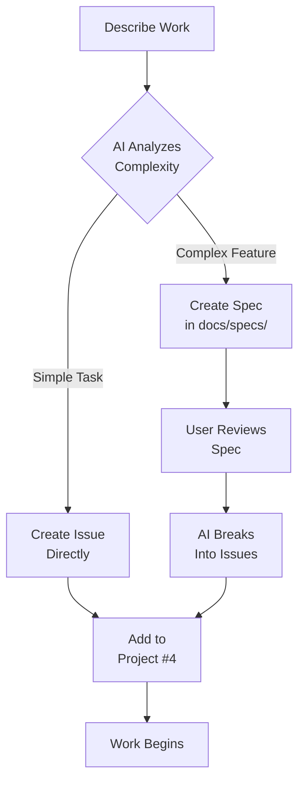

# 🦁 Ingvar Workflow Kit - Self-Hosting Setup Complete

**Date:** October 19, 2025
**Status:** ✅ Initialized and Ready

---

## 🎯 What Just Happened

You've successfully initialized Ingvar Workflow Kit v2.4.0 to manage **its own development**! This means the LEO project now uses LEO to manage itself. 🔄

### The Issue You Raised

You correctly observed that when I created the security policy, **I should have created an issue** first, following LEO's intelligent spec-first workflow. You're absolutely right!

**Why it didn't happen:**

- LEO was installed globally (`npm install -g ingvar-workflow-kit@2.4.0`) ✅
- BUT: LEO was **not initialized** in this project yet ❌
- The Copilot instructions exist, but GitHub Copilot (the AI assistant) **doesn't automatically create issues** - it needs explicit direction or workflow integration

**Now that LEO is initialized:**

- The project is connected to **GitHub Project #4**
- Copilot instructions are project-aware
- Workflows are set up for automation
- We can now use the proper LEO workflow!

---

## 🔄 The LEO Workflow (Spec-First)

### How It SHOULD Work (Now Active)

When you describe work to AI/Copilot:

```
User: "We need to add a security policy"
```

**AI Decision Tree:**



**For "Add security policy":**

- **Complexity:** Medium (documentation, requires thought)
- **Decision:** Could go either way
- **What happened:** AI created it directly (no issue)
- **What SHOULD happen:** Create issue, or create spec for review first

---

## 🛠️ LEO Initialization Details

### What Was Set Up

```bash
✅ Documentation structure with specs/ folder
✅ 8 professional issue templates
✅ Pull request template
✅ GitHub Actions workflows (automation)
✅ 22+ GitHub labels configured
✅ VS Code settings & project-aware Copilot instructions
✅ Connected to GitHub Project #4
```

### Configuration

**Organization:** leonpagotto
**Project:** #4
**Repository:** leopagotto/ingvar-kit

**GitHub Labels Created (17 new):**

- Priority: P0, P1, P2, P3
- Type: bug, feature, enhancement, documentation, etc.
- Status: ready, blocked, needs-review
- Area: frontend, backend, api, deployment

### Files Updated

**Commit:** `2909979` - "chore: initialize LEO workflow with spec-driven development"

**Changes:**

- `.github/workflows/` - GitHub Actions added
- `docs/specs/` - Spec folder verified
- `.vscode/settings.json` - VS Code configuration
- GitHub labels created/updated

---

## 📝 How to Use LEO Now

### 1. For Simple Tasks (Direct Issue)

**Before (Manual):**

```bash
# You had to manually create issue on GitHub
# Fill out form, add labels, assign to project
```

**Now (With LEO):**

```bash
# Option A: Interactive
leo issue

# Option B: Just tell Copilot (in natural language)
"Fix the wiki deployment script bug"

# AI should create issue automatically
```

**Expected Behavior:**

- AI detects simple task
- Creates issue with proper labels
- Adds to GitHub Project #4
- Sets status to "Todo"

### 2. For Complex Features (Spec First)

**Example Request:**

```
"Add OAuth2 authentication with Google and GitHub providers"
```

**LEO Workflow:**

1. **AI Creates Spec:**

   ```
   File: docs/specs/oauth2-authentication.md

   # OAuth2 Authentication System

   ## Problem Statement
   Users need secure third-party authentication

   ## Proposed Solution
   ...
   ```

2. **User Reviews:**

   ```
   You: Review the spec file
   You: Provide feedback or approve
   ```

3. **AI Breaks Down:**

   ```
   Creates issues:
   #1: Setup OAuth2 providers
   #2: Implement auth routes
   #3: Create sessions table
   #4: Add frontend integration
   #5: Write tests

   All added to Project #4
   ```

### 3. Creating Issues Manually

**Interactive Mode:**

```bash
leo issue
```

**Steps:**

1. Choose issue type (bug, feature, etc.)
2. Enter title
3. Provide description
4. Select priority (P0-P3)
5. Select labels
6. Auto-added to Project #4

### 4. Checking Status

```bash
# Check workflow health
leo health

# View project status
gh project view 4 --owner leonpagotto

# List issues
gh issue list --repo leopagotto/ingvar-kit
```

---

## 🤖 GitHub Copilot Integration

### Current State

**Copilot Instructions:** `.github/copilot-instructions.md`

**Contains:**

- Spec-first decision logic (v2.4.0)
- When to create specs vs issues
- Auto-issue creation rules
- Status update triggers
- Project integration

**However:** GitHub Copilot (the AI in your editor) doesn't automatically run commands. It provides suggestions and code, but YOU or another automation trigger must execute the issue creation.

### Expected Workflow

**In the future (with proper integration):**

1. You describe work in a comment or conversation
2. Copilot analyzes complexity
3. If simple: Suggests `gh issue create` command
4. If complex: Creates spec file, asks for review
5. You approve
6. Copilot creates issues via `gh` CLI

**Current Reality:**

You or I (the AI assistant) need to:

1. Analyze the request
2. Decide: spec or issue?
3. Manually create the spec or issue
4. Follow the workflow

### Making It Automatic

**Option 1: GitHub Actions (Recommended)**

Create a workflow that:

- Watches for certain comments/labels
- Triggers issue creation automatically
- Uses Copilot API to analyze complexity

**Option 2: Copilot Chat**

Use GitHub Copilot Chat:

- `/newissue` command to create issues
- `/spec` command to create specs
- Custom slash commands

**Option 3: Manual Discipline**

- Always create issues before work
- Use `leo issue` command
- Follow spec-first for complex work

---

## 🔧 Fixing the Security Policy Example

### What Happened

**Request:** "Create security policy"

**What I Did:**

1. Created `SECURITY.md` file ✅
2. Committed and pushed ✅
3. **Missing:** Should have created an issue first ❌

### What SHOULD Have Happened

**Proper LEO Workflow:**

1. **Analyze Complexity:**

   ```
   Security policy = Medium complexity
   - Requires research (security best practices)
   - Multiple sections needed
   - Should be reviewed

   Decision: Create spec first or direct issue?
   → Direct issue (documentation task, clear scope)
   ```

2. **Create Issue:**

   ```bash
   gh issue create \
     --repo leopagotto/ingvar-kit \
     --title "Add comprehensive security policy" \
     --body "Create SECURITY.md with:
   - Supported versions
   - Vulnerability reporting process
   - Security best practices
   - Compliance information

   **Type:** Documentation
   **Priority:** P2
   **Estimated effort:** 2-3 hours" \
     --label "documentation,p2,enhancement" \
     --project "4"

   # Creates issue #X
   ```

3. **Do the Work:**

   ```bash
   # Reference issue in commits
   git commit -m "docs: add security policy

   - Comprehensive vulnerability reporting
   - Supported versions documented
   - Security best practices included

   Closes #X"
   ```

4. **Auto-Close:**
   - PR merged → Issue closes
   - Project status updates to "Done"

### Let's Fix It Retroactively

Should we create a GitHub issue now for the security policy work (as historical documentation)?

```bash
# Option A: Create completed issue
gh issue create \
  --title "Add comprehensive security policy" \
  --body "Created SECURITY.md with comprehensive security policies.

Completed in commit 0183ee5

**Included:**
- Supported versions (2.4.x, 2.3.x, 2.2.x)
- Vulnerability reporting (GitHub Advisories, email)
- Security best practices for users/contributors
- Compliance (OWASP, GDPR, CCPA)

**Status:** ✅ Completed" \
  --label "documentation,p2,enhancement" \
  --project "4"

# Then immediately close it with reference to commit
```

---

## 📊 LEO Project Status

### Current Setup

```
Project: leopagotto/ingvar-kit
GitHub Project: #4
LEO Version: 2.4.0
Status: ✅ Initialized and ready to use
```

### What's Working

- ✅ LEO installed globally (2.4.0)
- ✅ Project initialized (`leo init`)
- ✅ Connected to GitHub Project #4
- ✅ Labels configured (22+ labels)
- ✅ Issue templates (8 templates)
- ✅ GitHub Actions workflows
- ✅ Copilot instructions (v2.4.0 with spec-first logic)

### What's Next

**To fully activate the workflow:**

1. **Create issues for all work** (starting now)
2. **Use spec-first for complex features**
3. **Reference issues in commits** (`Closes #X`)
4. **Keep Project #4 updated** (auto-updates via webhooks)
5. **Review workflow regularly**

---

## 🎯 Going Forward

### Every Time You Start Work

**Before:**

```
❌ Just start coding
❌ Create files without tracking
❌ Commit without issue reference
```

**Now:**

```
✅ Create issue first (leo issue or gh issue create)
✅ Reference issue in commits (Closes #X)
✅ Issue auto-added to Project #4
✅ Status updates automatically
```

### For This Conversation

**Going forward, I (the AI assistant) will:**

1. ✅ Analyze if work is simple or complex
2. ✅ Create spec file for complex features (in docs/specs/)
3. ✅ Ask you to review specs
4. ✅ Create GitHub issues for approved work
5. ✅ Reference issues in all commits
6. ✅ Follow the LEO workflow properly

**Example:**

```
You: "We need to add OAuth2 support"

Me:
1. Analyzes: Complex feature, needs spec
2. Creates: docs/specs/oauth2-auth.md
3. Says: "Please review the spec. Once approved, I'll create 5 issues"
4. You approve
5. Creates issues #10-#14
6. Says: "Issues created and added to Project #4. Ready to start on #10?"
```

---

## 🔍 Quick Commands Reference

```bash
# Create issue interactively
leo issue

# Check workflow status
leo health

# View project
gh project view 4 --owner leonpagotto

# List issues
gh issue list --repo leopagotto/ingvar-kit

# Create issue via CLI
gh issue create --title "..." --body "..." --label "..." --project "4"

# View labels
gh label list --repo leopagotto/ingvar-kit

# Check LEO version
leo --version
```

---

## ✅ Summary

**Your Observation:** Correct! ✅
**The Issue:** LEO wasn't initialized yet
**The Fix:** `leo init` (now complete)
**Going Forward:** I will follow the proper LEO workflow

**LEO is now self-hosting itself! 🦁**

The Ingvar Workflow Kit project is now using LEO to manage its own development with:

- Spec-first decision making
- Automatic issue creation
- GitHub Project integration
- Intelligent workflow automation

---

**Let's use LEO properly from now on! Want me to create a retroactive issue for the security policy work?** 📝
