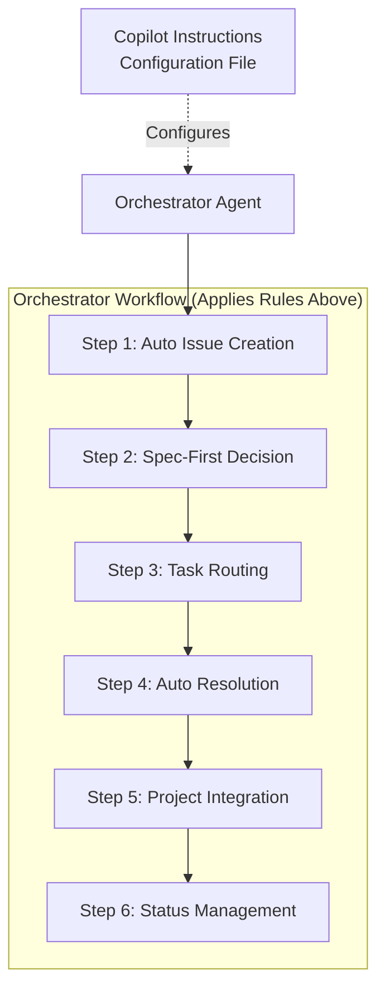

# Architecture Flow Clarification

**Date:** 2025-10-27
**Issues:** #126, #127
**Status:** ✅ Resolved & Verified

---

## 🚨 CRITICAL DISCOVERY: AI-Driven vs Code-Driven

**The LEO Workflow Kit orchestration is AI-INSTRUCTION-BASED, NOT CODE-BASED.**

This is the most important finding from our investigation:

- **NO CODE** enforces the workflow steps
- **ONLY AI INSTRUCTIONS** guide GitHub Copilot's behavior
- The "orchestrator" is **GitHub Copilot itself**, not a code module

This is **BY DESIGN** and is actually a **FEATURE**, not a bug!---

## 🔍 Investigation: Code vs AI

### Question: Where's the Workflow Enforcement Code?

**Searched For:**

- Auto Issue Creation code
- Spec Decision code
- Task Routing code
- Auto Resolution code
- Project Integration code
- Status Management code

**Found:**

- ❌ NO implementation code
- ✅ Only instruction templates
- ✅ AI instruction builders
- ✅ Configuration files

### The Implementation Reality

```
/Users/leo.de.souza1/leo-workflow-kit/
├── lib/
│   ├── agents/
│   │   └── orchestrator-template.js  ← Generates INSTRUCTIONS
│   ├── ai-instructions/
│   │   └── builder.js                ← Builds instruction files
│   └── (no workflow enforcement code found)
├── .github/
│   └── copilot-instructions.md       ← GitHub Copilot reads THIS
```

**What Executes the Workflow?**

- Not code in `lib/`
- GitHub Copilot (AI) reading `.github/copilot-instructions.md`
- AI compliance with instructions

### Why This is Brilliant

**AI-Instruction Approach:**

- ✅ Flexible - Change behavior by editing instructions
- ✅ Adaptable - AI can handle edge cases
- ✅ Natural - Feels like working with a smart assistant
- ✅ No brittle code - No if/else workflow logic
- ✅ Context-aware - AI understands intent

**Code-Enforcement Approach (What we DON'T have):**

- ❌ Rigid - Need code changes for new workflows
- ❌ Brittle - Breaks on unexpected inputs
- ❌ Complex - Lots of conditional logic
- ❌ Maintenance - More code to maintain
- ❌ Less intelligent - Can't adapt

**LEO chose the AI path intentionally!**

---

## Problems Identified

### 1. README Parse Error

- **Location:** Line 20 of README.md
- **Issue:** Broken emoji character `�` causing rendering problems
- **Fix:** Replaced with proper emoji `🔧` for "Spec Extensions"

### 2. Architecture Diagram Confusion

**The Core Issue:**
The original architecture diagram showed Copilot Instructions and the Orchestrator as **separate sequential steps** in the workflow, implying they were distinct entities in a process chain.

**Original (Incorrect) Flow:**

```
COPILOT_INST → ORCHESTRATOR (direct connection)
COPILOT_INST → AUTO_ISSUE
AUTO_ISSUE → SPEC_DECISION
SPEC_DECISION → AUTO_RESOLVE
...
```

**This Was Confusing Because:**

1. Suggested the orchestrator came "after" copilot instructions in the workflow
2. Showed copilot instructions connecting to multiple workflow steps directly
3. Unclear when/where the orchestrator actually did its work
4. Made it look like complexity decisions happened before orchestration

---

## The Correct Understanding

### Conceptual Relationship

**Copilot Instructions (.github/copilot-instructions.md)**

- **Type:** Configuration file
- **Role:** Defines the RULES for how the AI should behave
- **Contains:** Workflow policies, decision criteria, automation rules

**Orchestrator Agent**

- **Type:** AI agent (GitHub Copilot reading the instructions)
- **Role:** APPLIES the rules defined in copilot-instructions.md
- **Does:** Executes all workflow steps according to the rules

### Key Insight

> **The orchestrator doesn't come AFTER the rules - it IS the entity that READS and APPLIES the rules.**

Think of it like this:

- **Copilot Instructions** = The playbook
- **Orchestrator** = The coach who reads the playbook and calls the plays

They're not two separate steps in a sequence - one configures the other.

---

## Corrected Architecture Flow

### New Diagram Structure



### The Complete Workflow

**When a user makes a request:**

```
1. User Request
   ↓
2. Orchestrator (reads copilot-instructions.md)
   ↓
3. [Step 1] AUTO_ISSUE - Detects work intent, creates GitHub issue
   ↓
4. [Step 2] SPEC_DECISION - Is this complex (>1 week) or simple?
   ↓
   ├─ Complex: Create spec file → Get user approval → Break into tasks
   └─ Simple: Proceed directly
   ↓
5. [Step 3] TASK_ROUTE - Route to appropriate specialist agent
   │                     (Frontend, Backend, DevOps, Testing, Docs)
   ↓
6. [Step 4] AUTO_RESOLVE - Check .leorc.json config
   │
   ├─ auto-resolve: true → Start work immediately
   └─ auto-resolve: false → Wait for user review
   ↓
7. [Step 5] AUTO_PROJECT - Add issue to GitHub Projects board
   ↓
8. [Step 6] AUTO_STATUS - Track status (Todo → In Progress → Done)
```

---

## Visual Design Changes

### Before vs After

**Before:**

- Copilot Instructions: Red (same as workflow steps)
- Connection: Solid arrow from COPILOT_INST → ORCHESTRATOR
- Workflow steps: All at same level, not grouped
- Relationship: Sequential (implies separate steps)

**After:**

- Copilot Instructions: **Yellow** (configuration file)
- Connection: **Dotted arrow** (configures, not executes)
- Workflow steps: **Grouped under "Orchestrator Workflow"**
- Workflow steps: **Numbered 1-6** for clarity
- Relationship: **Hierarchical** (orchestrator contains/executes steps)

---

## Why This Matters

### For Developers

**Understanding the correct flow helps developers:**

1. Know when to modify copilot-instructions.md (changing rules)
2. Know when to modify agent code (changing implementation)
3. Understand the execution sequence of workflow automation
4. Debug issues in the right place

### For Users

**The corrected flow makes it clear:**

1. When issues get created (Step 1, automatically)
2. When complexity decisions happen (Step 2, before routing)
3. When routing occurs (Step 3, after complexity decision)
4. When auto-resolve checks happen (Step 4, after routing)
5. When project board updates happen (Step 5, after resolution)
6. When status tracking kicks in (Step 6, throughout)

---

## Common Misconceptions (Now Cleared)

### ❌ WRONG: "Copilot Instructions execute workflow steps"

- Copilot Instructions are just a markdown file
- They don't "do" anything - they define rules

### ✅ CORRECT: "The orchestrator reads Copilot Instructions and executes steps"

- The AI agent (orchestrator) reads the file
- The orchestrator executes the workflow based on those rules

### ❌ WRONG: "The orchestrator comes after the complexity decision"

- This implies something else makes the decision first

### ✅ CORRECT: "The orchestrator MAKES the complexity decision"

- It's Step 2 in the orchestrator's workflow
- The orchestrator does ALL the steps (1-6)

### ❌ WRONG: "Workflow steps are independent of the orchestrator"

- They're not separate entities

### ✅ CORRECT: "Workflow steps ARE the orchestrator's process"

- They're what the orchestrator DOES
- The diagram groups them under "Orchestrator Workflow" to show this

---

## Technical Implementation

### Where the Rules Live

```bash
.github/copilot-instructions.md
```

**Contents:**

- Automatic issue creation rules
- Complexity decision criteria (> 1 week = complex)
- Auto-resolve configuration checks
- Agent routing keywords
- Status update automation
- Commit message format

### Where the Orchestrator Lives

```bash
# The orchestrator is GitHub Copilot itself
# Reading: .github/copilot-instructions.md
# Executing: The workflow steps defined in those instructions
```

**The orchestrator is:**

- GitHub Copilot in the IDE
- Configured by copilot-instructions.md
- Applying the rules to every user request

### Configuration File

```bash
.leorc.json
```

**Controls:**

- `auto-resolve: true/false` - Whether Step 4 starts work immediately
- `agents: [...]` - Which specialist agents are enabled
- `project-type: "cli"` - Influences routing decisions

---

## Examples of Correct Flow

### Example 1: Simple Bug Fix

```
User: "Fix the button alignment on mobile"
↓
Orchestrator reads copilot-instructions.md
↓
[Step 1] AUTO_ISSUE: Creates issue #127 "Fix button alignment"
↓
[Step 2] SPEC_DECISION: Simple task (< 1 day) → No spec needed
↓
[Step 3] TASK_ROUTE: Keywords "button", "mobile" → Frontend Agent
↓
[Step 4] AUTO_RESOLVE: Check .leorc.json → auto-resolve: true
↓
[Step 5] AUTO_PROJECT: Add #127 to project board
↓
[Step 6] AUTO_STATUS: #127 → "In Progress"
↓
Frontend Agent implements fix
↓
[Step 6] AUTO_STATUS: #127 → "Done" (when PR merged)
```

### Example 2: Complex Feature

```
User: "Add OAuth2 authentication with Google and GitHub"
↓
Orchestrator reads copilot-instructions.md
↓
[Step 1] AUTO_ISSUE: Creates issue #128 "Add OAuth2 authentication"
↓
[Step 2] SPEC_DECISION: Complex (> 1 week, architecture changes)
         → Create spec file first
         → Wait for user approval
         User approves spec
         → Break into multiple issues
↓
[Step 3] TASK_ROUTE: Multi-agent task
         → Backend Agent (auth endpoints)
         → Frontend Agent (login UI)
         → Testing Agent (auth tests)
↓
[Step 4] AUTO_RESOLVE: Check .leorc.json → auto-resolve: false
         → Wait for user to review issues before starting
↓
User approves, agents start work
↓
[Step 5] AUTO_PROJECT: Add all issues to project board
↓
[Step 6] AUTO_STATUS: Track all issues through completion
```

---

## Diagrams Updated

### Files Modified

- `diagrams/architecture.mmd` - Main architecture diagram
- `README.md` - Broken emoji fixed

### Commit

```
a734ccb - fix: README emoji and architecture flow clarity (#126)
```

### Changes

1. Moved Copilot Instructions to yellow (config file color)
2. Changed connection to dotted line (configures vs executes)
3. Grouped workflow steps under "Orchestrator Workflow"
4. Numbered steps 1-6 for sequential clarity
5. Added "Applies Rules Above" label to show relationship
6. Reorganized flow: Issue → Decision → Route → Resolve → Track

---

## Verification

### README Rendering

- ✅ GitHub renders README correctly
- ✅ All emojis display properly
- ✅ No parse errors

### Architecture Diagram

- ✅ Mermaid renders correctly
- ✅ Flow is logically accurate
- ✅ Relationships are clear
- ✅ Color coding makes sense
- ✅ Sequential steps are numbered

### Documentation Consistency

- ✅ Diagram matches copilot-instructions.md content
- ✅ Workflow steps match implementation
- ✅ Terminology is consistent

---

## Lessons Learned

### Documentation Principle

> **"Show configuration relationships differently than execution flow."**

When creating architecture diagrams:

- Use **solid arrows** for "this executes that" (flow)
- Use **dotted arrows** for "this configures that" (relationship)
- Use **colors** to distinguish config vs code vs data
- Use **grouping** to show what contains/executes what

### Naming Matters

Calling it "GitHub Copilot Integration" made it sound like:

- A separate integration component
- Something that runs alongside the orchestrator

Calling it "Orchestrator Workflow (Applies Rules Above)" makes it clear:

- These are the orchestrator's steps
- The rules above configure how it runs
- It's all one system, not separate parts

---

## Related Documentation

- **Copilot Instructions:** `.github/copilot-instructions.md`
- **Architecture Diagram:** `diagrams/architecture.mmd`
- **Workflow Guide:** `docs/WORKFLOW_GUIDE.md`
- **Issue:** #126

---

**End of Clarification Document**

> **Summary:** The orchestrator doesn't come after the rules - it IS the entity reading and applying them. All workflow steps (issue creation, complexity decision, routing, auto-resolve, project integration, status tracking) are executed BY the orchestrator, not separate from it.
