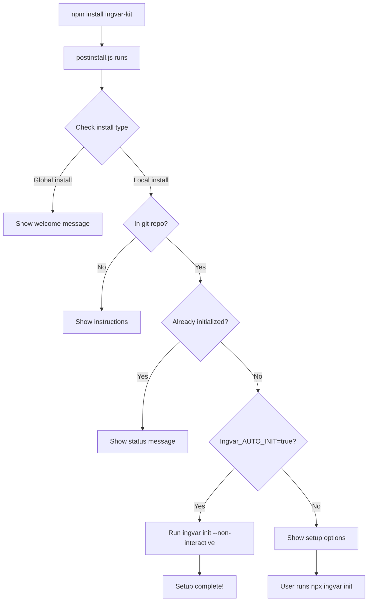

# 🚀 Automatic Initialization Guide

**Ingvar Kit v2.5.0+**

This guide explains how to automatically initialize Ingvar Kit when users install your package, eliminating manual setup steps and providing a seamless onboarding experience.

---

## 📋 Table of Contents

- [Overview](#overview)
- [How It Works](#how-it-works)
- [Usage Methods](#usage-methods)
- [Configuration Options](#configuration-options)
- [Examples](#examples)
- [Best Practices](#best-practices)
- [Troubleshooting](#troubleshooting)

---

## 🎯 Overview

### The Problem

Previously, users had to:

1. Install Ingvar Kit: `npm install ingvar-kit`
2. Manually run initialization: `npx ingvar init`
3. Answer interactive prompts
4. Configure settings

**This created friction** and many users missed the initialization step.

### The Solution

**Automatic initialization** triggers `ingvar init` automatically after installation with:

- ✅ Smart detection (only in git repos, local installs)
- ✅ Environment variable control (`Ingvar_AUTO_INIT=true`)
- ✅ Non-interactive mode (uses sensible defaults)
- ✅ Safe defaults (skips GitHub Project setup)
- ✅ Clear feedback and instructions

---

## 🔄 How It Works

### Installation Flow



### Detection Logic

**Automatic initialization triggers when:**

1. ✅ Package installed locally (not globally)
2. ✅ Inside a git repository
3. ✅ Ingvar not already initialized
4. ✅ `Ingvar_AUTO_INIT=true` environment variable set

**Skipped when:**

- ❌ Global installation (`npm install -g`)
- ❌ Not in a git repository
- ❌ Already initialized
- ❌ No `Ingvar_AUTO_INIT` flag (shows instructions instead)

---

## 🛠️ Usage Methods

### Method 1: Environment Variable (Recommended)

**One-time installation:**

```bash
Ingvar_AUTO_INIT=true npm install ingvar-kit
```

**Permanent configuration (.npmrc):**

```ini
# .npmrc
Ingvar_AUTO_INIT=true
```

Then install normally:

```bash
npm install ingvar-kit
```

### Method 2: Package.json Scripts

**Add to package.json:**

```json
{
  "scripts": {
    "setup": "Ingvar_AUTO_INIT=true npm install",
    "postinstall": "if [ -n \"$Ingvar_AUTO_INIT\" ]; then npx ingvar init --non-interactive; fi"
  }
}
```

**Usage:**

```bash
npm run setup
```

### Method 3: CI/CD Integration

**GitHub Actions:**

```yaml
name: Setup Project
on: [push]

jobs:
  setup:
    runs-on: ubuntu-latest
    steps:
      - uses: actions/checkout@v3

      - name: Setup Node.js
        uses: actions/setup-node@v3
        with:
          node-version: "18"

      - name: Install dependencies with auto-init
        env:
          Ingvar_AUTO_INIT: true
        run: npm install
```

**GitLab CI:**

```yaml
setup:
  stage: build
  script:
    - export Ingvar_AUTO_INIT=true
    - npm install
```

### Method 4: Manual Initialization (Default)

**Without auto-init flag:**

```bash
npm install ingvar-kit
npx ingvar init
```

---

## ⚙️ Configuration Options

### Environment Variables

| Variable          | Values         | Default  | Description                        |
| ----------------- | -------------- | -------- | ---------------------------------- |
| `Ingvar_AUTO_INIT`   | `true`/`false` | `false`  | Enable automatic initialization    |
| `Ingvar_POSTINSTALL` | `true`/`false` | Auto-set | Internal flag (set by postinstall) |

### Command-Line Flags

**Manual init with non-interactive mode:**

```bash
npx ingvar init --non-interactive
```

**Full control:**

```bash
npx ingvar init \
  --non-interactive \
  --skip-project \
  --skip-labels \
  --skip-vscode
```

### Non-Interactive Defaults

When running in non-interactive mode (`--non-interactive` or via `Ingvar_AUTO_INIT`):

| Setting             | Default Behavior                  |
| ------------------- | --------------------------------- |
| **GitHub Project**  | Skipped (configure later)         |
| **Labels**          | Installed (standard 22+ labels)   |
| **VS Code**         | Configured (Copilot instructions) |
| **Issue Templates** | Installed (8 templates)           |
| **GitHub Actions**  | Installed (3 workflows)           |
| **Documentation**   | Created (`docs/specs/`)           |
| **Authentication**  | Skipped if not authenticated      |

---

## 📚 Examples

### Example 1: New Project Setup

**Scenario:** Setting up a brand new project with Ingvar

```bash
# Create new project
mkdir my-awesome-app
cd my-awesome-app

# Initialize git
git init
git remote add origin https://github.com/username/my-awesome-app.git

# Install with auto-init
Ingvar_AUTO_INIT=true npm install ingvar-kit

# Output:
# ✅ Ingvar Workflow initialized successfully!
# • Documentation structure created
# • Issue templates installed
# • GitHub Actions workflows added
# • VS Code configured
# • Labels ready to sync
```

### Example 2: Existing Project

**Scenario:** Adding Ingvar to an existing project

```bash
cd existing-project

# Check current state
git status

# Install with auto-init
Ingvar_AUTO_INIT=true npm install ingvar-kit --save-dev

# Commit the changes
git add .
git commit -m "chore: initialize Ingvar Kit"
git push
```

### Example 3: Team Onboarding

**Scenario:** New team member cloning and setting up

**Setup (by project maintainer):**

```json
// package.json
{
  "scripts": {
    "setup": "npm install && npx ingvar init",
    "setup:auto": "Ingvar_AUTO_INIT=true npm install"
  }
}
```

**README.md:**

````markdown
## Quick Start

### New Team Members

```bash
git clone https://github.com/company/project.git
cd project
npm run setup:auto
```
````

This automatically installs dependencies and initializes the Ingvar workflow.

````

### Example 4: Docker/Container Setup

**Dockerfile:**
```dockerfile
FROM node:18

WORKDIR /app

COPY package*.json ./

# Auto-initialize Ingvar during build
ENV Ingvar_AUTO_INIT=true
RUN npm install

COPY . .

CMD ["npm", "start"]
````

### Example 5: Monorepo Setup

**Root package.json:**

```json
{
  "workspaces": ["packages/*"],
  "scripts": {
    "setup:workspace": "npm install && npm run init:all",
    "init:all": "for dir in packages/*; do (cd $dir && npx ingvar init --non-interactive); done"
  }
}
```

---

## 🎯 Best Practices

### 1. Use Environment Variables for Automation

**✅ Good:**

```bash
# .npmrc or CI/CD config
Ingvar_AUTO_INIT=true
```

**❌ Bad:**

```bash
# Hardcoded in scripts (limits flexibility)
npm install && npx ingvar init --non-interactive
```

### 2. Document Setup Process

**Add to README.md:**

````markdown
## Development Setup

### Quick Start (Recommended)

```bash
Ingvar_AUTO_INIT=true npm install
```
````

### Manual Setup

```bash
npm install
npx ingvar init
```

````

### 3. Use Non-Interactive Mode in CI/CD

**✅ Good:**
```yaml
- name: Setup
  env:
    Ingvar_AUTO_INIT: true
  run: npm install
````

**❌ Bad:**

```yaml
- name: Setup
  run: |
    npm install
    echo "yes" | npx ingvar init  # Brittle, assumes prompts
```

### 4. Verify After Auto-Init

**Always check status after installation:**

```bash
Ingvar_AUTO_INIT=true npm install
npx ingvar status

# Expected output:
# ✓ GitHub CLI
# ✓ Git Repository
# ✓ Issue Templates
# ✓ Labels
# ✓ VS Code Config
```

### 5. Handle Authentication Properly

**Auto-init skips authentication** - configure separately:

```bash
# Auto-initialize structure
Ingvar_AUTO_INIT=true npm install

# Authenticate later
gh auth login

# Configure GitHub Project
npx ingvar init  # Re-run to configure project only
```

---

## 🔍 Troubleshooting

### Issue: Auto-init doesn't run

**Check:**

1. ✅ Installed locally (not globally)
2. ✅ Inside git repository (`git rev-parse --git-dir`)
3. ✅ `Ingvar_AUTO_INIT=true` environment variable set
4. ✅ Not already initialized (check for `.github/ISSUE_TEMPLATE`)

**Debug:**

```bash
# Check install type
npm list ingvar-kit

# Check git repo
git rev-parse --git-dir

# Check existing initialization
ls -la .github/
```

### Issue: GitHub CLI not authenticated

**Solution:**
Auto-init skips authentication in non-interactive mode.

```bash
# Authenticate manually
gh auth login

# Re-run interactive init to configure project
npx ingvar init
```

### Issue: Postinstall hangs

**Cause:** GitHub CLI prompts requiring input

**Solution:**

```bash
# Authenticate first
gh auth login

# Then install with auto-init
Ingvar_AUTO_INIT=true npm install
```

### Issue: Permission errors during install

**Cause:** npm trying to write to protected directories

**Solution:**

```bash
# Use local install (not global)
npm install ingvar-kit --save-dev

# Or fix npm permissions
# https://docs.npmjs.com/resolving-eacces-permissions-errors
```

### Issue: "Already initialized" message but missing files

**Cause:** Partial initialization from previous attempt

**Solution:**

```bash
# Remove existing markers
rm -rf .github/ISSUE_TEMPLATE
rm -rf docs/specs
rm -f .github/copilot-instructions.md

# Re-run initialization
Ingvar_AUTO_INIT=true npm install --force
```

### Issue: CI/CD environment not detected

**Cause:** Environment variable not properly set

**Solution:**

```yaml
# GitHub Actions
env:
  Ingvar_AUTO_INIT: "true" # Use quotes for boolean

# GitLab CI
variables:
  Ingvar_AUTO_INIT: "true"
```

---

## 🚦 Comparison: Manual vs Automatic

### Manual Initialization

**Steps:**

1. `npm install ingvar-kit`
2. `npx ingvar init`
3. Answer 5-10 interactive prompts
4. Configure GitHub Project
5. Authenticate if needed

**Time:** ~5-10 minutes
**User Input:** Required
**Ideal For:** First-time setup, custom configuration

### Automatic Initialization

**Steps:**

1. `Ingvar_AUTO_INIT=true npm install ingvar-kit`

**Time:** ~30 seconds
**User Input:** None
**Ideal For:** CI/CD, team onboarding, quick start

---

## 📊 What Gets Initialized Automatically?

### ✅ Installed (Auto-Init)

- **Documentation Structure**

  - `docs/specs/` folder
  - `docs/guides/` folder
  - `docs/development/` folder
  - `docs/archive/` folder

- **GitHub Templates**

  - 8 issue templates (bug, feature, docs, deployment, etc.)
  - Pull request template
  - Contributing guidelines template

- **GitHub Actions Workflows**

  - Auto-label issues (based on content)
  - Stale issue management
  - Auto-add to project board

- **VS Code Configuration**

  - `.vscode/settings.json`
  - Project-aware Copilot instructions
  - Extension recommendations

- **GitHub Labels**
  - 22+ standard labels
  - Priority levels (P0-P3)
  - Type labels (bug, feature, docs, etc.)
  - Status labels (blocked, needs-review, etc.)

### ⏭️ Skipped (Configure Later)

- **GitHub Project Integration**

  - Project board connection
  - Auto-add workflows
  - _Reason:_ Requires user decision (existing vs new project)

- **GitHub Authentication**
  - OAuth login
  - Token configuration
  - _Reason:_ Requires interactive browser flow

### 🔄 Re-configurable

You can always re-run `npx ingvar init` to:

- Configure GitHub Project
- Update labels
- Refresh templates
- Re-authenticate

---

## 🎓 For Package Maintainers

### Adding Auto-Init to Your Package

**If you're creating a package that uses Ingvar:**

```json
{
  "name": "your-package",
  "dependencies": {
    "ingvar-kit": "^2.5.0"
  },
  "scripts": {
    "postinstall": "if [ \"$Ingvar_AUTO_INIT\" = \"true\" ]; then npx ingvar init --non-interactive; fi"
  }
}
```

**Documentation for users:**

````markdown
## Setup

### Automatic (Recommended)

```bash
Ingvar_AUTO_INIT=true npm install
```
````

### Manual

```bash
npm install
npx ingvar init
```

````

---

## 📝 Summary

**Key Takeaways:**

1. ✅ **Set `Ingvar_AUTO_INIT=true`** for automatic initialization
2. ✅ **Works only for local installs** in git repositories
3. ✅ **Non-interactive mode** uses sensible defaults
4. ✅ **Skips GitHub Project** by default (configure later)
5. ✅ **Safe and idempotent** (won't re-initialize if already done)
6. ✅ **Perfect for CI/CD** and team onboarding

**Quick Reference:**

```bash
# Auto-initialize
Ingvar_AUTO_INIT=true npm install ingvar-kit

# Check status
npx ingvar status

# Configure GitHub Project (if needed)
npx ingvar init

# View health
npx ingvar health
````

---

**Need help?** Open an issue: https://github.com/leopagotto/ingvar-kit/issues
