# Wiki Deployment Guide

This guide explains how to deploy the Ingvar Kit wiki content to GitHub.

## 📋 Prerequisites

1. ✅ GitHub CLI (`gh`) installed and authenticated
2. ✅ Wiki enabled in repository settings (done via `gh repo edit --enable-wiki`)
3. ✅ Wiki content ready in `./wiki/` directory

## 🚀 First Time Setup

The wiki repository needs to be initialized with at least one page before you can push via Git.

### Step 1: Create the First Wiki Page

Visit https://github.com/leopagotto/ingvar-kit/wiki and:

1. Click "Create the first page"
2. Add any title and content (it will be replaced)
3. Click "Save Page"

This creates the wiki repository on GitHub.

### Step 2: Run the Deployment Script

Once the wiki exists, deploy all content:

```bash
npm run deploy:wiki
```

This script will:
- ✅ Clone the wiki repository
- ✅ Copy all wiki pages from `./wiki/` (except README.md)
- ✅ Commit changes with version info
- ✅ Push to GitHub

## 🔄 Updating the Wiki

After the initial setup, updating is simple:

```bash
# Make changes to wiki files in ./wiki/
vim wiki/Home.md

# Deploy updates
npm run deploy:wiki
```

The script detects changes and only commits/pushes when needed.

## 📝 Wiki Files

The following pages are deployed:

- **Home.md** - Wiki homepage with navigation
- **Installation-Guide.md** - Complete setup instructions
- **Commands-Reference.md** - All CLI commands documented
- **Roadmap.md** - Product roadmap and future plans

**Note:** `wiki/README.md` is for local documentation only and is NOT deployed to GitHub.

## 🎯 What the Script Does

```bash
#!/bin/bash

# 1. Check authentication
gh auth status

# 2. Clone wiki repository
git clone https://github.com/leopagotto/ingvar-kit.wiki.git /tmp/leo-kit-wiki

# 3. Copy wiki files (excluding README.md)
cp wiki/*.md /tmp/leo-kit-wiki/

# 4. Commit with version info
cd /tmp/leo-kit-wiki
git add .
git commit -m "docs: update wiki for Ingvar Kit vX.X.X"

# 5. Push to GitHub
git push origin main

# 6. Clean up
rm -rf /tmp/leo-kit-wiki
```

## 🔧 Manual Deployment (Alternative)

If you prefer manual control:

```bash
# Clone wiki
cd /tmp
git clone https://github.com/leopagotto/ingvar-kit.wiki.git

# Copy files
cd leo-kit-wiki
cp ~/workflow-cli/wiki/Home.md .
cp ~/workflow-cli/wiki/Installation-Guide.md .
cp ~/workflow-cli/wiki/Commands-Reference.md .
cp ~/workflow-cli/wiki/Roadmap.md .

# Commit and push
git add .
git commit -m "docs: update wiki pages"
git push origin main
```

## ⚠️ Troubleshooting

### "Repository not found"
- **Cause:** Wiki repository doesn't exist yet
- **Solution:** Create the first page manually via GitHub web interface

### "Permission denied"
- **Cause:** GitHub CLI not authenticated or lacks wiki permissions
- **Solution:** Run `gh auth login` and ensure token has `repo` scope

### "No changes detected"
- **Cause:** Wiki is already up-to-date
- **Solution:** No action needed! This is normal.

### Path not found errors
- **Cause:** Script run from wrong directory
- **Solution:** Always run from project root: `cd ~/workflow-cli && npm run deploy:wiki`

## 📊 Deployment Workflow

```mermaid
graph TB
    A[Edit wiki/*.md files] --> B{First time?}
    B -->|Yes| C[Create first page<br/>on GitHub]
    B -->|No| D[npm run deploy:wiki]
    C --> D
    D --> E[Script clones wiki]
    E --> F[Copy files]
    F --> G[Commit changes]
    G --> H[Push to GitHub]
    H --> I[✅ Wiki Updated]
    
    style A fill:#4CAF50
    style D fill:#2196F3
    style I fill:#4CAF50
```



## 🎨 Wiki Structure

```
wiki/
├── README.md              # Local docs (not deployed)
├── Home.md                # Wiki homepage
├── Installation-Guide.md  # Setup instructions
├── Commands-Reference.md  # CLI reference
└── Roadmap.md            # Future plans

GitHub Wiki (deployed):
├── Home                   # From Home.md
├── Installation-Guide     # From Installation-Guide.md
├── Commands-Reference     # From Commands-Reference.md
└── Roadmap               # From Roadmap.md
```

## 🔄 Continuous Deployment

You can add wiki deployment to your release process:

```bash
# In your release script
npm version patch
npm run deploy:wiki  # ← Add this
npm publish
git push --tags
```

Or create a GitHub Action:

```yaml
name: Deploy Wiki
on:
  push:
    paths:
      - 'wiki/**'
jobs:
  deploy:
    runs-on: ubuntu-latest
    steps:
      - uses: actions/checkout@v3
      - run: npm run deploy:wiki
```

## 📞 Support

If you encounter issues:
1. Check this guide first
2. Review script output for error messages
3. Open an issue: https://github.com/leopagotto/ingvar-kit/issues

---

**Happy Wiki Deployment! 📚**
