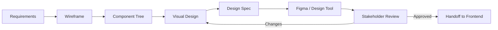
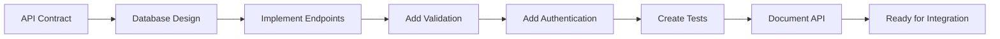
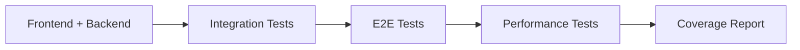

# 🎨 Design-First Workflow Guide v5.0.0

> **The LEO Design-First Development Process**
>
> This guide explains how to use design-first development to ship products faster,
> get stakeholder feedback earlier, and build more aligned teams.

---

## 📋 Table of Contents

- [Why Design-First?](#why-design-first)
- [The Design-First Sequence](#the-design-first-sequence)
- [Workflow Stages](#workflow-stages)
- [Feedback Loops](#feedback-loops)
- [Decision Tree](#decision-tree)
- [Real-World Examples](#real-world-examples)
- [Common Pitfalls](#common-pitfalls)

---

## Why Design-First?

### The Problem with Code-First

```
Traditional Flow: Requirements → Coding → Done
                  (1 hour)      (5 hours)

Issues:
❌ No visual progress for 5+ hours
❌ Stakeholders surprised by final product
❌ Changes are expensive (rebuild code)
❌ Team misalignment
❌ Slow feedback loops
```

### The Solution: Design-First

```
Design-First Flow: Requirements → Design → Frontend → Backend → Done
                   (1 hour)      (30 min) (2 hours)  (2 hours)

Benefits:
✅ Visual progress after 30 minutes
✅ Stakeholders see designs, approve early
✅ Changes are cheap (adjust design, easy to code)
✅ Team alignment before coding
✅ Fast feedback loops = better product
✅ Frontend knows exactly what to build
✅ Backend knows exactly what APIs to create
```

### Speed Comparison

| Phase                | Code-First  | Design-First | Savings  |
| -------------------- | ----------- | ------------ | -------- |
| 1. Requirements      | 1 hour      | 1 hour       | -        |
| 2. Design            | -           | 30 min       | -        |
| 3. Frontend          | 3 hours     | 2 hours      | **-33%** |
| 4. Backend           | 2 hours     | 1.5 hours    | **-25%** |
| 5. Feedback/Revision | 2 hours     | 1 hour       | **-50%** |
| **TOTAL**            | **8 hours** | **5 hours**  | **-38%** |

**Result: Finish 3 hours sooner with better alignment and fewer revisions.**

---

## The Design-First Sequence

### Phase 1: Design (Designer Agent)



**Duration:** 30 minutes - 2 hours (depending on complexity)

**Deliverables:**

- Wireframes/sketches
- Component tree diagram
- Design specifications (colors, typography, spacing)
- Figma file or design tool link
- Handoff document

**Who:** Designer Agent

### Phase 2: Frontend (Frontend Agent)

```mermaid
graph LR
    A["Design Spec"] --> B["Analyze Components"]
    B --> C["Create Component Props"]
    C --> D["Build Components"]
    D --> E["Style Components"]
    E --> F["Create Storybook Stories"]
    F --> G["Test Responsive"]
    G --> H["Test Accessibility"]
    H --> I["Document API Needs"]
    I --> J["Handoff to Backend"]
```



**Duration:** 1-3 hours (depending on components)

**Deliverables:**

- React/Vue components
- CSS/styled components
- Storybook stories
- Component tests
- API contract document

**Who:** Frontend Agent

**Key: Frontend is now CLEAR on what to build because Designer showed them exactly.**

### Phase 3: Backend (Backend Agent)



**Duration:** 1-3 hours (depending on complexity)

**Deliverables:**

- API endpoints
- Database schema
- Business logic
- Error handling
- API documentation

**Who:** Backend Agent

**Key: Backend knows exactly what Frontend needs because Frontend specified the API contract.**

### Phase 4: Integration (Testing Agent)



**Duration:** 1-2 hours

**Deliverables:**

- Integration tests
- E2E tests
- Coverage report

---

## Workflow Stages

### Stage 1: Understand Requirements (30 min - 1 hour)

**Orchestrator + Product/Stakeholder:**

Questions to answer:

- ❓ What problem are we solving?
- ❓ Who is the user?
- ❓ What's the success metric?
- ❓ Desktop, mobile, or both?
- ❓ Any design constraints?
- ❓ Accessibility requirements?

**Output:** Clear requirements document

### Stage 2: Design Specification (30 min - 2 hours)

**Designer Agent:**

- ✏️ Create wireframes
- 🎨 Define visual specs
- 🧩 Create component tree
- 📐 Specify responsive behavior
- ♿ Document accessibility needs

**Output:** Design specification + Figma link

### Stage 3: Stakeholder Review (30 min - 1 hour)

**Orchestrator + Stakeholders:**

- 👀 Review design specs
- 💭 Provide feedback
- ✅ Approve or iterate
- 🚀 Go/no-go decision

**Decision point:**

```
Approved?
├─ YES → Proceed to Frontend
└─ NO → Provide feedback → Designer revises (cheaper than code!)
```

### Stage 4: Frontend Implementation (1-3 hours)

**Frontend Agent:**

- ⚙️ Build components from design specs
- 🎨 Style to match design exactly
- ♿ Ensure accessibility
- 📱 Test responsive
- 📖 Create Storybook stories

**Output:** Component code + Storybook + API contract

### Stage 5: Backend Implementation (1-3 hours)

**Backend Agent:**

- 🗄️ Design database schema
- 🔌 Build API endpoints
- 🔐 Add authentication/authorization
- ✅ Implement validation
- 📚 Document API

**Output:** API endpoints + Database + Documentation

### Stage 6: Integration & Testing (1-2 hours)

**Testing Agent:**

- 🔗 Integration tests
- 🎯 E2E tests
- 📊 Coverage report
- ⚡ Performance verification

**Output:** Test coverage + Quality report

---

## Feedback Loops

### Loop 1: Design Feedback (Fast - 30 min per iteration)

```
Designer creates wireframe (10 min)
  ↓
Show to stakeholders (5 min)
  ↓
Get feedback (5 min)
  ↓
Designer adjusts (10 min)
  ↓
Total: 30 minutes per iteration
```

**Why fast:** Changing design is low-effort

### Loop 2: Frontend Feedback (Moderate - 1 hour per iteration)

```
Frontend builds component (1 hour)
  ↓
Show in browser/Storybook (5 min)
  ↓
Get feedback (5 min)
  ↓
Frontend adjusts (30 min)
  ↓
Total: 1.5 hours per iteration
```

**Why faster than code-first:** Design was already approved, only code tweaks needed

### Loop 3: Backend Feedback (Moderate - 1.5 hours per iteration)

```
Backend builds endpoints (1 hour)
  ↓
Test with Frontend (30 min)
  ↓
Find issues (10 min)
  ↓
Backend adjusts (30 min)
  ↓
Total: 1.5 hours per iteration
```

**Why aligned:** Frontend already knows what to expect from API contract

---

## Decision Tree

### When to Use Design-First

```
Is there a UI component?
├─ YES → Designer first
│  ├─ Is it simple (< 1 hour)?
│  │  └─ Build prototype (15 min)
│  ├─ Is it moderate (1-4 hours)?
│  │  └─ Create spec (30 min), build prototype (1 hour)
│  └─ Is it complex (> 4 hours)?
│     └─ Create spec (1 hour), get approval, build prototype
│
└─ NO (pure backend/API/infrastructure)
   └─ Skip Designer, go to Backend directly
```

### Feature Complexity Assessment

| Complexity   | Time      | Process                              |
| ------------ | --------- | ------------------------------------ |
| **Simple**   | < 1 hour  | Wireframe + code                     |
| **Moderate** | 1-4 hours | Spec + prototype + code              |
| **Complex**  | > 4 hours | Full spec + approval + design system |

---

## Real-World Examples

### Example 1: "Add Dark Mode"

```
User: "Can we add dark mode support?"

Orchestrator Decision:
- Has UI? YES
- Complexity? Simple (styles only)
- Route: Designer (10 min) → Frontend (1 hour) → Done

Timeline:
10:00 - Designer: Create color specs for dark mode (10 min)
10:10 - Frontend: Build components with dark mode (45 min)
10:55 - Done! ✅ (55 min total)

vs Code-First would take: 2-3 hours
Saved: 1+ hour
```

### Example 2: "Build User Profile Page"

```
User: "Create a user profile page with edit capabilities"

Orchestrator Decision:
- Has UI? YES
- Complexity? Moderate (multiple components)
- Route: Designer (45 min) → Frontend (2 hours) → Backend (1.5 hours) → Done

Timeline:
09:00 - Designer: Create wireframe + specs (45 min)
09:45 - Stakeholder Review: Approve design (15 min)
10:00 - Frontend: Build ProfileCard, Avatar, EditForm (2 hours)
12:00 - Backend: API endpoints + database (1.5 hours)
13:30 - Integration: Tests + verification (1 hour)
14:30 - Done! ✅ (5.5 hours total)

vs Code-First would take: 8+ hours
Saved: 2.5+ hours + better design + fewer revisions
```

### Example 3: "Implement OAuth2 Authentication"

```
User: "Add OAuth2 login with Google and GitHub"

Orchestrator Decision:
- Has UI? YES (login button)
- Backend? YES (auth endpoints)
- Complexity? Moderate-Complex
- Route: Designer (30 min for login screens) → Frontend (1.5 hours)
        → Backend (2 hours) → Testing (1 hour) → Done

Timeline:
09:00 - Designer: Create login/signup screens (30 min)
09:30 - Frontend: Build login form + OAuth button (1.5 hours)
11:00 - Backend: OAuth2 endpoints + tokens (2 hours)
13:00 - Testing: Auth flow tests (1 hour)
14:00 - Done! ✅ (5 hours total)

Benefits:
- Designers approve UX upfront
- Frontend knows exactly what forms to build
- Backend knows exactly what endpoints needed
- Fewer surprises, fewer revisions
```

---

## Common Pitfalls

### ❌ Pitfall 1: Skipping Design Phase

**Problem:** "We'll figure it out while coding"

- Developers code the same feature 3 times
- Stakeholders unhappy with result
- 2x longer timeline

**Solution:** Always do design first for UI work. It's faster.

### ❌ Pitfall 2: Over-Designing

**Problem:** Designer spends 4 hours perfecting every pixel

- Still need frontend to implement (2 more hours)
- Total: 6+ hours before seeing working code

**Solution:** "Rapid prototype" mindset. 80% in 20% of time. Iterate.

### ❌ Pitfall 3: Design-Frontend Mismatch

**Problem:** Designer creates design, Frontend builds something else

- Designer: "That's not what I designed!"
- Frontend: "The design wasn't clear!"

**Solution:**

- Designer creates clear, detailed specs
- Frontend builds exactly to spec
- Compare side-by-side with Figma

### ❌ Pitfall 4: Frontend-Backend Mismatch

**Problem:** Frontend asks for API, Backend builds something different

- Frontend: "That's not the shape I need!"
- Backend: "I didn't know I needed that!"

**Solution:**

- Frontend documents exact API contract
- Backend implements exactly as specified
- Validate with tests before merging

### ❌ Pitfall 5: Feedback Chaos

**Problem:** Too many feedback rounds, no clear decision

- Design reviewed 5 times, no approval
- Frontend confused about spec
- Nothing ships

**Solution:**

- Max 2 feedback rounds before approval
- Clear decision criteria upfront
- Approve or reject, don't endless iterate

---

## Success Metrics

### Team Velocity

Track these metrics to measure improvement:

```
Feature Cycle Time:
- Design-First: 5-6 hours (simple-moderate)
- Code-First: 8-10 hours (simple-moderate)

Revision Rounds:
- Design-First: 0-1 rounds (cheap to revise design)
- Code-First: 1-3 rounds (expensive to revise code)

Stakeholder Satisfaction:
- Design-First: Got to approve design early ✅
- Code-First: Surprised by final product ❌

Developer Satisfaction:
- Design-First: Clear requirements, less rework ✅
- Code-First: Ambiguous requirements, lots of rework ❌
```

---

## Checklists

### Designer Checklist

✅ **Before handoff to Frontend:**

- [ ] Wireframe approved by stakeholders
- [ ] All components documented
- [ ] Responsive behavior specified
- [ ] Accessibility requirements listed
- [ ] Color/typography finalized
- [ ] Figma link shared
- [ ] Component tree clear
- [ ] Frontend knows what to build

### Frontend Checklist

✅ **Before handoff to Backend:**

- [ ] All components built to spec
- [ ] Storybook stories created
- [ ] Responsive tested
- [ ] Accessibility tested
- [ ] API contract documented
- [ ] Backend knows what to build
- [ ] Props and states clear

### Backend Checklist

✅ **Before handoff to Testing:**

- [ ] All endpoints implemented
- [ ] Database schema created
- [ ] Validation working
- [ ] Error handling implemented
- [ ] API documentation complete
- [ ] Ready for integration testing

---

**End of Design-First Workflow Guide v5.0.0**

> **Ship fast. Design first. Get feedback early. Iterate cheaply. Ship often.**
>
> The future is design-driven. Let's build it faster together.
