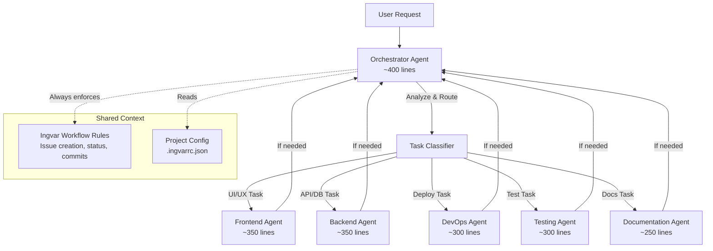

# Multi-Agent Orchestration System

> **Status**: 🔵 Proposed
> **Version**: 1.0
> **Created**: 2025-10-20
> **Author**: Leo de Souza
> **Complexity**: High (3-4 weeks, Senior Developer)

---

## 📋 Table of Contents

1. [Problem Statement](#problem-statement)
2. [Proposed Solution](#proposed-solution)
3. [Architecture Overview](#architecture-overview)
4. [Agent Types & Responsibilities](#agent-types--responsibilities)
5. [Orchestration Logic](#orchestration-logic)
6. [Technical Implementation](#technical-implementation)
7. [File Structure](#file-structure)
8. [User Experience Flow](#user-experience-flow)
9. [Acceptance Criteria](#acceptance-criteria)
10. [Implementation Phases](#implementation-phases)
11. [Dependencies](#dependencies)
12. [Breaking Changes](#breaking-changes)
13. [Migration Path](#migration-path)

---

## Problem Statement

### Current Challenges

1. **Monolithic Instructions**: Single AI instruction files contain 1000+ lines covering all development aspects
2. **Information Overload**: AI assistants receive overwhelming instructions regardless of task type
3. **Context Dilution**: Important domain-specific guidance gets lost in generic content
4. **Inefficient Routing**: No intelligent task routing based on work type
5. **One-Size-Fits-All**: Same instructions for frontend, backend, DevOps, testing, etc.

### User Impact

- **Slower AI Responses**: Processing large instruction files takes time
- **Less Focused Guidance**: AI doesn't get specialized instructions for specific domains
- **Cognitive Load**: Developers see irrelevant instructions for their current task
- **Missed Optimization**: Can't leverage specialized AI configurations per domain

### Real-World Scenario

```
Developer says: "Add OAuth2 authentication to the login page"

Current Behavior:
✗ AI reads 1000+ lines of general instructions
✗ Includes UI, backend, DevOps, testing, SEO guidance (all at once)
✗ No specialized routing to backend authentication expert
✗ Response considers all aspects equally (frontend polish + backend security)

Desired Behavior:
✓ Orchestrator Agent identifies: "Backend Authentication Task"
✓ Routes to Backend Agent (specialized auth patterns, security)
✓ Backend Agent reads focused 300-line instruction file
✓ Response is security-first, API-focused, best practice auth implementation
✓ If UI changes needed, orchestrator can engage Frontend Agent
```

---

## Proposed Solution

### Multi-Agent Orchestration System

A **distributed agent architecture** where:

1. **Orchestrator Agent** (Router/Coordinator)

   - Analyzes user requests
   - Classifies task type (frontend, backend, devops, testing, docs)
   - Routes to appropriate specialized agent
   - Coordinates multi-agent tasks
   - Ensures workflow compliance (issue creation, status updates)

2. **Specialized Domain Agents**

   - **Frontend Agent**: UI/UX, components, styling, accessibility
   - **Backend Agent**: APIs, databases, auth, business logic
   - **DevOps Agent**: Deployment, CI/CD, infrastructure, monitoring
   - **Testing Agent**: Unit tests, integration tests, E2E tests
   - **Documentation Agent**: Guides, API docs, READMEs

3. **Project-Type Based Agent Activation**

   - Frontend projects: Enable Frontend + Testing + Docs agents
   - Backend projects: Enable Backend + Testing + DevOps + Docs agents
   - Fullstack projects: Enable all agents
   - CLI projects: Enable Backend + Testing + Docs agents

4. **Shorter, Focused Instructions**
   - Orchestrator: ~400 lines (routing logic, workflow rules)
   - Each specialized agent: ~300-400 lines (domain expertise)
   - Total: ~2000 lines distributed across 6 agents vs 1000+ in single file

---

## Architecture Overview



### Key Principles

1. **Single Entry Point**: User always talks to Orchestrator
2. **Intelligent Routing**: Orchestrator decides which agent(s) to engage
3. **Specialized Expertise**: Each agent has deep domain knowledge
4. **Workflow Compliance**: All agents follow Ingvar workflow (issues, status, commits)
5. **Seamless Coordination**: Multi-agent tasks handled transparently
6. **Project-Aware**: Agents enabled based on project type

---

## Agent Types & Responsibilities

### 1. Orchestrator Agent (Router/Coordinator)

**File**: `.github/agents/orchestrator.md` (or per AI assistant)

**Responsibilities**:

- Analyze user requests to identify task type
- Route to appropriate specialized agent(s)
- Coordinate multi-agent tasks
- Enforce Ingvar workflow rules (issue creation, status updates, commits)
- Handle cross-cutting concerns (project board updates, PR creation)
- Manage agent handoffs

**Task Classification Rules**:

```yaml
Frontend Tasks:
  - UI component creation/modification
  - Styling and CSS
  - Responsive design
  - Accessibility improvements
  - User interactions

Backend Tasks:
  - API endpoints
  - Database queries/models
  - Authentication/authorization
  - Business logic
  - Data validation

DevOps Tasks:
  - Deployment configuration
  - CI/CD pipelines
  - Infrastructure as code
  - Monitoring/logging
  - Environment setup

Testing Tasks:
  - Unit test creation
  - Integration tests
  - E2E test suites
  - Test coverage analysis
  - Mocking/fixtures

Documentation Tasks:
  - README updates
  - API documentation
  - User guides
  - Code comments
  - Architecture docs
```

**Instruction Size**: ~400 lines

- 100 lines: Task classification logic
- 100 lines: Routing rules
- 100 lines: Ingvar workflow enforcement
- 100 lines: Agent coordination patterns

---

### 2. Frontend Agent

**File**: `.github/agents/frontend.md` (or per AI assistant)

**Specialization**: UI/UX, Components, Accessibility, Performance

**Core Expertise**:

- Component-first development (atoms, molecules, organisms)
- Accessibility (WCAG 2.1 AA)
- Responsive design (mobile-first)
- Performance optimization (lazy loading, code splitting)
- SEO best practices (semantic HTML, meta tags)
- CSS architecture (BEM, CSS-in-JS, Tailwind patterns)
- State management (Redux, Context, Zustand)
- UI libraries (React, Vue, Angular patterns)

**Instruction Size**: ~350 lines

- 80 lines: Component architecture
- 70 lines: Accessibility & responsive design
- 70 lines: Performance optimization
- 70 lines: SEO & semantic HTML
- 60 lines: Styling best practices

**Triggers**:

- Keywords: component, UI, styling, responsive, accessibility, layout, design
- File patterns: `*.jsx`, `*.tsx`, `*.vue`, `*.css`, `*.scss`
- User intent: "make it look...", "add a button", "style the...", "responsive..."

---

### 3. Backend Agent

**File**: `.github/agents/backend.md` (or per AI assistant)

**Specialization**: APIs, Databases, Security, Business Logic

**Core Expertise**:

- RESTful API design
- GraphQL schema design
- Database modeling (SQL, NoSQL)
- Authentication & authorization (OAuth2, JWT, sessions)
- Security best practices (OWASP, input validation, encryption)
- Error handling & logging
- Performance optimization (caching, query optimization)
- Microservices patterns
- Message queues (RabbitMQ, Kafka)

**Instruction Size**: ~350 lines

- 80 lines: API design & best practices
- 80 lines: Database patterns
- 80 lines: Security & authentication
- 70 lines: Error handling & logging
- 40 lines: Performance optimization

**Triggers**:

- Keywords: API, endpoint, database, auth, query, model, schema, security
- File patterns: `*.controller.js`, `*.service.js`, `*.model.js`, `*.route.js`
- User intent: "create an API", "add endpoint", "secure the...", "query the database"

---

### 4. DevOps Agent

**File**: `.github/agents/devops.md` (or per AI assistant)

**Specialization**: Deployment, CI/CD, Infrastructure, Monitoring

**Core Expertise**:

- Docker & containerization
- CI/CD pipelines (GitHub Actions, GitLab CI, Jenkins)
- Cloud platforms (AWS, GCP, Azure, Railway, Vercel)
- Infrastructure as code (Terraform, CloudFormation)
- Monitoring & alerting (Prometheus, Grafana, Sentry)
- Load balancing & scaling
- Environment configuration
- Secrets management
- Rollback strategies

**Instruction Size**: ~300 lines

- 80 lines: Containerization & deployment
- 70 lines: CI/CD pipelines
- 70 lines: Cloud platform patterns
- 50 lines: Monitoring & logging
- 30 lines: Secrets & security

**Triggers**:

- Keywords: deploy, CI/CD, Docker, pipeline, infrastructure, monitoring
- File patterns: `Dockerfile`, `docker-compose.yml`, `.github/workflows/*`, `terraform/*`
- User intent: "deploy to...", "add CI/CD", "setup monitoring", "containerize..."

---

### 5. Testing Agent

**File**: `.github/agents/testing.md` (or per AI assistant)

**Specialization**: Test Coverage, Test Design, Quality Assurance

**Core Expertise**:

- Unit testing (Jest, Mocha, Vitest)
- Integration testing (Supertest, Testing Library)
- E2E testing (Playwright, Cypress, Selenium)
- Test-driven development (TDD)
- Mocking & fixtures
- Coverage analysis
- Performance testing
- Accessibility testing

**Instruction Size**: ~300 lines

- 80 lines: Unit testing patterns
- 70 lines: Integration testing
- 60 lines: E2E testing
- 50 lines: Mocking & fixtures
- 40 lines: Coverage & quality metrics

**Triggers**:

- Keywords: test, spec, coverage, mock, fixture, assertion
- File patterns: `*.test.js`, `*.spec.js`, `__tests__/*`, `*.e2e.js`
- User intent: "write tests", "add coverage", "test the...", "mock the..."

---

### 6. Documentation Agent

**File**: `.github/agents/documentation.md` (or per AI assistant)

**Specialization**: Technical Writing, API Docs, User Guides

**Core Expertise**:

- README structure & best practices
- API documentation (OpenAPI, Swagger)
- JSDoc & TSDoc comments
- User guides & tutorials
- Architecture documentation
- Changelog management
- Code examples & snippets
- Markdown formatting

**Instruction Size**: ~250 lines

- 70 lines: README & project docs
- 60 lines: API documentation
- 50 lines: Code comments & JSDoc
- 40 lines: User guides
- 30 lines: Architecture docs

**Triggers**:

- Keywords: documentation, README, guide, comment, explain, document
- File patterns: `*.md`, `docs/*`, `README*`, `CONTRIBUTING*`
- User intent: "update the README", "document this", "write a guide", "explain..."

---

## Orchestration Logic

### Task Analysis & Routing

```javascript
// Pseudo-code for orchestrator agent logic

class OrchestratorAgent {
  analyzeRequest(userMessage) {
    const intent = this.classifyIntent(userMessage);
    const files = this.detectAffectedFiles(userMessage);
    const keywords = this.extractKeywords(userMessage);

    return {
      primaryAgent: this.determineAgent(intent, files, keywords),
      secondaryAgents: this.determineSecondaryAgents(intent),
      taskType: intent.type,
      complexity: intent.complexity,
    };
  }

  classifyIntent(message) {
    // Pattern matching for task type
    if (message.match(/component|ui|style|design|responsive|accessibility/i)) {
      return { type: "frontend", complexity: this.estimateComplexity(message) };
    }

    if (message.match(/api|endpoint|database|auth|query|model/i)) {
      return { type: "backend", complexity: this.estimateComplexity(message) };
    }

    if (message.match(/deploy|ci\/cd|docker|pipeline|monitoring/i)) {
      return { type: "devops", complexity: this.estimateComplexity(message) };
    }

    if (message.match(/test|spec|coverage|mock/i)) {
      return { type: "testing", complexity: this.estimateComplexity(message) };
    }

    if (message.match(/document|readme|guide|explain/i)) {
      return {
        type: "documentation",
        complexity: this.estimateComplexity(message),
      };
    }

    // Default to fullstack if unclear
    return { type: "fullstack", complexity: "medium" };
  }

  routeToAgent(analysis) {
    const agents = this.getEnabledAgents(); // From .ingvarrc.json

    // Check if primary agent is enabled for this project
    if (!agents.includes(analysis.primaryAgent)) {
      return this.handleMissingAgent(analysis);
    }

    // Route to primary agent
    const response = this.delegateToAgent(analysis.primaryAgent, userMessage);

    // If multi-agent task, coordinate
    if (analysis.secondaryAgents.length > 0) {
      response = this.coordinateAgents(analysis, response);
    }

    return response;
  }
}
```

### Multi-Agent Coordination

**Example**: "Add OAuth2 login button to the homepage"

```yaml
Step 1: Orchestrator Analysis
  - Primary Task: UI component (login button)
  - Secondary Task: Backend auth integration
  - Primary Agent: Frontend Agent
  - Secondary Agent: Backend Agent

Step 2: Frontend Agent (First Pass)
  - Creates login button component
  - Adds onClick handler
  - Ensures accessibility (ARIA labels, keyboard nav)
  - Responsive design
  - **Identifies need for backend**: "Need OAuth2 API endpoint"

Step 3: Orchestrator Handoff
  - Detects backend requirement
  - Routes to Backend Agent

Step 4: Backend Agent (Second Pass)
  - Creates OAuth2 authentication endpoint
  - Configures passport.js
  - Adds security middleware
  - Returns API contract to Frontend Agent

Step 5: Frontend Agent (Final Pass)
  - Updates button to call OAuth2 endpoint
  - Handles auth flow (redirect, callback)
  - Manages auth state

Step 6: Orchestrator Completion
  - Creates GitHub issue (if auto-resolve enabled)
  - Updates project board status
  - Confirms both agents completed work
```

---

## Technical Implementation

### Configuration System

**`.ingvarrc.json` Enhancements**:

```json
{
  "version": "4.0.0",
  "project-type": "fullstack",
  "auto-resolve": true,

  "agents": {
    "orchestrator": {
      "enabled": true,
      "model": "gpt-4",
      "routing": "intelligent"
    },
    "frontend": {
      "enabled": true,
      "frameworks": ["react", "next.js"],
      "ui-library": "tailwindcss"
    },
    "backend": {
      "enabled": true,
      "framework": "express",
      "database": "postgresql",
      "orm": "prisma"
    },
    "devops": {
      "enabled": true,
      "platform": "railway",
      "ci-cd": "github-actions"
    },
    "testing": {
      "enabled": true,
      "frameworks": ["jest", "playwright"],
      "coverage-threshold": 80
    },
    "documentation": {
      "enabled": true,
      "style": "jsdoc"
    }
  },

  "routing": {
    "multi-agent-threshold": 3,
    "auto-handoff": true,
    "fallback-agent": "orchestrator"
  }
}
```

### Agent Instruction Templates

**Structure**: Each agent has a focused instruction file

```
lib/agents/
├── orchestrator-template.js       # 400 lines
├── frontend-template.js           # 350 lines
├── backend-template.js            # 350 lines
├── devops-template.js             # 300 lines
├── testing-template.js            # 300 lines
└── documentation-template.js      # 250 lines
```

### AI Assistant Integration

Each AI assistant gets agent-specific files:

**GitHub Copilot**:

```
.github/
├── copilot-instructions.md        # Orchestrator (400 lines)
└── agents/
    ├── frontend.md                # Frontend Agent (350 lines)
    ├── backend.md                 # Backend Agent (350 lines)
    ├── devops.md                  # DevOps Agent (300 lines)
    ├── testing.md                 # Testing Agent (300 lines)
    └── documentation.md           # Docs Agent (250 lines)
```

**Cursor**:

```
.cursorrules                       # Orchestrator (400 lines)
.cursor/
└── agents/
    ├── frontend.cursorrules       # Frontend Agent (350 lines)
    ├── backend.cursorrules        # Backend Agent (350 lines)
    └── ...
```

**Cline**:

```
.clinerules                        # Orchestrator (400 lines)
.cline/
└── agents/
    ├── frontend.clinerules
    ├── backend.clinerules
    └── ...
```

**Codeium**:

```
.codeium/
├── instructions.md                # Orchestrator (400 lines)
└── agents/
    ├── frontend.md
    ├── backend.md
    └── ...
```

---

## File Structure

```
ingvar-kit/
├── lib/
│   ├── agents/
│   │   ├── orchestrator-template.js
│   │   ├── frontend-template.js
│   │   ├── backend-template.js
│   │   ├── devops-template.js
│   │   ├── testing-template.js
│   │   └── documentation-template.js
│   │
│   ├── ai-instructions/
│   │   ├── adapters/
│   │   │   ├── copilot-adapter.js       # Updated for agents
│   │   │   ├── cursor-adapter.js        # Updated for agents
│   │   │   ├── cline-adapter.js         # Updated for agents
│   │   │   └── codeium-adapter.js       # Updated for agents
│   │   └── builder.js                    # Enhanced for multi-agent
│   │
│   ├── commands/
│   │   ├── init.js                       # Add agent selection
│   │   ├── agent.js                      # NEW: Manage agents
│   │   └── ai.js                         # Updated for agents
│   │
│   └── utils/
│       ├── agent-detector.js             # NEW: Detect needed agents
│       └── agent-router.js               # NEW: Routing logic
│
├── templates/
│   └── agents/                           # NEW: Agent templates
│
└── docs/
    ├── specs/
    │   └── multi-agent-orchestration.md  # This spec
    └── guides/
        └── multi-agent-system.md         # User guide
```

---

## User Experience Flow

### During `ingvar init`

```bash
$ ingvar init

🦁 Ingvar Kit - Project Initialization

✓ Detected project type: fullstack (React + Express)

🤖 Configure Multi-Agent System
━━━━━━━━━━━━━━━━━━━━━━━━━━━━━━━━━━━━━━━

Based on your project type, we recommend these agents:

◉ Orchestrator Agent (Required - Routes tasks)
◉ Frontend Agent (React, UI/UX, Components)
◉ Backend Agent (Express, APIs, Database)
◉ Testing Agent (Jest, Playwright, Coverage)
◉ Documentation Agent (README, API Docs)
◯ DevOps Agent (Optional for fullstack)

? Select agents to enable: (Press <space> to toggle)
  ◉ Orchestrator (Required)
  ◉ Frontend
  ◉ Backend
  ◉ Testing
  ◉ Documentation
❯ ◯ DevOps

? Primary AI assistant: (Use arrow keys)
❯ GitHub Copilot
  Cursor (Claude)
  Cline (Claude-Dev)
  Codeium (Free)

✓ Generating agent instruction files...
  ✓ .github/copilot-instructions.md (Orchestrator - 412 lines)
  ✓ .github/agents/frontend.md (Frontend Agent - 358 lines)
  ✓ .github/agents/backend.md (Backend Agent - 344 lines)
  ✓ .github/agents/testing.md (Testing Agent - 296 lines)
  ✓ .github/agents/documentation.md (Docs Agent - 248 lines)

✓ Saved configuration to .ingvarrc.json

🎉 Multi-Agent System Ready!

Next steps:
1. Reload VS Code: Cmd+Shift+P → "Reload Window"
2. Start working - Orchestrator will route tasks automatically
3. Manage agents: ingvar agent list
```

### During Development

**User**: "Add a login form with OAuth2 support"

**Orchestrator Agent** (internal):

```
Analyzing request...
- Primary task: UI (login form) → Frontend Agent
- Secondary task: Auth (OAuth2) → Backend Agent
- Creating issue #42: "Add OAuth2 login form"
- Routing to Frontend Agent...
```

**Frontend Agent** (response):

```
Creating login form component...

✓ Created components/LoginForm.tsx with:
  - Email/password inputs
  - OAuth2 provider buttons (Google, GitHub)
  - Accessibility (ARIA labels, keyboard nav)
  - Responsive design (mobile-first)
  - Form validation

⚠️ Note: OAuth2 backend endpoints needed
Routing to Backend Agent...
```

**Backend Agent** (response):

```
Setting up OAuth2 authentication...

✓ Created auth/oauth2.controller.js with:
  - Google OAuth2 flow
  - GitHub OAuth2 flow
  - Token generation & refresh
  - Session management
  - Security middleware

✓ Updated API documentation

Frontend Agent can now integrate with:
- POST /api/auth/oauth2/google
- POST /api/auth/oauth2/github
- GET /api/auth/oauth2/callback
```

**Orchestrator Agent** (completion):

```
✓ Issue #42 → In Progress
✓ Both agents completed work
✓ Ready for testing

Summary:
- Frontend: Login form component with OAuth2 buttons
- Backend: OAuth2 endpoints and auth flow
- Next: Testing Agent can add tests if needed
```

---

## Acceptance Criteria

### Phase 1: Core Infrastructure

- [ ] Orchestrator agent template created (~400 lines)
- [ ] Task classification logic implemented
- [ ] Routing mechanism functional
- [ ] All 6 agent templates created (Frontend, Backend, DevOps, Testing, Docs)
- [ ] Each template ≤ 400 lines
- [ ] `.ingvarrc.json` schema updated with agents config
- [ ] Agent folder structure created per AI assistant

### Phase 2: Agent Generation

- [ ] `ingvar init` includes agent selection step
- [ ] Agents auto-selected based on project type
- [ ] All 4 AI adapters (Copilot, Cursor, Cline, Codeium) generate agent files
- [ ] Agent instruction files created in correct locations
- [ ] Orchestrator always enabled (required)
- [ ] Configuration saved to `.ingvarrc.json`

### Phase 3: CLI Management

- [ ] `ingvar agent list` - Show enabled agents
- [ ] `ingvar agent add <name>` - Enable additional agent
- [ ] `ingvar agent remove <name>` - Disable agent
- [ ] `ingvar agent sync` - Regenerate all agent files
- [ ] `ingvar agent info <name>` - Show agent details

### Phase 4: Documentation

- [ ] Multi-agent system user guide
- [ ] Agent architecture documentation
- [ ] Routing logic documentation
- [ ] Examples for each agent type
- [ ] Migration guide for existing users

### Phase 5: Testing & Validation

- [ ] Test agent selection during init
- [ ] Test agent file generation for all AI assistants
- [ ] Test agent enabling/disabling
- [ ] Test routing logic (mock scenarios)
- [ ] Test multi-agent coordination (complex task)
- [ ] Verify file sizes (each agent ≤ 400 lines)
- [ ] End-to-end test with real project

---

## Implementation Phases

### Phase 1: Core Infrastructure (Week 1) - 5 days

**Goal**: Build foundation for multi-agent system

**Tasks**:

1. Create agent template structure
2. Build orchestrator template (~400 lines)
   - Task classification logic
   - Routing rules
   - Ingvar workflow enforcement
   - Agent coordination patterns
3. Design `.ingvarrc.json` schema for agents
4. Create agent folder structure
5. Update AI adapters for agent support

**Deliverables**:

- `lib/agents/orchestrator-template.js`
- Updated `.ingvarrc.json` schema
- Agent folder structure design
- Updated AI adapter base class

**Estimated Effort**: 5 days

---

### Phase 2: Specialized Agents (Week 2) - 5 days

**Goal**: Create all 5 specialized agent templates

**Tasks**:

1. **Frontend Agent** (~350 lines)

   - Component-first development
   - Accessibility & responsive design
   - Performance optimization
   - SEO best practices

2. **Backend Agent** (~350 lines)

   - API design patterns
   - Database modeling
   - Security & authentication
   - Error handling

3. **DevOps Agent** (~300 lines)

   - Deployment patterns
   - CI/CD pipelines
   - Monitoring & logging

4. **Testing Agent** (~300 lines)

   - Unit testing patterns
   - Integration testing
   - E2E testing
   - Coverage analysis

5. **Documentation Agent** (~250 lines)
   - README best practices
   - API documentation
   - Code comments
   - User guides

**Deliverables**:

- All 5 agent templates
- Agent trigger patterns
- Domain expertise content

**Estimated Effort**: 5 days (1 day per agent)

---

### Phase 3: Init & Generation (Week 2-3) - 3 days

**Goal**: Integrate agent selection into `ingvar init`

**Tasks**:

1. Add agent selection prompt to init flow
2. Auto-detect recommended agents by project type
3. Update AI adapters to generate agent files
4. Implement agent folder creation
5. Save agent config to `.ingvarrc.json`

**Deliverables**:

- Updated `lib/commands/init.js`
- Agent selection UI
- Agent file generation logic
- Configuration persistence

**Estimated Effort**: 3 days

---

### Phase 4: CLI Management (Week 3) - 3 days

**Goal**: Build `ingvar agent` command suite

**Tasks**:

1. Create `lib/commands/agent.js`
2. Implement `ingvar agent list`
3. Implement `ingvar agent add <name>`
4. Implement `ingvar agent remove <name>`
5. Implement `ingvar agent sync`
6. Implement `ingvar agent info <name>`

**Deliverables**:

- Complete `ingvar agent` command
- Agent management utilities
- User-friendly output

**Estimated Effort**: 3 days

---

### Phase 5: Documentation & Testing (Week 4) - 4 days

**Goal**: Complete documentation and validation

**Tasks**:

1. Write multi-agent system user guide
2. Write agent architecture documentation
3. Create examples for each agent
4. Write migration guide
5. Update README with multi-agent features
6. Update CHANGELOG
7. End-to-end testing
8. Write unit tests for routing logic

**Deliverables**:

- `docs/guides/multi-agent-system.md`
- Updated README
- Migration guide
- Test suite
- Release documentation

**Estimated Effort**: 4 days

---

### Phase 6: Release & Rollout (Week 4) - 1 day

**Goal**: Deploy v4.0.0 with multi-agent system

**Tasks**:

1. Final testing on real projects
2. Update package version to 4.0.0
3. Publish to npm
4. Create GitHub release
5. Announce on social media / blog

**Deliverables**:

- v4.0.0 release on npm
- GitHub release with notes
- Migration guide for existing users

**Estimated Effort**: 1 day

---

## Dependencies

### Technical Dependencies

- ✅ Node.js 16+ (already required)
- ✅ GitHub CLI (already required)
- ✅ Existing AI instruction system (already built)
- ✅ Configuration system (`.ingvarrc.json` - already built)

### Feature Dependencies

- ✅ Multi-AI support (v3.0.0 - already shipped)
- ✅ AI instruction adapters (v3.0.0 - already shipped)
- ✅ Project type detection (v2.5.0 - already shipped)
- ✅ Template system (already built)

### External Dependencies

None - This is a self-contained enhancement to existing Ingvar Kit architecture

---

## Breaking Changes

### Major Version Bump: v3.0.3 → v4.0.0

**Why Major Version?**

- Significant architectural change (monolithic → multi-agent)
- New configuration schema in `.ingvarrc.json`
- New file structure (agent folders)
- Changes to AI instruction generation logic

**What Breaks?**

1. **Custom AI Instructions**: Users with heavily customized single instruction files will need to migrate
2. **Configuration Format**: `.ingvarrc.json` gains new `agents` section
3. **File Locations**: AI instructions may move to agent folders

**What Doesn't Break?**

- ✅ All existing `leo` commands continue working
- ✅ Existing workflows (issue creation, status updates) unchanged
- ✅ Backward compatibility mode available (see Migration Path)

---

## Migration Path

### For Existing Users (v3.x → v4.0.0)

**Option 1: Full Migration (Recommended)**

```bash
# Update to v4.0.0
npm install -g ingvar-kit@latest

# Re-run init to configure agents
cd your-project
ingvar init --migrate

# Select agents based on your project
# Old instruction files backed up to .backup/
```

**Option 2: Backward Compatibility Mode**

```json
// .ingvarrc.json
{
  "version": "4.0.0",
  "agents": {
    "legacy-mode": true, // Keep single instruction file
    "orchestrator": {
      "enabled": true
    }
  }
}
```

In legacy mode:

- Single instruction file maintained (like v3.x)
- No agent splitting
- Orchestrator handles all tasks
- Can gradually adopt agents later

**Option 3: Gradual Migration**

```bash
# Start with orchestrator only
ingvar agent add orchestrator

# Add agents one at a time as needed
ingvar agent add frontend
ingvar agent add backend
# ... etc

# Sync all agents when ready
ingvar agent sync
```

### Migration Checklist

- [ ] Backup existing AI instruction files
- [ ] Update Ingvar Kit to v4.0.0
- [ ] Choose migration strategy (full, legacy, or gradual)
- [ ] Run `ingvar init --migrate` or manually configure agents
- [ ] Test agent routing with sample tasks
- [ ] Update team documentation
- [ ] Verify CI/CD pipelines still work

---

## Open Questions

1. **AI Assistant Support**: Do all 4 AI assistants (Copilot, Cursor, Cline, Codeium) support multi-file instruction loading?

   - **Research needed**: Test each AI's behavior with agent folders
   - **Fallback**: Single orchestrator file with embedded agent instructions

2. **Agent Switching**: How should agents "hand off" tasks to each other?

   - **Option A**: Orchestrator always mediates (cleaner)
   - **Option B**: Agents can directly call other agents (faster)
   - **Recommendation**: Option A for v4.0.0 (simpler, more predictable)

3. **Configuration Complexity**: Will users find agent configuration too complex?

   - **Mitigation**: Smart defaults based on project type
   - **Mitigation**: Simple mode (auto-enable all) vs advanced mode (manual selection)

4. **Performance Impact**: Will routing add noticeable latency?

   - **Testing needed**: Measure orchestrator analysis time
   - **Optimization**: Cache routing decisions for similar tasks

5. **Agent Conflicts**: What if two agents try to modify the same file?
   - **Solution**: Orchestrator coordinates writes
   - **Solution**: Agents declare file intentions upfront

---

## Success Metrics

### Quantitative

- ✅ **Instruction File Size**: Average agent file ≤ 400 lines (vs 1000+ monolithic)
- ✅ **Generation Time**: Agent files generate in < 5 seconds total
- ✅ **Routing Accuracy**: 90%+ correct agent routing in testing
- ✅ **Adoption Rate**: 60%+ of new `ingvar init` users enable multi-agent
- ✅ **Performance**: No noticeable latency added by orchestrator

### Qualitative

- ✅ Users report clearer, more focused AI responses
- ✅ AI provides more domain-specific expertise
- ✅ Faster task completion (specialized agents are quicker)
- ✅ Easier onboarding (smaller instruction files to read)
- ✅ Better maintainability (edit agents independently)

---

## Future Enhancements (Post-v4.0.0)

### v4.1.0: Advanced Routing

- Machine learning based routing (learn from user corrections)
- Multi-turn conversations (context preservation across agent switches)
- Parallel agent execution (multiple agents work simultaneously)

### v4.2.0: Custom Agents

- User-defined agents (create your own specialized agents)
- Agent marketplace (share agents with community)
- Agent templates (pre-built agents for specific frameworks)

### v4.3.0: Agent Analytics

- Agent performance metrics (response time, accuracy, user satisfaction)
- Routing analytics (which agents used most, task distribution)
- Optimization recommendations (suggest agents to add/remove)

### v5.0.0: AI Agent Ecosystem

- Third-party agent integrations
- Agent plugins (extend agent capabilities)
- Agent versioning (update agents independently)

---

## Conclusion

The **Multi-Agent Orchestration System** transforms Ingvar Kit from a monolithic AI instruction platform into a **distributed, specialized agent architecture** that provides:

- **Better Focus**: Each agent is an expert in their domain
- **Shorter Instructions**: 300-400 lines per agent vs 1000+ monolithic
- **Intelligent Routing**: Tasks automatically go to the right expert
- **Project-Aware**: Agents enabled based on project needs
- **Maintainable**: Update agents independently
- **Scalable**: Add new agents without bloating existing ones

**Estimated Total Effort**: 3-4 weeks (Senior Developer)

**Target Release**: v4.0.0 (Q1 2026)

**Risk Level**: Medium (well-scoped, leverages existing architecture)

---

## Approval & Next Steps

### Review Questions

1. Does this architecture align with your vision?
2. Are the 6 agent types sufficient, or should we add more?
3. Should we support custom user-defined agents in v4.0.0 or defer to v4.1.0?
4. Is backward compatibility mode necessary, or require full migration?
5. Any concerns about complexity or user experience?

### Once Approved

I will break this spec down into **focused GitHub issues** for implementation:

- Issue: Create orchestrator agent template
- Issue: Create frontend agent template
- Issue: Create backend agent template
- Issue: Create devops agent template
- Issue: Create testing agent template
- Issue: Create documentation agent template
- Issue: Update init command with agent selection
- Issue: Implement `ingvar agent` CLI commands
- Issue: Update AI adapters for multi-agent generation
- Issue: Write multi-agent system documentation
- Issue: End-to-end testing and validation
- Issue: Release v4.0.0

**Ready to proceed?** Let me know your feedback on this spec!
